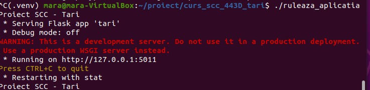
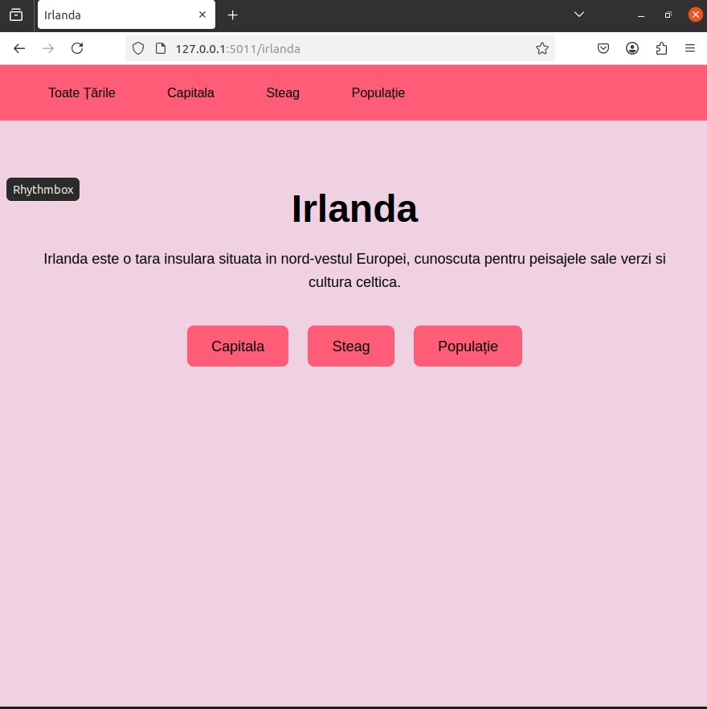
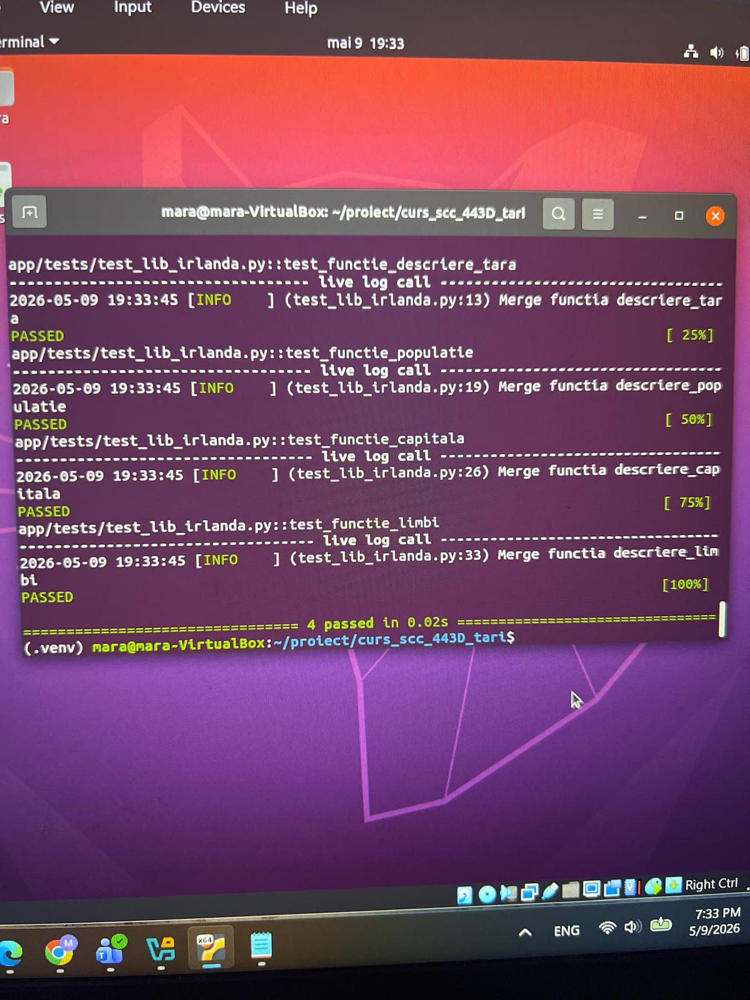
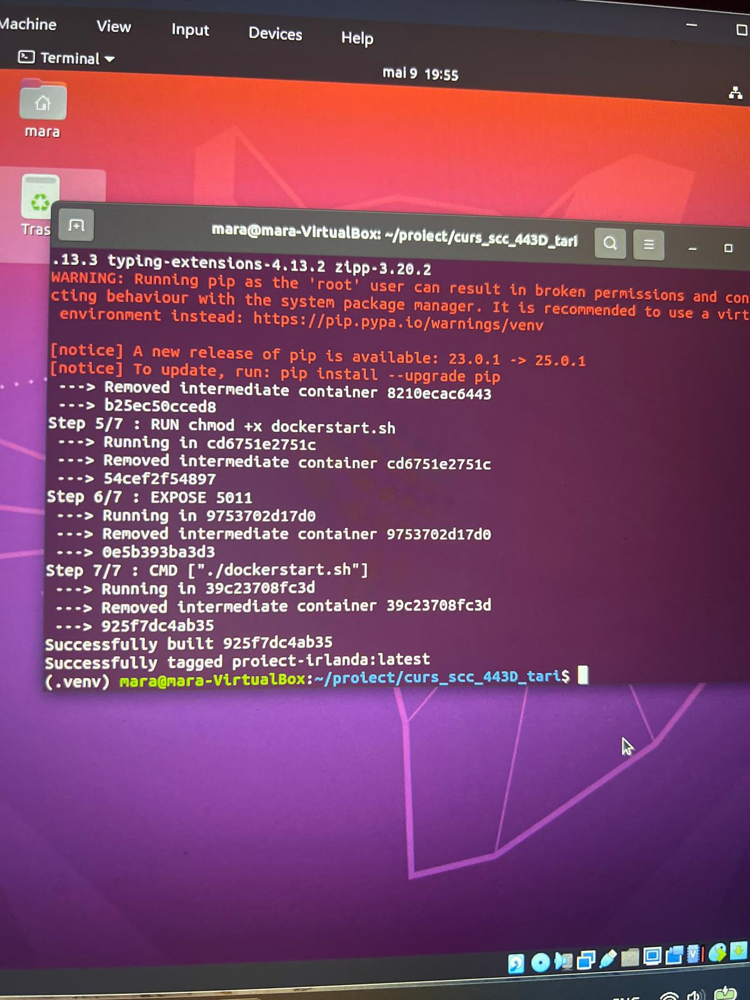
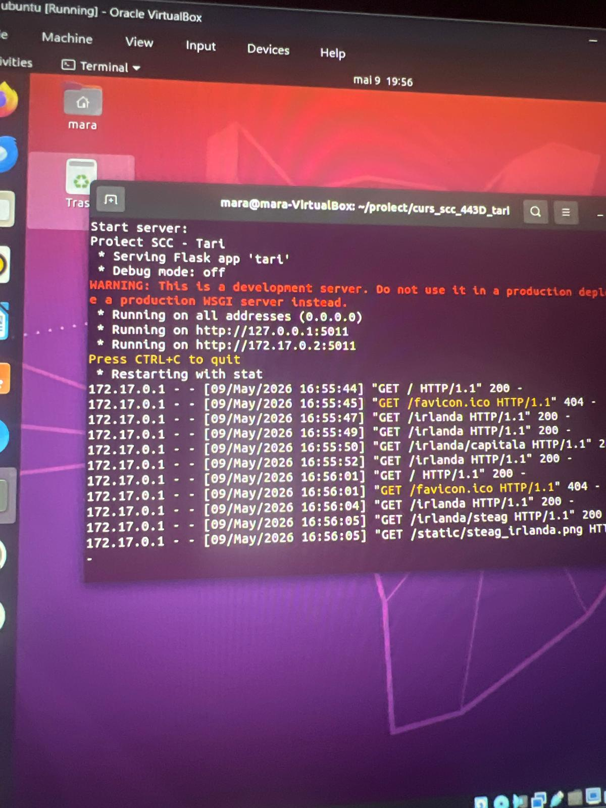
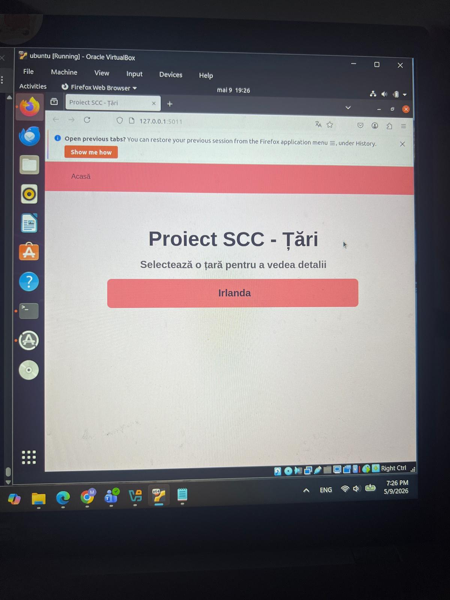

# Proiect SCC - Irlanda

## 1. Identificator Dezvoltator
- **Nume:** Pirjol Mara
- **Grupă:** 443D
- **Țară alocată:** Irlanda

## 2. Funcționalitate Adăugată
Am implementat logica pentru afișarea informațiilor despre Irlanda. Aceasta include:

- **descriere_tara()** – Returnează o descriere generală a Irlandei.
- **descriere_capitala()** – Returnează capitala Irlandei: Dublin.
- **descriere_populatie()** – Returnează populația Irlandei.
- **descriere_limbi()** – Returnează limbile oficiale ale Irlandei.
- **descriere_steag()** – Returnează imaginea steagului Irlandei.

### Rute accesibile

| Rută | Descriere |
|------|-----------|
| `/` | Pagina principală – lista tuturor țărilor |
| `/irlanda` | Informații generale despre Irlanda |
| `/irlanda/capitala` | Capitala Irlandei |
| `/irlanda/populatie` | Populația Irlandei |
| `/irlanda/steag` | Steagul Irlandei |

## 3. Stadiul Implementării
- [x] Cod funcționalitate adăugat

## 4. Testare

### Testare Manuală
Aplicația a fost verificată local rulând `./ruleaza_aplicatia` și accesând `http://127.0.0.1:5011/`.

**Output Consolă Locală:**

**Aplicația Accesată la `http://127.0.0.1:5011/`:**

### Testare Locală folosind Pytest
Mai întâi am verificat că testele funcționează local.

**Testare Locală cu Pytest:**

### Testare Automată folosind Jenkins
Am configurat un Pipeline în Jenkins care rulează automat testele. Testul din `app/tests/` a trecut cu succes.

## 5. Containerizare (Docker)
Aplicația a fost containerizată folosind Docker. Containerul expune portul 5011.

**Dovezi Containerizare:**

*1. Creare imagine Docker:*

*2. Interacțiune / rulare container Docker:*

*3. Accesare aplicație din container în browser:*

