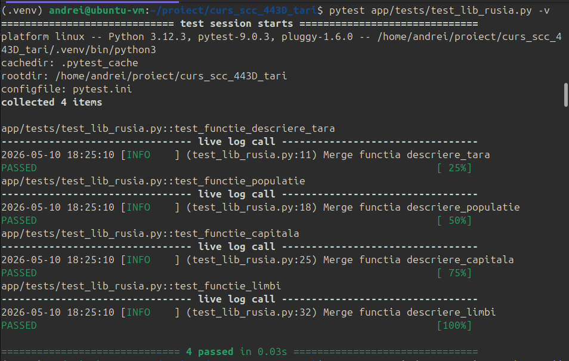
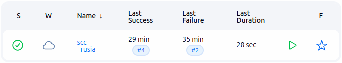
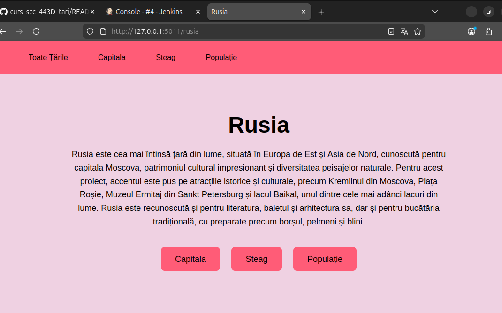
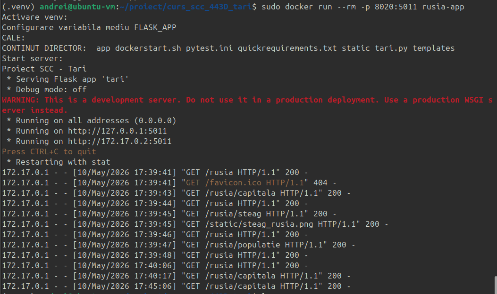

# Proiect SCC - Rusia

## 1. Identificator Dezvoltator

**Nume:** Corina Ghenciu  
**Grupă:** 443D  
**Țară alocată:** Rusia  

---

## 2. Funcționalitate Adăugată

Am implementat logica pentru afișarea informațiilor despre Rusia în aplicația web Flask.

Funcționalitatea include:

- crearea fișierului `app/lib/biblioteca_rusia.py`;
- modificarea fișierului `app/lib/biblioteca_tari.py` pentru integrarea Rusiei în aplicație;
- adăugarea testelor automate în `app/tests/test_lib_rusia.py`;
- adăugarea steagului Rusiei în folderul `static/`;
- adăugarea fișierelor `Dockerfile` și `Jenkinsfile`.

Descrierea Rusiei include informații generale despre țară și atracții turistice reprezentative.

Au fost incluse atracții precum:

- Kremlinul din Moscova;
- Piața Roșie;
- Muzeul Ermitaj din Sankt Petersburg;
- Lacul Baikal;
- Catedrala Sfântul Vasile;
- Teatrul Bolșoi;
- Piața Palatului din Sankt Petersburg;
- Metroul din Moscova;
- Munții Ural;
- Palatul Peterhof.

De asemenea, descrierea menționează preparate tradiționale și elemente culturale cunoscute din Rusia, precum:

- borș;
- pelmeni;
- blini;
- baletul rusesc;
- literatura rusă clasică.

---

## 3. Stadiul Implementării

- [x] Cod funcționalitate adăugat
- [x] Teste automate adăugate
- [x] Steag Rusia adăugat
- [x] Dockerfile adăugat
- [x] Jenkinsfile adăugat
- [x] Aplicația a fost rulată local
- [x] Testele au fost rulate local cu succes
- [x] Aplicația a fost rulată în container Docker
- [ ] Pipeline-ul Jenkins a fost rulat cu succes

---

## 4. Structura Proiectului

```text
.
├── activeaza_venv
├── activeaza_venv_jenkins
├── app
│   ├── lib
│   │   ├── biblioteca_rusia.py
│   │   ├── biblioteca_header.py
│   │   └── biblioteca_tari.py
│   └── tests
│       └── test_lib_rusia.py
├── dockerstart.sh
├── Dockerfile
├── Jenkinsfile
├── pytest.ini
├── quickrequirements.txt
├── README.md
├── ruleaza_aplicatia
├── screenshots
│   ├── rusia_docker_browser.png
│   ├── rusia_docker_build.png
│   ├── rusia_jenkins_build_pass.png
│   ├── rusia_jenkins_console_output.png
│   └── rusia_pytest.png
├── static
│   └── steag_rusia.png
├── tari.py
└── templates
    ├── base.html
    ├── home.html
    ├── pagina.html
    ├── steag.html
    └── tara.html
```

---

## 5. Fișiere Modificate / Adăugate

### `app/lib/biblioteca_rusia.py`

Conține funcțiile pentru afișarea informațiilor despre Rusia:

- `descriere_tara()`
- `descriere_limbi()`
- `descriere_populatie()`
- `descriere_capitala()`
- `descriere_steag()`

Funcția `descriere_tara()` prezintă Rusia într-un mod general și include atracții importante, începând cu Kremlinul din Moscova, Piața Roșie și Muzeul Ermitaj.

### `app/lib/biblioteca_tari.py`

A fost modificat pentru:

- importarea bibliotecii Rusiei;
- adăugarea țării în dicționarul `TARI`;
- maparea bibliotecii în dicționarul `BIBLIOTECI`.

### `app/tests/test_lib_rusia.py`

Conține testele automate pentru funcțiile implementate în biblioteca Rusiei.

### `static/steag_rusia.png`

Conține imaginea steagului Rusiei.

### `Dockerfile`

Folosit pentru containerizarea aplicației. Fișierul a fost adăugat după modelul existent în branch-ul `dev_gavrila_radu`.

### `Jenkinsfile`

Folosit pentru rularea pipeline-ului Jenkins. Fișierul a fost adăugat după modelul existent în branch-ul `dev_gavrila_radu`.

### `screenshots/`

Conține dovezi pentru rularea testelor, Docker și Jenkins.

---

## 6. Rute Disponibile

| Rută | Descriere |
|---|---|
| `/` | Pagina principală |
| `/rusia` | Pagina principală pentru Rusia |
| `/rusia/capitala` | Afișează capitala Rusiei |
| `/rusia/populatie` | Afișează populația Rusiei |
| `/rusia/limbi` | Afișează limba principală |
| `/rusia/steag` | Afișează steagul Rusiei |

---

## 7. Testare
### Testare Automată

Testele se află în:

```text
app/tests/test_lib_rusia.py
```

Funcții testate:

- `descriere_tara()`
- `descriere_populatie()`
- `descriere_capitala()`
- `descriere_limbi()`

Comanda utilizată pentru rularea testelor:

```bash
pytest app/tests/test_lib_rusia.py -v
```

Rezultat obținut local:

```text
4 passed
```

Dovadă rulare teste:



---

## 8. Jenkins

A fost adăugat fișierul:

```text
Jenkinsfile
```

Pipeline-ul Jenkins include etape pentru:

- build;
- verificarea calității codului cu `pylint`;
- rularea testelor automate cu `pytest`;
- creare imagine Docker.

Testarea automată cu Jenkins rulează testele din folderul:

```text
app/tests/
```

Job-ul Jenkins pentru proiectul Rusia a fost rulat cu succes.



În Console Output se observă rularea pipeline-ului Jenkins și finalizarea cu succes.



---

## 9. Containerizare Docker

A fost adăugat fișierul:

```text
Dockerfile
```

Aplicația poate fi containerizată folosind Docker.

Construirea imaginii Docker:

```bash
sudo docker build -t rusia-app .
```

Dovadă construire imagine Docker:


Rularea containerului:

```bash
sudo docker run --rm -p 8020:5011 rusia-app
```

După rularea containerului, aplicația poate fi accesată la:

```text
http://127.0.0.1:8020/rusia
```

Dovadă rulare aplicație în container:


---

## 10. Integrare și Review

Branch dezvoltare:

```text
dev_ghenciu_corina
```

Branch main personal:

```text
main_ghenciu_corina
```

Pull Request:

```text
dev_ghenciu_corina -> main_ghenciu_corina
```

Review-uri:

- [ ] Am făcut review pentru colegul: ................................
- [ ] Am primit review de la: ................................

---

## 11. Ce mai este de făcut

- [ ] Integrarea finală în branch-ul principal al grupei, dacă este cerută de cadrul didactic

---

## 12. Concluzie

Proiectul implementează țara Rusia în structura aplicației existente, respectând template-ul primit.

Au fost adăugate:

- biblioteca pentru Rusia;
- testele automate;
- steagul Rusiei;
- Dockerfile;
- Jenkinsfile;
- screenshots cu dovezi de rulare;
- documentația în README.
