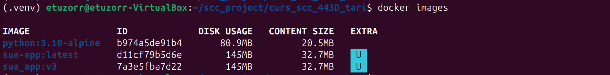
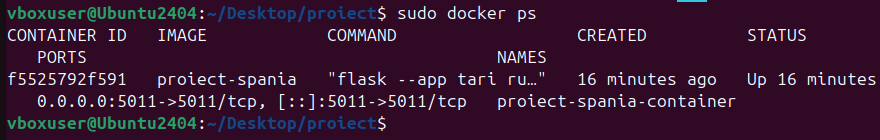
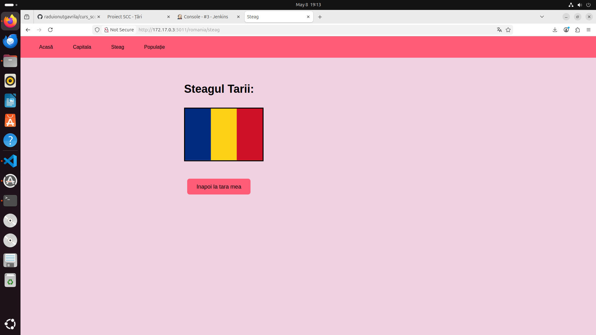
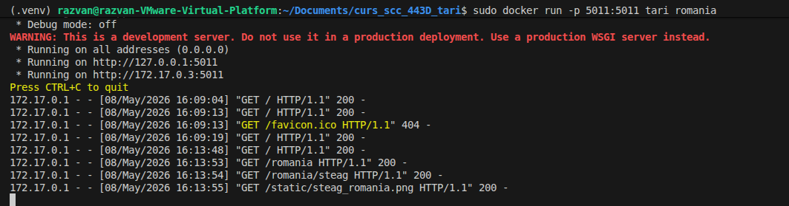

# Proiect SCC - Țări

## 1. Identificator Dezvoltator
- **Nume:** Roșeanu Vlad-George
- **Grupă:** 443D
- **Țară alocată:** Canada

## 2. Funcționalitate Adăugată
Am implementat logica pentru afișarea informațiilor despre Canada. Aceasta include:
- Definirea rutelor în `app/lib/biblioteca_canada.py`.
- Adăugarea datelor specifice (populație, capitală, vecini) în dicționarul de țări.
- Integrarea steagului în folderul `static/`.

## 3. Stadiul Implementării
- [x] Cod funcționalitate adăugat

## 4. Testare
### Testare Manuală
Aplicația a fost verificată local rulând `python3 tari.py` și accesând `http://localhost:5000`.

### Testare Automatizată (Jenkins) [ ]
Am configurat un Pipeline în Jenkins care rulează automat testele. Testul din `app/tests/` a trecut cu succes (PASS).

**Dovada Build Jenkins:**
Status Build Jenkins

Console Output Pytest

## 5. Containerizare (Docker) []
Aplicația a fost containerizată folosind o imagine de Python 3.12-slim. Containerul expune portul 5011.

**Dovezi Containerizare:**

*1. Imaginea Docker creată:*

*2. Containerul rulând activ:*

*3. Accesare aplicație din container (Browser):*

*4. Log-uri consolă (interacțiune browser-container):*

## 6. Integrare și Review []
- **Branch dezvoltare: [Nume Coleg / ID PR]**
- **Pull Request (PR) către [Nume Coleg / ID PR]:** 
- **Review-uri:**
    - [ ] Am făcut review pentru colegul: [Nume Coleg / ID PR]
    - [ ] Am primit review de la: [Nume Coleg / ID PR]

## 7. Ce mai este de făcut
- [ ] Integrarea finală în branch-ul `main` al grupei după aprobarea tuturor review-urilor.
