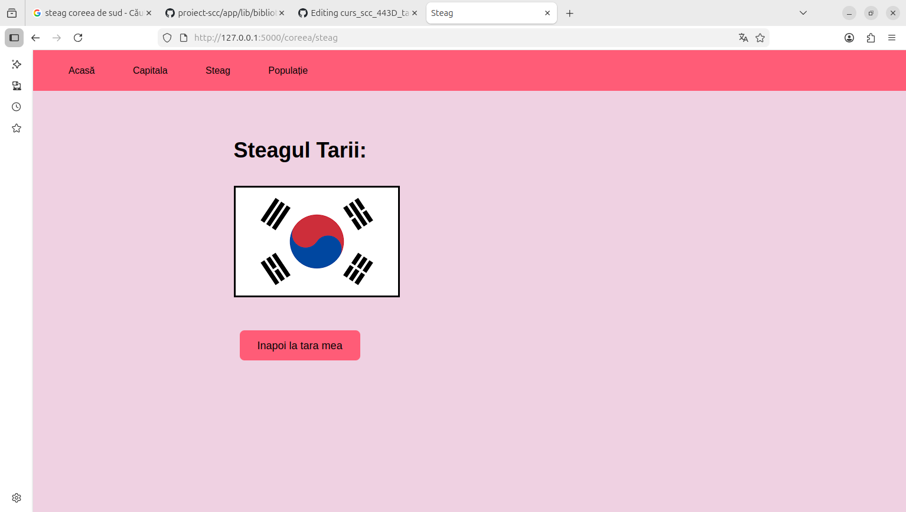
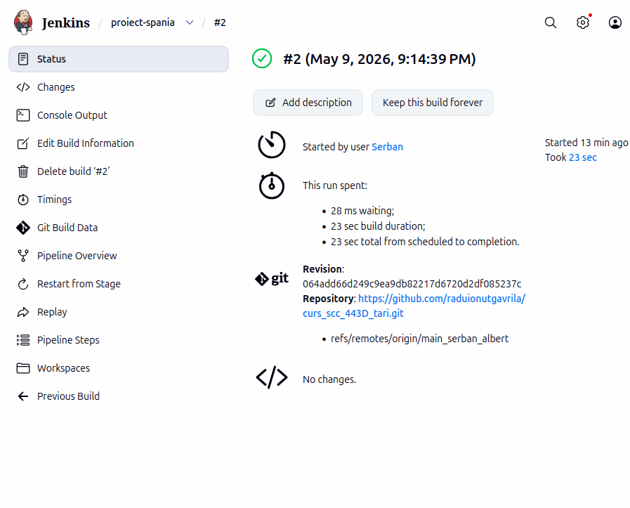

# Proiect SCC - Țări

## 1. Identificator Dezvoltator
- **Nume:** Toacă Cristiana
- **Grupă:** 443D
- **Țară alocată:** Coreea de Sud

## 2. Funcționalitate Adăugată
Am implementat logica pentru afișarea informațiilor despre România. Aceasta include:
- Definirea rutelor în `app/lib/biblioteca_romania.py`.
- Adăugarea datelor specifice (populație, capitală, vecini) în dicționarul de țări.
- Integrarea steagului în folderul `static/`.

## 3. Stadiul Implementării
- [x] Cod funcționalitate adăugat

## 4. Testare
### Testare Manuală
Aplicația a fost verificată local rulând `./ruleaza_aplicatia` și accesând `http://localhost:5011`.


### Testare Automatizată folosind Jenkins si Pytest
Am configurat un Pipeline în Jenkins care rulează automat testele. Testul din `app/tests/` a trecut cu succes (PASS).

**Dovada Build Jenkins:**


**Testare locala cu pytest:**


## 5. Containerizare (Docker) []
Aplicația a fost containerizată folosind o imagine de Python 3.12-slim. Containerul expune portul 5011.

**Dovezi Containerizare:**

*1. Imaginea Docker creată:*


*2. Containerul rulând activ:*


*3. Accesare aplicație din container (Browser):*


*4. Log-uri consolă (interacțiune browser-container):*


## 6. Integrare și Review []
- **Branch dezvoltare: `dev_gheorghe_razvan`**
- **Pull Request (PR) către `main_gheorghe_razvan`:** 
Creat
- **Review-uri:**
    - [ ] Am făcut review pentru colegul: [Nume Coleg / ID PR]
    - [ ] Am primit review de la: [Nume Coleg / ID PR]

<<<<<<< HEAD
## 7. Ce mai este de făcut
- [ ] Integrarea finală în branch-ul `main` al grupei după aprobarea tuturor review-urilor.
=======
BIBLIOTECI = {
    'tara_mea': prescurtare_biblioteca_tara_mea,
}
```
## Ce se modifica in /app/tests


Fisierul test_lib_belgia.py este un test automatizat care verifică funcțiile din biblioteca țării . 
El importă funcțiile principale (descriere_tara, descriere_capitala, descriere_limbi, descriere_populatie), definește valori așteptate pentru fiecare și folosește assert result == expected_result pentru a confirma că rezultatul funcțiilor corespunde exact cu ce trebuie. 

1. Redenumeste `app/tests/test_lib_belgia.py` cu numele tarii alese `app/tests/test_lib_<tara_mea>.py` (de exemplu `test_romania.py`).
2. Schimbă importul din `biblioteca_belgia` în `biblioteca_<tara_mea>` (asa cum este mentionat si comentariu)
3. Actualizează fiecare `expected_result` cu valoarea aleasa pentru țara ta


## Ce se adauga in `static/`

- Adauga poza cu steagul tarii tale in format `png` in directorul `static/` ( sterge apoi poza steag_belgia.png).
- Adauga locatia pozei in functia desriere_steag() din  `biblioteca_<tara_mea>.py`, sub formatul '/static/<steag_tara>.png'.

## Ce NU se modifica

- `tari.py` - NU SE MODIFICA
- `app/lib/biblioteca_header.py` - NU SE MODIFICA
- `templates/base.html` - NU SE MODIFICA
- `templates/pagina.html` - NU SE MODIFICA
- `templates/steag.html` - NU SE MODIFICA
- `templates/tara.html` - NU SE MODIFICA (este template generic pentru pagina de tara)


## Structura de baza

`app/lib/`
- `biblioteca_tari.py` - fisier in care vor fi agregate numele si bibliotecile de la toate tarile din proiect ( agregarea se va face la final, cand se va face Pull Request in branch-ul main)
- `biblioteca_<tara_mea>.py` - fisierul individual cu functiile pentru tara aleasa
- `biblioteca_header.py` - header comun, nu se modifica

`static/`
- aici se pune poza steagului in format `png`

`templates/`
- `base.html` - scheletul proiectului - contine structura html + css statica
- `home.html` - pagina de pornire unde sunt listate tarile
- `tara.html` - template generic pentru pagina fiecarei tari, unde este afisat rezultatul functiei descriere_tara()
- `pagina.html` - pagina folosita pentru a afisa rezultatul funtiilor descriere_capitala() / descriere_populatie() / descriere_limbi()
- `steag.html` - pagina folosita pentru a afisa rezultatul functiei descriere_steag()
  
`tari.py` - fișierul principal al aplicației Flask care gestionează rutele web și afișează informații despre țări. Este intermediar între cererile web și bibliotecile fiecărei țări, oferind utilizatorului informații formatate despre acestea.


## Scripturi de activare si rulare

### `activeaza_venv`

Acest script activeaza mediul virtual Python din `.venv`. Comanda:  `. ./activeaza_venv`


### `ruleaza_aplicatia`

Acest script porneste aplicatia Flask local. Comanda: `./ruleaza_aplicatia`


### `dockerstart.sh`

Acest script face acelasi lucru, dar cu optiuni suplimentare. Este apelat in fisierul Dockerfile

## Permisiuni de executie

Pentru a rula scripturile, trebuie acordate permisiuni de executie:

```bash
chmod 764 activeaza_venv ruleaza_aplicatia dockerstart.sh
```

## Testare cu Pytest

Pentru a rula testele, mergeți în directorul principal al proiectului și folosiți comanda:

`pytest app/tests/*.py -v`

Aceasta verifica fiecare funcție din fișier și arata ce teste trec sau ce teste eșuează. Asigurati-va ca aveti venv-ul pornit.


# Pasi recomandati pentru proiect

1. `git clone https://github.com/raduionutgavrila/curs_scc_443D_tari.git` - pentru a copia local repository-ul
2. `git checkout dev-template` - pentru a selecta ramura de dezvolatare cu template-ul
3. `git checkout -b dev-nume-prenume` - pentru a crea o noua ramura de dezvoltare pornind de la template
4. modifica `app/lib/biblioteca_tari.py`
5. redenumeste `app/lib/biblioteca_belgia.py` in `app/lib/biblioteca_<tara_mea>.py` si modifica continutul functiilor
6. adauga poza cu steagul in `static/` si adauga link catre acesta in functia din 'biblioteca_<tara_mea>.py'
7. ruleaza cu `. ./activeaza_venv` si `./ruleaza_aplicatia`
8. testeaza cu `pytest app/tests/test_lib_<tara_mea>.py -v`


# Ce mai trebuie adaugat

- Creare Dockerfile
- Creare Jenkinsfile

## Observatie finala

Scripturile din aceasta aplicatie sunt introduse dupa modelul aplicatiei `chrchende/sysinfo:simplu_main`.


  
>>>>>>> origin/dev-template
