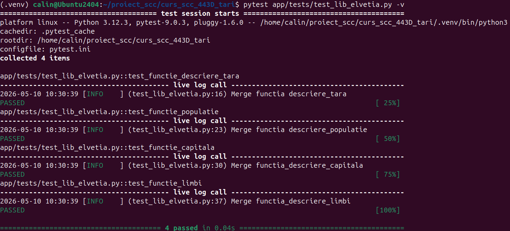
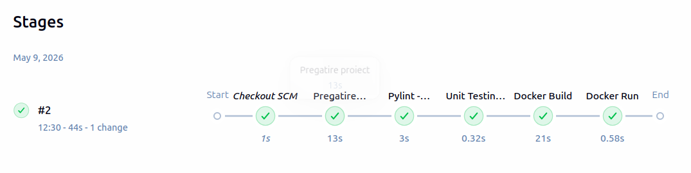
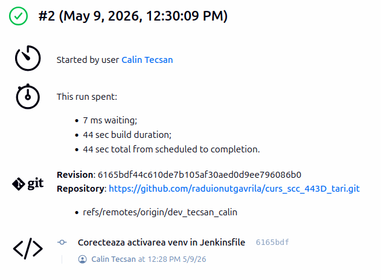
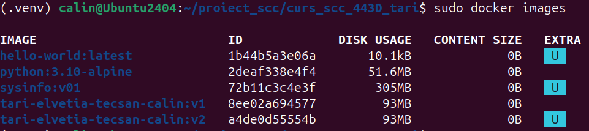
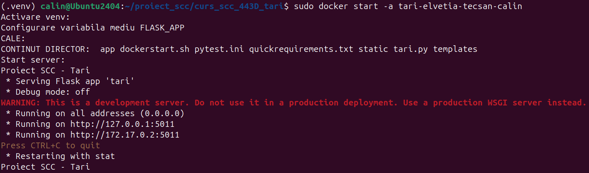
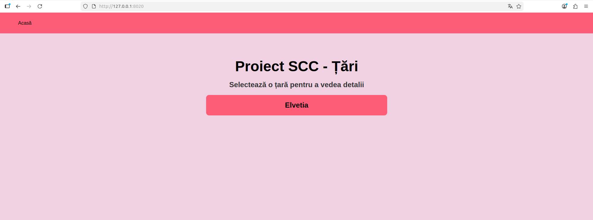
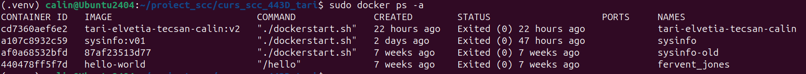

# Proiect SCC - Tari

## 1. Dezvoltator

**Nume:** Tecșan Călin  
**Grupa:** 443D  
**Tara aleasa:** Elveția  

---

## 2. Functionalitate adaugata

In cadrul proiectului am implementat functionalitatea pentru tara **Elvetia**.

Au fost adaugate/modificate urmatoarele componente:

- biblioteca individuala pentru tara: `app/lib/biblioteca_elvetia.py`;
- actualizarea fisierului `app/lib/biblioteca_tari.py` pentru includerea tarii Elvetia in aplicatie;
- test automat pentru biblioteca tarii: `app/tests/test_lib_elvetia.py`;
- imaginea steagului Elvetiei in directorul `static/`;
- fisier `Dockerfile` pentru containerizarea aplicatiei;
- fisier `Jenkinsfile` pentru automatizarea etapelor de testare si build.

Functionalitatile disponibile pentru Elvetia sunt:

- descrierea tarii;
- capitala;
- populatia;
- limbile oficiale;
- afisarea steagului.

---

## 3. Stadiul implementarii

**Cod aplicatie:** finalizat pentru tara Elvetia.  
**Integrare in biblioteca generala:** realizata in `biblioteca_tari.py`.  
**Rute web:** accesibile prin browser la portul 5011  
**Resurse statice:** steagul Elvetiei a fost adaugat in `static/steag_elvetia.png`.  
**Testare locala:** realizata cu Pytest.  
**Containerizare:** imaginea Docker a fost construita, iar containerul a fost pornit cu succes.
**Pipeline Jenkins:** creat si rulat cu succes.  


---

## 4. Testare

### 4.1 Testare manuala

Aplicatia a fost pornita local si au fost verificate paginile corespunzatoare tarii Elvetia in browser.

Au fost testate manual urmatoarele informatii:

- descrierea tarii;
- capitala;
- populatia;
- limbile oficiale;
- steagul.

**Status testare manuala:** OK

### 4.2 Testare unitara cu Pytest

Testele unitare au fost definite in fisierul:

```bash
app/tests/test_lib_elvetia.py
```

Comanda folosita pentru rularea testelor:

```bash
pytest app/tests/test_lib_elvetia.py -v
```

**Status Pytest:** PASS



### 4.3 Testare cu Jenkins

A fost creat fisierul `Jenkinsfile`, care automatizeaza urmatoarele etape:

- pregatirea proiectului;
- crearea si activarea mediului virtual Python;
- instalarea dependentelor;
- verificarea codului cu Pylint;
- rularea testelor unitare cu Pytest;
- construirea imaginii Docker;
- pornirea containerului Docker.

**Status Jenkins Pipeline:** SUCCESS





---

## 5. Containerizare Docker

Aplicatia a fost containerizata folosind un `Dockerfile` bazat pe imaginea `python:3.10-alpine`.

### 5.1 Imagine Docker

Imaginea Docker a fost construita manual cu urmatoarea comanda:

```bash
docker build -t tari-elvetia-tecsan-calin:v1 .
```

Imaginea creata manual:

```text
tari-elvetia-tecsan-calin:v1
```

Imaginea creata automat de Jenkins are formatul:

```text
tari-elvetia-tecsan-calin:v<BUILD_NUMBER>
```

Exemplu:

```text
tari-elvetia-tecsan-calin:v1
```

Verificarea imaginilor Docker:

```bash
docker images
```



### 5.2 Container Docker

Containerul a fost creat si pornit folosind comanda:

```bash
docker run -d --name tari-elvetia-tecsan-calin -p 8020:5011 tari-elvetia-tecsan-calin:v1
```

Aplicatia ruleaza in container pe portul intern `5011`, iar pe masina locala este accesibila prin portul `8020`.



Acces aplicatie:

```text
http://localhost:8020
```



Verificarea containerelor Docker:

```bash
docker ps -a
```



---

## 6. Integrare si review

**Branch sursa:** `dev_tecsan_calin`  
**Branch destinatie:** `main_tecsan_calin`  

**Status integrare:** de completat dupa Pull Request  
**Review:** de completat dupa review-ul primit de la coleg  

### Pull Request-uri la care am facut review

| PR ID | Autor | Descriere |
|---|---|---|
| de completat | de completat | de completat |

---

## 7. Comenzi utile

### 7.1 Activare mediu virtual

```bash
. ./activeaza_venv
```

### 7.2 Pornire aplicatie local

```bash
./ruleaza_aplicatia
```

### 7.3 Rulare teste Pytest

```bash
pytest app/tests/test_lib_elvetia.py -v
```

### 7.4 Construire imagine Docker

```bash
docker build -t tari-elvetia-tecsan-calin:v1 .
```

### 7.5 Pornire container Docker

```bash
docker run -d --name tari-elvetia-tecsan-calin -p 8020:5011 tari-elvetia-tecsan-calin:v1
```

### 7.6 Oprire container

```bash
docker stop tari-elvetia-tecsan-calin
```

### 7.7 Repornire container existent

```bash
docker start tari-elvetia-tecsan-calin
```

### 7.8 Stergere container

```bash
docker rm -f tari-elvetia-tecsan-calin
```

### 7.9 Verificare imagini Docker

```bash
docker images
```

### 7.10 Verificare containere Docker

```bash
docker ps -a
```

### 7.11 Verificare loguri container

```bash
docker logs tari-elvetia-tecsan-calin
```

---

## 8. Ce mai este de facut

- [x] Implementarea bibliotecii pentru Elvetia.
- [x] Actualizarea fisierului `biblioteca_tari.py`.
- [x] Adaugarea testelor unitare pentru Elvetia.
- [x] Adaugarea steagului in directorul `static/`.
- [x] Crearea fisierului `Dockerfile`.
- [x] Crearea fisierului `Jenkinsfile`.
- [x] Rularea testelor cu Pytest.
- [x] Rularea pipeline-ului Jenkins.
- [x] Construirea imaginii Docker.
- [x] Pornirea containerului Docker.
- [x] Adaugarea capturilor de ecran in README.
- [x] Crearea Pull Request-ului.
- [x] Obtinerea review-ului de la un coleg.
- [x] Integrarea finala in branch-ul principal.

---

## 8. Concluzie

Functionalitatea pentru Elvetia a fost implementata in aplicatia web Flask a proiectului SCC - Tari. Codul a fost testat local cu Pytest, verificat prin pipeline Jenkins si containerizat folosind Docker. Aplicatia poate fi rulata local sau in container si poate fi accesata din browser.
