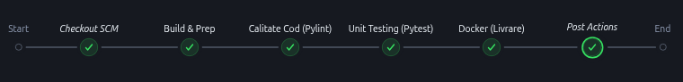
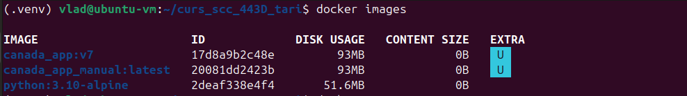
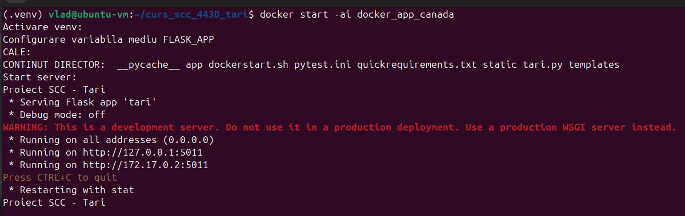
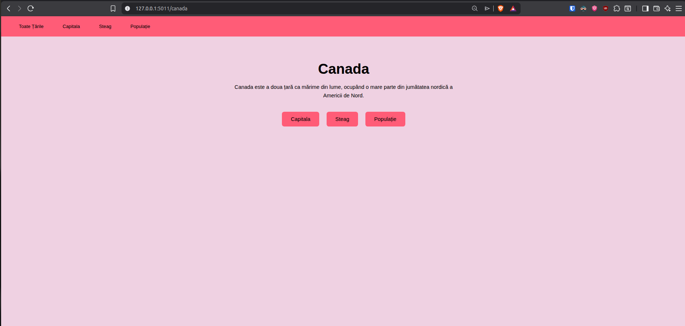
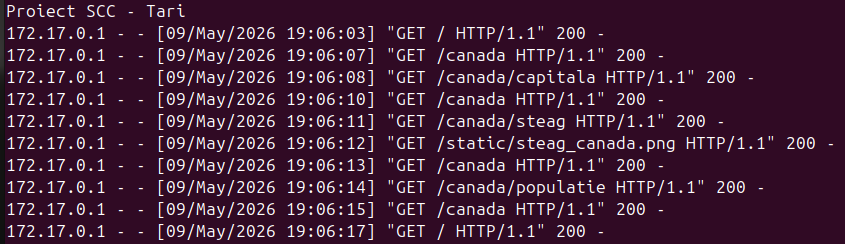

# Proiect SCC - Țări - Canada

## Dezvoltator
- **Nume:** Roșeanu Vlad-George
- **Grupă:** 443D
- **Țară alocată:** Canada 🇨🇦
- **Branch de dezvoltare:** `dev_roseanu_vlad`

## Funcționalitate Adăugată
Am adaugat funcționalitatea pentru **Canada** în fișierul `app/lib/biblioteca_canada.py`:
- **descriere_tara()** – Returnează o descriere generală a Canadei
- **descriere_capitala()** – Returnează capitala Canadei
- **descriere_populatie()** – Returnează populația Canadei
- **descriere_limbi()** – Returnează limbile oficiale ale Canadei
- **descriere_steag()** – Returnează imaginea steagului Canadei

## Rute accesibile

| Ruta | Descriere |
|------|-----------|
| `/` | Pagina principală – lista tuturor țărilor |
| `/canada` | Informații generale despre Canada |
| `/canada/capitala` | Capitala Canadei – Ottawa |
| `/canada/populatie` | Populația Canadei |
| `/canada/steag` | Steagul Canadei |

## Modificări

🇨🇦 `app/lib/biblioteca_canada.py` – biblioteca cu funcțiile pentru Canada

🔗 `app/lib/biblioteca_tari.py` – adăugat import și înregistrare Canada în TARI și BIBLIOTECI

🛠️ `app/tests/test_lib_canada.py` – teste unitare pentru Canada

⚙️ `Jenkinsfile` – pipeline declarativ pentru Jenkins

🐳 `Dockerfile` – containerizarea aplicației

## Testare Manuală
Aplicația a fost verificată local rulând:

```bash
python3 tari.py
```

și accesând:

```text
http://localhost:5000
```


## Testare Automatizată (Jenkins)
Am configurat un Pipeline în Jenkins care rulează automat testele. Testul din `app/tests/` a trecut cu succes (PASS).

**Dovada Build Jenkins:**



## Containerizare (Docker)
Aplicația a fost containerizată folosind o imagine de Python 3.10-alpine. Containerul expune portul 5011.

**Dovezi Containerizare:**

*1. Imaginea Docker creată:*


*2. Toate containerele Docker:*


*3. Containerul rulând activ:*


*4. Accesare aplicație din container (Browser):*


*5. Log-uri consolă (interacțiune browser-container):*


## Comenzi folosite:
🧪 Rulare manuala pytest:
```bash
pytest app/tests/test_lib_canada.py -v
```
🐳 Construirea imaginii:
```bash
docker build -t <nume_img> <locatia_fisierului_dockerfile>
```
🚀 Crearea și construirea:
```bash
docker run -it --name <nume_cont> -p <port_local>:<port_intern> <imagine>
```
🔄 Repornirea containerului in mod interactiv:
```bash
docker start -ai <nume_cont>
```


## Integrare și Review
🌿 Branch sursa: `dev_roseanu_vlad`

🎯 Branch destinatie: `main_roseanu_vlad`

📊 Status: *Verificat*

👀 Review: *Esterabadeyan Hadi*

## Pull Request-uri la care am făcut review

| PR ID | Autor | Descriere |
| :---: | :---: | :---: |
| #44 | Esterabadeyan Hadi - Etuzrorr | Am verificat schimbarea numelor de poze din screenshots/ |

## Ce mai este de făcut

 - [x] Finalizare cod și teste manuale.
 - [x] Aplicație containerizată și accesibilă.
 - [x] Succes Pipeline Jenkins.
 - [ ] Obținerea aprobării de la colegi pentru PR-ul final.
 - [ ] Integrarea finală în branch-ul main.
