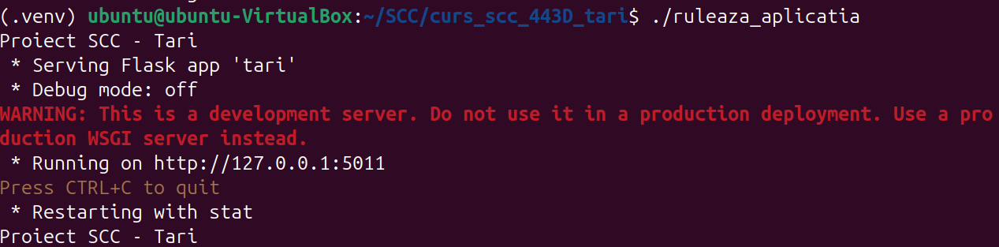
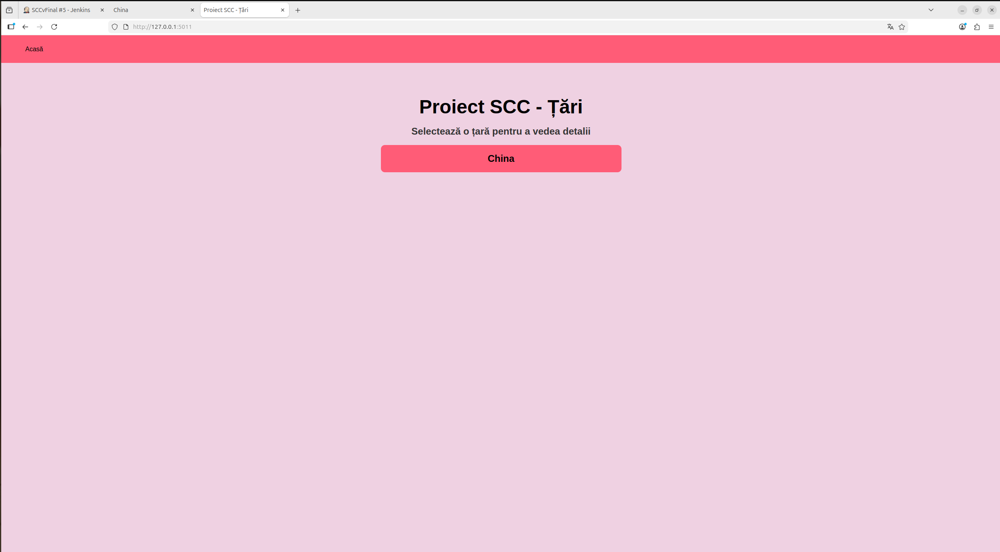
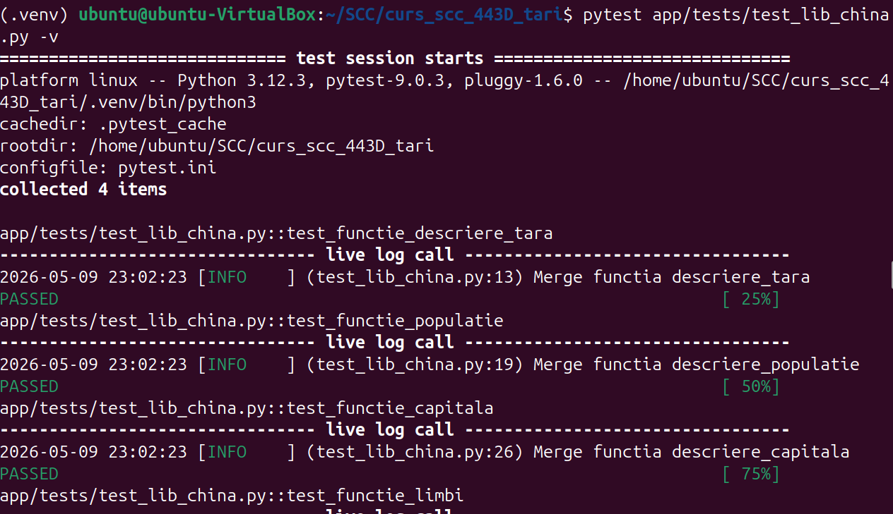
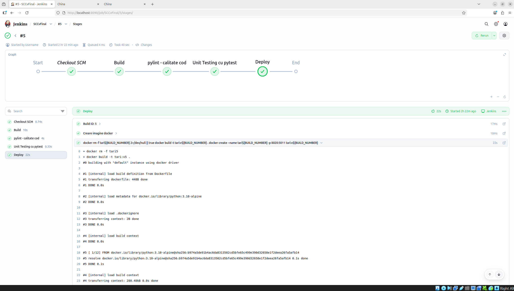
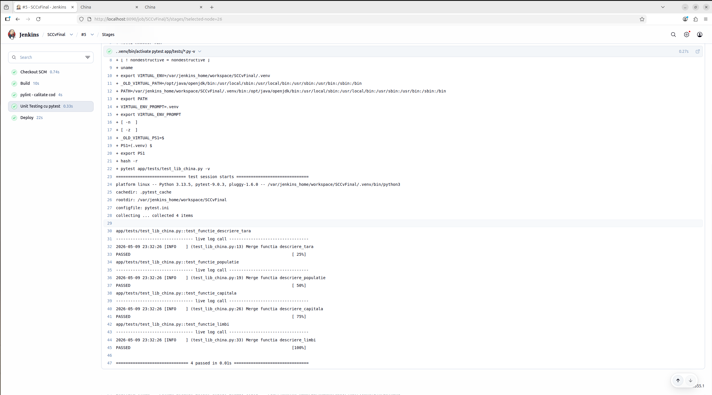
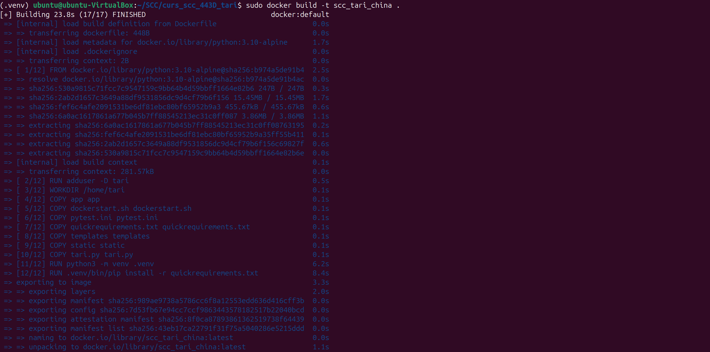
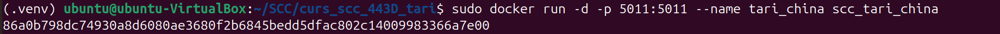
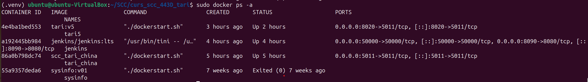
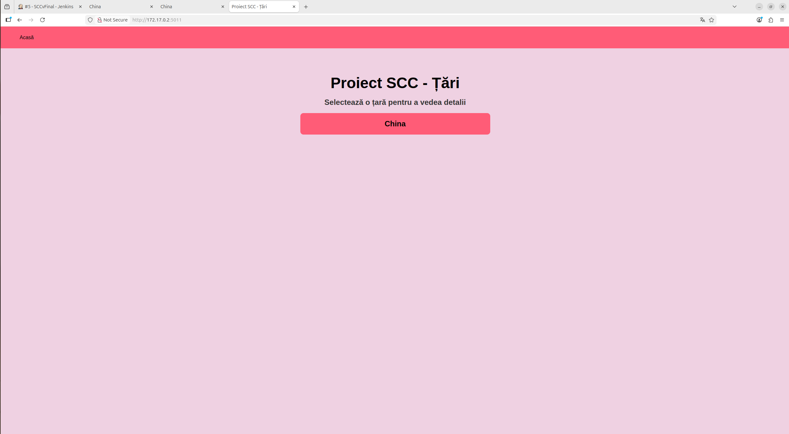
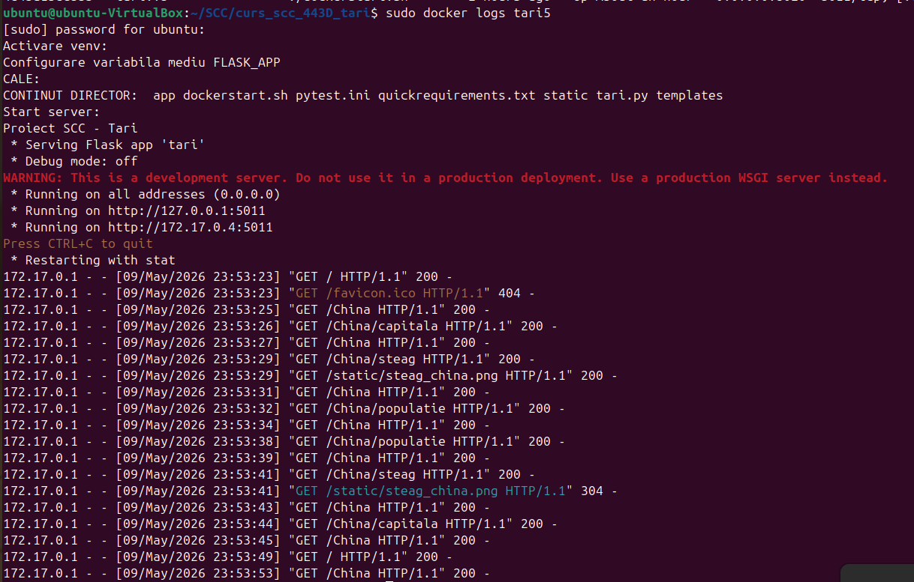

# Proiect SCC - Țări

## 1. Identificator Dezvoltator
- **Nume:** Teodorescu-Colciu Matei
- **Grupă:** 443D
- **Țară alocată:** China

## 2. Funcționalitate Adăugată
Am implementat logica pentru afișarea informațiilor despre China. Aceasta include:

- **descriere_tara()** – Returnează o descriere generală a Chinei
- **descriere_capitala()** – Returnează capitala Chinei
- **descriere_populatie()** – Returnează populația Chinei
- **descriere_limbi()** – Returnează limbile oficiale ale Chinei
- **descriere_steag()** – Returnează imaginea steagului Chinei

### Rute accesibile

| Ruta | Descriere |
|------|-----------|
| `/` | Pagina principală – lista tuturor țărilor |
| `/china` | Informații generale despre China |
| `/china/capitala` | Capitala Chinei |
| `/china/populatie` | Populația Chinei |
| `/china/steag` | Steagul Chinei |

## 3. Stadiul Implementării
- [x] Cod funcționalitate adăugat

## 4. Testare
### Testare Manuală
Aplicația a fost verificată local rulând `.\ruleaza_aplicatia` și accesând `http://127.0.0.1:5011/`.

**Output Consola Locala:**

**Apliactia Accesata la `http://127.0.0.1:5011/`:**

### Testare Locala Folosind Pytest
Mai intai am verificat ca testele functioneaza local.

**Testare Locala cu Pytest:**

### Testare Automata folosind Jenkins

Am configurat un Pipeline în Jenkins care rulează automat testele. Testul din `app/tests/` a trecut cu succes (PASS).

**Dovada Build Jenkins:**

**Dovada Teste Pytest in Jenkins:**

## 5. Containerizare (Docker)
Aplicația a fost containerizată folosind o imagine de Python 3.10-alpine. Containerul expune portul 5011 si poate fi accesat la `http://172.17.0.2:5011/`.

**Dovezi Containerizare:**

*1. Creare imagine Docker:*

*2. Start container creat:*

*3. Verificare a rularii containerului:*

*4. Accesare aplicație din container (Browser):*

Aplicatia va putea fi accesata la: `http://172.17.0.2:5011/`

*5. Log-uri consolă (interacțiune browser-container):*

## 6. Integrare și Review
- **Branch dezvoltare: `dev_teodorescu_matei`**
- **Pull Request (PR) către `main_teodorescu_matei`:** 

## 7. Review-uri:

- [x] Am făcut review pentru colegul: [ Dumitrache Alexandru (Dumitian) / #37 ]
- [x] Am primit review de la: [ Dumitrache Alexandru (Dumitian) / #39 ]

## 8. De facut
 - [x] Finalizare cod și teste manuale.
 - [x] Aplicație containerizată și accesibilă.
 - [x] Succes Pipeline Jenkins.
 - [x] Obținerea aprobării de la colegi pentru PR-ul final, in main.
 - [x] Integrarea finală în branch-ul main.
