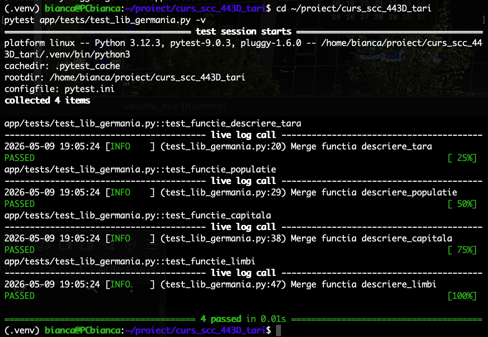
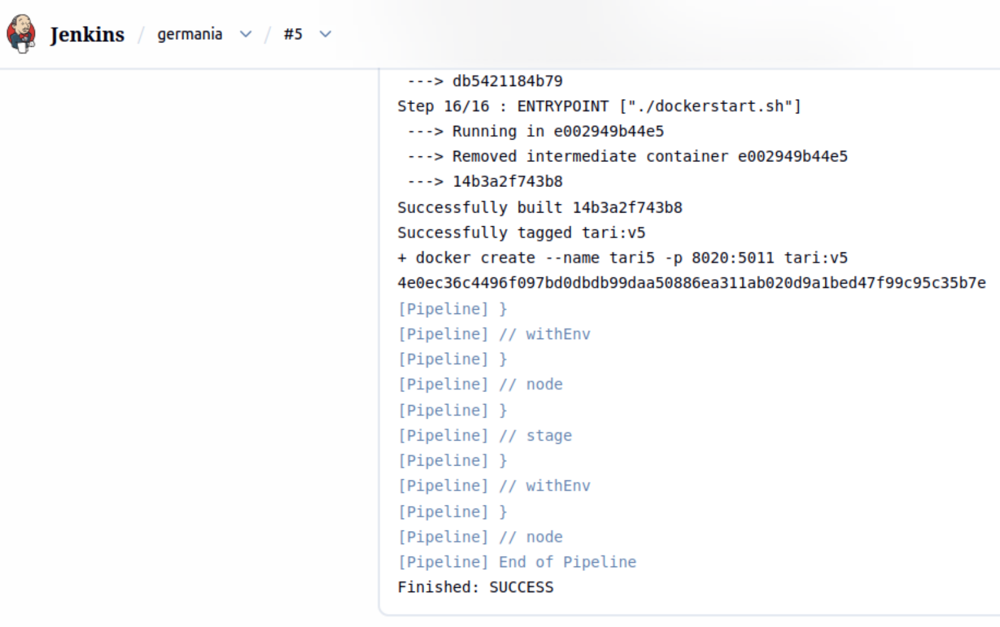
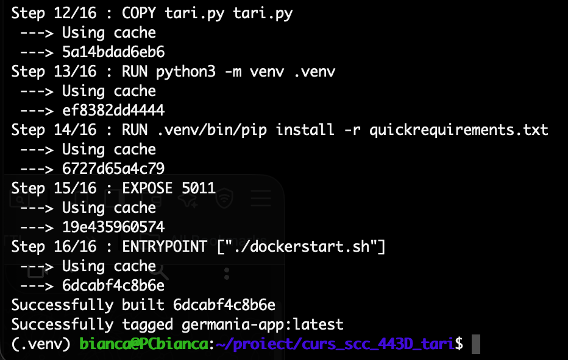
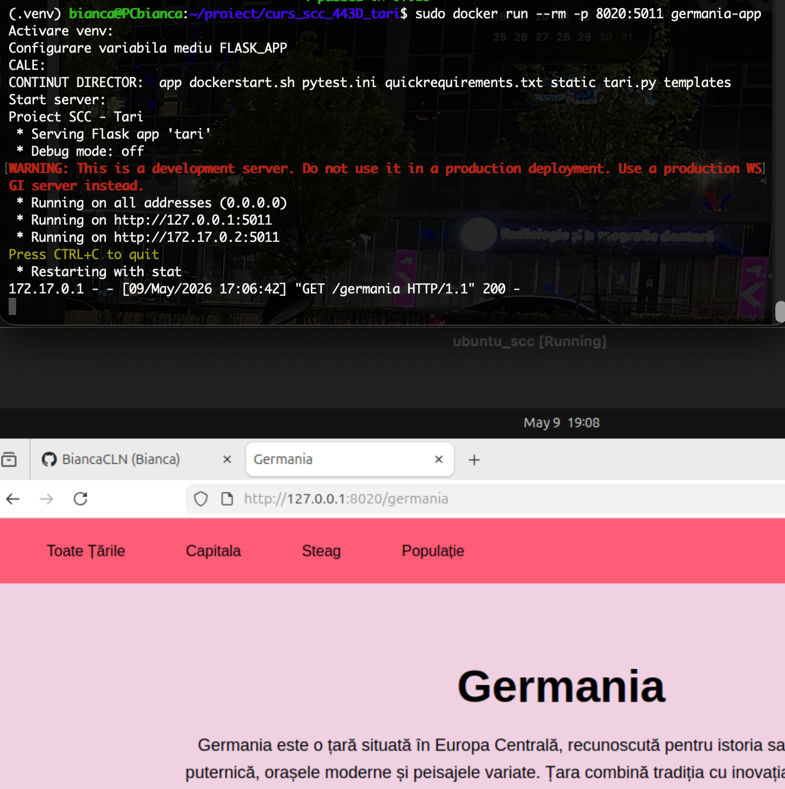

# Proiect SCC - Germania

## 1. Identificator Dezvoltator

**Nume:** Bianca Colan  
**Grupă:** 443D  
**Țară alocată:** Germania  

---

## 2. Funcționalitate Adăugată

Am implementat logica pentru afișarea informațiilor despre Germania în aplicația web Flask.

Funcționalitatea include:

- crearea fișierului `app/lib/biblioteca_germania.py`;
- modificarea fișierului `app/lib/biblioteca_tari.py` pentru integrarea Germaniei în aplicație;
- adăugarea testelor automate în `app/tests/test_lib_germania.py`;
- adăugarea steagului Germaniei în folderul `static/`;
- adăugarea fișierelor `Dockerfile` și `Jenkinsfile`.

Descrierea Germaniei include informații generale despre țară și atracții turistice reprezentative.

Au fost incluse atracții precum:

- BMW Museum din München;
- Mercedes-Benz Museum din Stuttgart;
- Porsche Museum din Stuttgart-Zuffenhausen;
- Poarta Brandenburg din Berlin;
- Castelul Neuschwanstein din Bavaria;
- Catedrala din Köln;
- Pădurea Neagră;
- Zidul Berlinului;
- Marienplatz din München;
- Valea Rinului.

De asemenea, descrierea menționează berării populare din Bavaria, precum:

- Hofbräuhaus München;
- Augustiner Bräustuben;
- Paulaner Bräuhaus.

---

## 3. Stadiul Implementării

- [x] Cod funcționalitate adăugat
- [x] Teste automate adăugate
- [x] Steag Germania adăugat
- [x] Dockerfile adăugat
- [x] Jenkinsfile adăugat
- [x] Aplicația a fost rulată local
- [x] Testele au fost rulate local cu succes
- [x] Aplicația a fost rulată în container Docker
- [x] Pipeline-ul Jenkins a fost rulat cu succes

---

## 4. Structura Proiectului

```text
.
├── activeaza_venv
├── activeaza_venv_jenkins
├── app
│   ├── lib
│   │   ├── biblioteca_germania.py
│   │   ├── biblioteca_header.py
│   │   └── biblioteca_tari.py
│   └── tests
│       └── test_lib_germania.py
├── dockerstart.sh
├── Dockerfile
├── Jenkinsfile
├── pytest.ini
├── quickrequirements.txt
├── README.md
├── ruleaza_aplicatia
├── screenshots
│   ├── docker_browser_germania.png
│   ├── docker_build.png
│   ├── jenkins_build_pass.png
│   ├── jenkins_console_output.png
│   └── pytest_germania.png
├── static
│   └── steag_germania.png
├── tari.py
└── templates
    ├── base.html
    ├── home.html
    ├── pagina.html
    ├── steag.html
    └── tara.html
```

---

## 5. Fișiere Modificate / Adăugate

### `app/lib/biblioteca_germania.py`

Conține funcțiile pentru afișarea informațiilor despre Germania:

- `descriere_tara()`
- `descriere_limbi()`
- `descriere_populatie()`
- `descriere_capitala()`
- `descriere_steag()`

Funcția `descriere_tara()` prezintă Germania într-un mod general și include atracții importante, începând cu muzeele auto BMW, Mercedes-Benz și Porsche.

### `app/lib/biblioteca_tari.py`

A fost modificat pentru:

- importarea bibliotecii Germaniei;
- adăugarea țării în dicționarul `TARI`;
- maparea bibliotecii în dicționarul `BIBLIOTECI`.

### `app/tests/test_lib_germania.py`

Conține testele automate pentru funcțiile implementate în biblioteca Germaniei.

### `static/steag_germania.png`

Conține imaginea steagului Germaniei.

### `Dockerfile`

Folosit pentru containerizarea aplicației. Fișierul a fost adăugat după modelul existent în branch-ul `dev_gavrila_radu`.

### `Jenkinsfile`

Folosit pentru rularea pipeline-ului Jenkins. Fișierul a fost adăugat după modelul existent în branch-ul `dev_gavrila_radu`.

### `screenshots/`

Conține dovezi pentru rularea testelor, Docker și Jenkins.

---

## 6. Rute Disponibile

| Rută | Descriere |
|---|---|
| `/` | Pagina principală |
| `/germania` | Pagina principală pentru Germania |
| `/germania/capitala` | Afișează capitala Germaniei |
| `/germania/populatie` | Afișează populația Germaniei |
| `/germania/limbi` | Afișează limba principală |
| `/germania/steag` | Afișează steagul Germaniei |

---

## 7. Testare

### Testare Manuală

Aplicația a fost verificată local rulând:

```bash
. ./activeaza_venv
./ruleaza_aplicatia
```

Aplicația a fost accesată în browser la:

```text
http://127.0.0.1:5011
```

Rute verificate manual:

```text
http://127.0.0.1:5011/germania
http://127.0.0.1:5011/germania/capitala
http://127.0.0.1:5011/germania/populatie
http://127.0.0.1:5011/germania/limbi
http://127.0.0.1:5011/germania/steag
```

### Testare Automată

Testele se află în:

```text
app/tests/test_lib_germania.py
```

Funcții testate:

- `descriere_tara()`
- `descriere_populatie()`
- `descriere_capitala()`
- `descriere_limbi()`

Comanda utilizată pentru rularea testelor:

```bash
pytest app/tests/test_lib_germania.py -v
```

Rezultat obținut local:

```text
4 passed
```

Dovadă rulare teste:



---

## 8. Jenkins

A fost adăugat fișierul:

```text
Jenkinsfile
```

Pipeline-ul Jenkins include etape pentru:

- build;
- verificarea calității codului cu `pylint`;
- rularea testelor automate cu `pytest`;
- creare imagine Docker.

Testarea automată cu Jenkins rulează testele din folderul:

```text
app/tests/
```

Job-ul Jenkins pentru proiectul Germania a fost rulat cu succes.


În Console Output se observă rularea pipeline-ului Jenkins și finalizarea cu succes.



---

## 9. Containerizare Docker

A fost adăugat fișierul:

```text
Dockerfile
```

Aplicația poate fi containerizată folosind Docker.

Construirea imaginii Docker:

```bash
sudo docker build -t germania-app .
```

Dovadă construire imagine Docker:



Rularea containerului:

```bash
sudo docker run --rm -p 8020:5011 germania-app
```

După rularea containerului, aplicația poate fi accesată la:

```text
http://127.0.0.1:8020/germania
```

Dovadă rulare aplicație în container:



---

## 10. Integrare și Review

Branch dezvoltare:

```text
dev_colan_bianca
```

Branch main personal:

```text
main_colan_bianca
```

Pull Request:

```text
dev_colan_bianca -> main_colan_bianca
```

Review-uri:

- [ ] Am făcut review pentru colegul: ................................
- [ ] Am primit review de la: ................................

---

## 11. Ce mai este de făcut

- [ ] Integrarea finală în branch-ul principal al grupei, dacă este cerută de cadrul didactic

---

## 12. Concluzie

Proiectul implementează țara Germania în structura aplicației existente, respectând template-ul primit.

Au fost adăugate:

- biblioteca pentru Germania;
- testele automate;
- steagul Germaniei;
- Dockerfile;
- Jenkinsfile;
- screenshots cu dovezi de rulare;
- documentația în README.
