# curs_scc_443D_tari

# Studenti - Tara
- Balaban Razvan-Marian -	Brazilia
- Ciobanu Andrei - Japonia
- Colan Bianca - Germania
- Cucui Mihai-Catalin - Laos
- Cucui Petrut-Gabriel - Nepal
- Dumitrache Alexandru - Italia
- Enache Bogdan - Norvegia 
- Esterabadeyan Hadi - Statele Unite
- Gavrilă Radu-Ionuț - Belgia
- Ghenciu Corina - Rusia
- Gheorghe Razvan - Romania
- Ghica Antonio - Namibia 
- Grigore Mihaela -	Finlanda 
- Ivan Luca - Danemarca
- Petcu Stefan-Ciprian - Serbia
- Pîrjol Mara-Olivia - Irlanda
- Roșeanu Vlad-George - Canada
- Serban Albert - Spania
- Tecșan Călin - Elveția
- Teodorescu Matei - China
- Toaca Cristiana - Corea de Sud 
- Tudor Iulian - Mexic
- Tuturluta Costi-Giani-Fabian - Franta
- Voicu Ioan-Andrei - Scoția 
- Zidu Cristian -	Estonia

## Țări Integrate în README.md
1. [Belgia - Gavrilă Radu-Ionuț](#belgia---gavrilă-radu-ionuț)
2. [Coreea de Sud - Toacă Cristiana](#coreea-de-sud---toacă-cristiana)
3. [Norvegia - Enache Bogdan-Gabriel](#norvegia---enache-bogdan-gabriel)
4. [România - Gheorghe Răzvan](#românia---gheorghe-răzvan)
5. [Brazilia - Balaban Răzvan-Marian](#brazilia---balaban-răzvan-marian)
6. [Japonia - Ciobanu Andrei](#japonia---ciobanu-andrei)
7. [Germania - Colan Bianca](#germania---colan-bianca)
8. [Italia - Dumitrache Alexandru](#italia---dumitrache-alexandru)
9. [Estonia - Zidu Cristian](#estonia---zidu-cristian)


# Belgia - Gavrilă Radu-Ionuț
[Tari Proiect](#index-țări)

## Dezvoltator
- **Nume:** Gavrilă Radu-Ionuț
- **Grupa:** 443D
- **Țară alocată:** Belgia

## Cuprins
- [Descriere generală](#descriere-generală)
- [Funcționalitate implementată](#funcționalitate-implementată)
- [Stadiu dezvoltare](#stadiu-dezvoltare)
- [Testare manuală în browser](#testare-manuală-în-browser)
- [Testare automată cu pytest](#testare-automată-cu-pytest)
- [Validare cod cu pylint](#validare-cod-cu-pylint)
- [Testare cu Docker](#testare-cu-docker)
- [DevOps CI](#devops-ci)
  - [Exemplu executie pipeline Jenkins](#exemplu-executie-pipeline-jenkins)
- [Concluzii](#concluzii)
- [Bibliografie](#bibliografie)

## Descriere generală
[cuprins](#cuprins)

Acest proiect se înscrie în tema comună a grupei 443D, „Țări”, scopul modulului fiind dezvoltarea și integrarea unui set de funcționalități dedicate țării **Belgia**.
 
Aplicația la bază este implementată utilizând framework-ul web Flask, fiind proiectată pentru a furniza date esențiale și formatate despre țara accesata. În vederea respectării practicilor moderne de inginerie software (DevOps), soluția a fost supusă testării automate (Pytest), validată static (Pylint), containerizată prin intermediul Docker și orchestrată într-un pipeline de integrare continuă (CI/CD) folosind Jenkins.

## Funcționalitate implementată
[cuprins](#cuprins)

În acest branch am adăugat și personalizat:

- Fișierul `app/lib/biblioteca_belgia.py` cu funcțiile:
  - `descriere_capitala()` – returnează capitala Belgiei.
  - `descriere_steag()` – returnează codul HTML pentru afișarea steagului Belgiei.
  - `descriere_tara()` – oferă o descriere generală a țării.
  - `descriere_limbi()` – afișează limbile oficiale (Neerlandeza, Franceza, Germana).
  - `descriere_populatie()` – afișează numărul de locuitori.

- Integrarea în fișierul de configurare globală `app/lib/biblioteca_tari.py`:
  - Declararea țării în dicționarul global `TARI`.
  - Maparea modulului aferent în dicționarul `BIBLIOTECI`.
  - Această configurare permite fișierului principal de rutare (`tari.py`) să expună dinamic următoarele endpoint-uri pentru Belgia, respectând tiparul arhitectural al proiectului:
    - `/belgia` – pagina principală a țării.
    - `/belgia/capitala` – date despre capitală.
    - `/belgia/populatie` – date demografice.
    - `/belgia/steag` – reprezentarea grafică a drapelului.

- Fișierul `app/tests/test_lib_belgia.py` care conține testele automate pentru funcțiile definite.

## Stadiu dezvoltare
[cuprins](#cuprins)

- Funcționalitate complet implementată.
- Cod adăugat în branch-ul de lucru.
- Dockerfile și Jenkinsfile sunt funcționale, urmând pipeline-ul de CI/CD.
- Testare locală, automată și containerizată realizată cu succes.

## Testare manuală în browser
[cuprins](#cuprins)

Clonarea repository-ului si selectarea ramurii de dezvoltare pentru 'Belgia':

```bash
mkdir scc
cd scc
git clone https://github.com/raduionutgavrila/curs_scc_443D_tari.git
cd curs_scc_443D_tari
git checkout dev_gavrila_radu
```

Se activează mediul virtual și se pornește aplicația cu scripturile bash existente (din rădăcina proiectului):

```bash
. ./activeaza_venv
./ruleaza_aplicatia
```


Daca apar erori de permisiuni se introduce comada:

```bash
sudo chmod 764 ./activeaza_venv ./ruleaza_aplicatia
```

Aplicația poate fi accesată în browser la adresa:

```
http://127.0.0.1:5011/
```


De asemenea, se pot verifica următoarele rute:
- `/belgia`
- `/belgia/capitala`
- `/belgia/populatie`
- `/belgia/steag`


## Testare automată cu `pytest`
[cuprins](#cuprins)

Testele au fost scrise în fișierul `app/tests/test_lib_belgia.py`. Cu mediul virtual activ, rularea testelor se face astfel:

```bash
pytest app/tests/test_lib_belgia.py -v
```

Toate testele au fost executate cu succes, validând corectitudinea funcțiilor definite.


## Validare cod cu `pylint`
[cuprins](#cuprins)

Pentru verificarea calității codului sursă se utilizează pachetul **pylint**. Acesta analizează conformitatea codului cu standardele Python (verifică spații, convenții de numire a variabilelor, variabile neutilizate etc.).

În cadrul acestui proiect, problemele raportate de **pylint** sunt doar afișate pentru monitorizare, nu sunt considerate erori.

```bash
pylint --exit-zero app/lib/biblioteca_belgia.py
pylint --exit-zero app/tests/test_lib_belgia.py
pylint --exit-zero tari.py
```


## Testare cu Docker
[cuprins](#cuprins)

Pentru asigurarea portabilității aplicației, am creat un container Docker. Pașii efectuați au fost:

1. Construirea imaginii:
```bash
docker build -t tari:v01 .
```


2. Rularea containerului:
```bash
docker run -d --name tari_belgia -p 8020:5011 tari:v01
```


3. Accesarea aplicației în browser:
```
http://localhost:8020/
```


# DevOps CI


- **CI** = Continuous Integration (Integrare Continuă)

Proiectul utilizează un flux de automatizare definit în `Jenkinsfile`, care asigură validarea codului și livrarea aplicației.

## Exemplu executie pipeline Jenkins

Pentru a se putea executa cu succes ultimul pas din pipeline-ul de Jenkins (crearea și lansarea containerului Docker), este necesar ca utilizatorul `jenkins` să aibă permisiuni de rulare a comenzilor Docker fără `sudo`.

Puteti gasi pasii de configurare pe [docs.docker.com - linux-postinstall](https://docs.docker.com/engine/install/linux-postinstall/).
Daca folositi masina virtuala linux, restartati masina dupa ce faceti configuratia.

**Etapele Pipeline-ului:**
1. **Build**: Crearea mediului virtual și instalarea dependințelor.
2. **Linter**: Verificarea stilului codului cu `pylint`.
3. **Unit Tests**: Rularea testelor cu `pytest`.
4. **Deploy**: Construirea imaginii Docker și pornirea containerului pe portul **8020**.


Pentru a porni serviciul, se rulează în terminal comanda:
```bash
jenkins
```
Se creează pipeline-ul în Jenkins, care este accesat local pe portul 8080 și se conectează cu repository-ul. 
Odată creat, se verifică funcționalitatea cu **Build Now**, urmat de confirmarea execuției cu succes în Console Output (log-uri).


## Concluzii
[cuprins](#cuprins)

Acest proiect atinge cu succes atât obiectivele funcționale, cât și pe cele tehnice, evidențiind următoarele aspecte:

- **Dezvoltare modulară:** Implementarea unei aplicații web folosind framework-ul Flask, integrând bune practici de inginerie software.
- **Arhitectură extensibilă:** Integrarea datelor pentru Belgia a confirmat fiabilitatea separării datelor în biblioteci individuale și agregarea lor dinamică.
- **Portabilitate:** Containerizarea prin Docker a asigurat un mediu de rulare izolată, rapidă și consistentă pe diverse platforme.
- **Automatizare (CI/CD):** Pipeline-ul configurat în Jenkins a optimizat procesul de dezvoltare prin integrare și livrare continuă.
- **Asigurarea calității:** Testarea automată cu `pytest` și analiza statică a codului cu `pylint` au garantat stabilitatea aplicației la fiecare modificare a codului sursă.

## Bibliografie
[cuprins](#cuprins)

https://github.com/crchende/sysinfo.git


# Coreea de Sud - Toacă Cristiana
[Tari Proiect](#index-țări)

## 1. Identificator Dezvoltator
- **Nume:** Toacă Cristiana
- **Grupă:** 443D
- **Țară alocată:** Coreea de Sud

## 2. Funcționalitate Adăugată

Am implementat logica pentru afișarea informațiilor despre Coreea de Sud. Aceasta include:

- **descriere_tara()** – Returnează o descriere generală a Coreei de Sud.
- **descriere_capitala()** – Returnează capitala Coreei de Sud: Seul.
- **descriere_populatie()** – Returnează populația Coreei de Sud.
- **descriere_limbi()** – Returnează limbile oficiale ale Coreei de Sud.
- **descriere_steag()** – Returnează imaginea steagului Coreei de Sud.

### Rute accesibile

| Rută | Descriere |
|------|-----------|
| `/` | Pagina principală – lista tuturor țărilor |
| `/coreea` | Informații generale despre Coreea de Sud |
| `/coreea/capitala` | Capitala Coreei de Sud |
| `/coreea/populatie` | Populația Coreei de Sud |
| `/coreea/steag` | Steagul Coreei de Sud |

## 3. Stadiul Implementării
- [x] Cod funcționalitate adăugat

## 4. Testare

### Testare Manuală
Aplicația a fost verificată local rulând `.\ruleaza_aplicatia` și accesând `http://127.0.0.1:5011/`.

**Output Consolă Locală:**

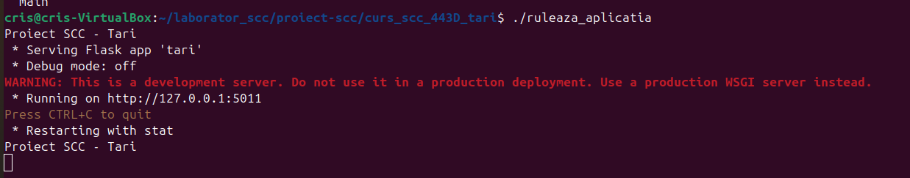

**Aplicația Accesată la `http://127.0.0.1:5011/`:**

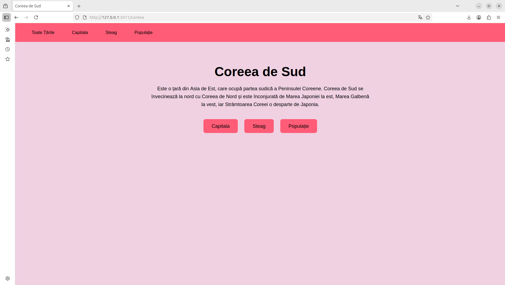

### Testare Locală folosind Pytest
Mai întâi am verificat că testele funcționează local.

**Testare Locală cu Pytest:**

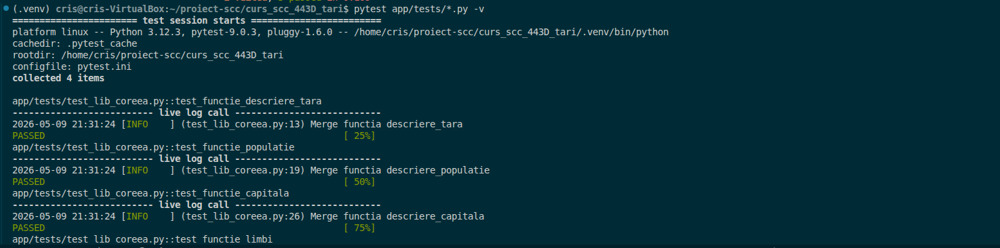


### Testare Automată folosind Jenkins

Am configurat un Pipeline în Jenkins care rulează automat testele. Testul din `app/tests/` a trecut cu succes (PASS).

**Dovadă Build Jenkins:**

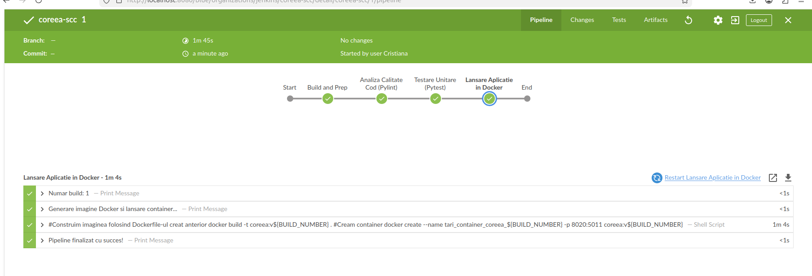

**Dovadă Teste Pytest în Jenkins:**


## 5. Containerizare (Docker)

Aplicația a fost containerizată folosind o imagine de Python 3.10-alpine. Containerul expune portul 5011 și poate fi accesat la `http://172.17.0.2:5011/`.

**Dovezi Containerizare:**

*1. Creare imagine Docker:*


*2. Start container creat:*


*3. Verificare a rulării containerului:*

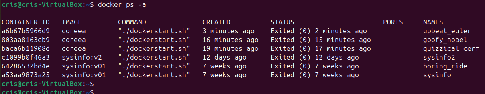

*4. Accesare aplicație din container (Browser):*

Aplicația va putea fi accesată la: `http://172.17.0.2:5011/`


*5. Log-uri consolă (interacțiune browser-container):*


## 6. Integrare și Review

- **Branch dezvoltare:** `dev_toaca_cristiana`
- **Pull Request (PR) către:** `main_toaca_cristiana` - Creat

## 7. Review-uri:

- [x] Am făcut review pentru colegul: [Tuturluță Fabian (Karther1337) / #35]
- [x] Am primit review de la: [ Gavrilă Radu (raduionutgavrila) / #20]

## 8. De făcut

 - [x] Finalizare cod și teste manuale.
 - [x] Aplicație containerizată și accesibilă.
 - [x] Succes Pipeline Jenkins.
 - [ ] Obținerea aprobării de la colegi pentru PR-ul final, în main.
 - [ ] Integrarea finală în branch-ul main.

# Norvegia - Enache Bogdan-Gabriel
[Tari Proiect](#index-țări)

## 1. Identificator Dezvoltator
- **Nume:** Enache Bogdan-Gabriel
- **Grupă:** 443D
- **Țară alocată:** Norvegia

## 2. Funcționalitate Adăugată

Am implementat logica pentru afișarea informațiilor despre Norvegia. Aceasta include:

- **descriere_tara()** – Returnează o descriere generală a Norvegiei.
- **descriere_capitala()** – Returnează capitala Norvegiei: Oslo.
- **descriere_populatie()** – Returnează populația Norvegiei.
- **descriere_limbi()** – Returnează limbile oficiale ale Norvegiei.
- **descriere_steag()** – Returnează imaginea steagului Norvegiei.

### Rute accesibile

| Rută | Descriere |
|------|-----------|
| `/` | Pagina principală – lista tuturor țărilor |
| `/norvegia` | Informații generale despre Norvegia |
| `/norvegia/capitala` | Capitala Norvegiei |
| `/norvegia/populatie` | Populația Norvegiei |
| `/norvegia/steag` | Steagul Norvegiei |

## 3. Stadiul Implementării
- [x] Cod funcționalitate adăugat

## 4. Testare

### Testare Manuală
Aplicația a fost verificată local rulând `./ruleaza_aplicatia` și accesând `http://127.0.0.1:5011/`.

**Output Consolă Locală:**

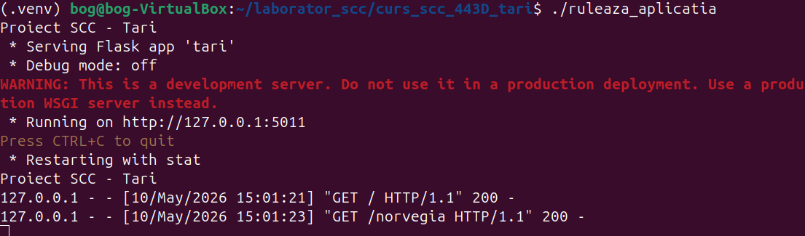

**Aplicația Accesată la `http://127.0.0.1:5011/`:**

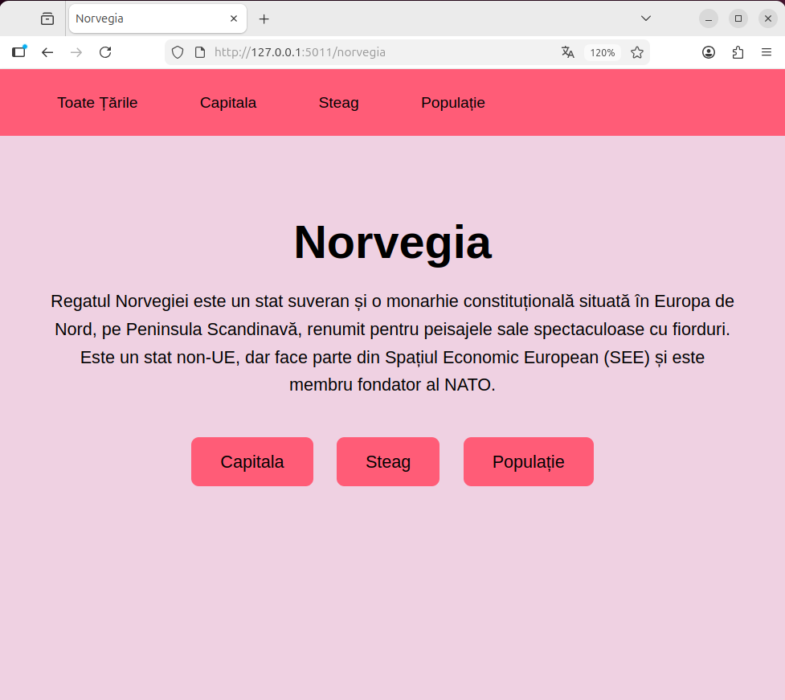

### Testare Locală folosind Pytest
Mai întâi am verificat că testele funcționează local.

**Testare Locală cu Pytest:**

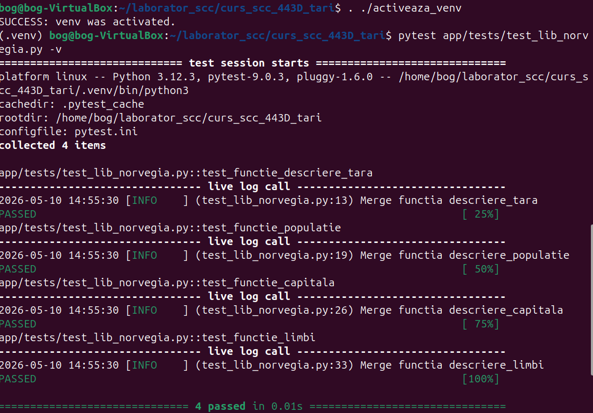

### Testare Automată folosind Jenkins

Am configurat un Pipeline în Jenkins care rulează automat testele. Testul din `app/tests/` a trecut cu succes (PASS).

**Dovadă Build Jenkins:**

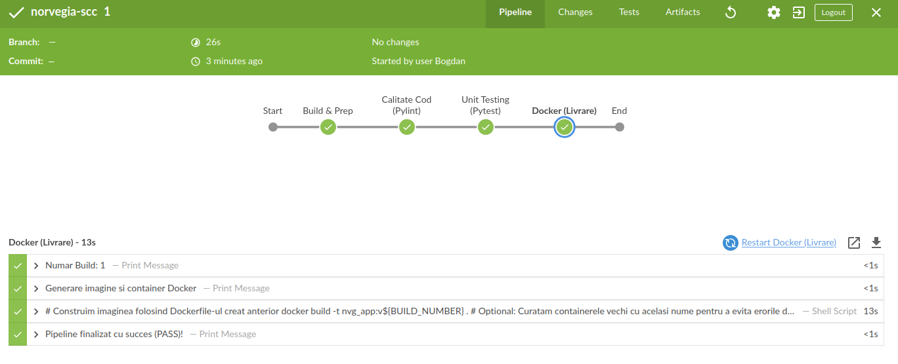

**Dovadă Teste Pytest în Jenkins:**

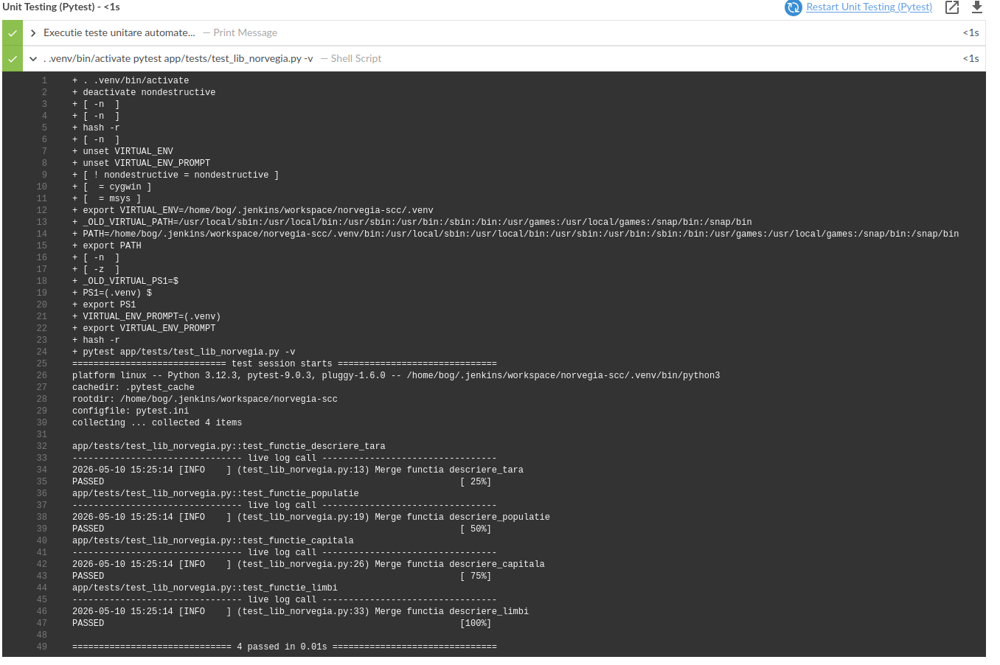

## 5. Containerizare (Docker)

Aplicația a fost containerizată folosind o imagine de Python 3.10-alpine. Containerul expune portul 5011 și poate fi accesat la `http://172.17.0.2:5011/`.

**Dovezi Containerizare:**

*1. Creare imagine Docker:*

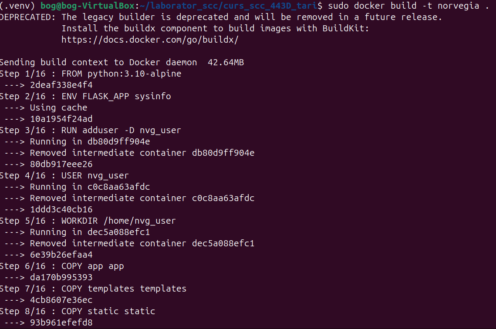

*2. Start container creat:*

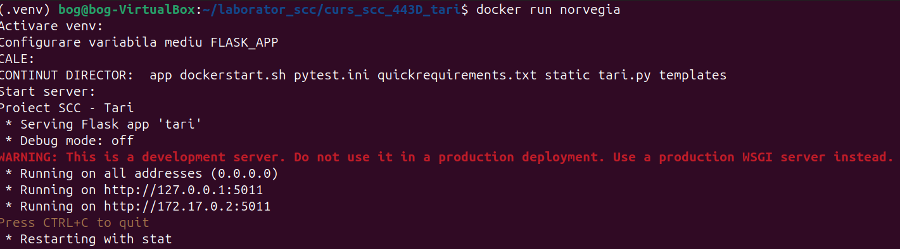

*3. Verificare a rulării containerului:*

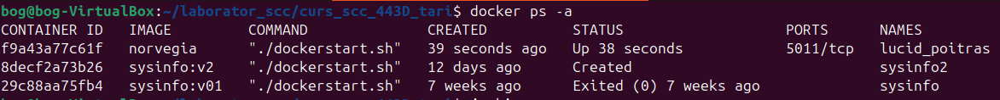

*4. Accesare aplicație din container (Browser):*

Aplicația va putea fi accesată la: `http://172.17.0.2:5011/`

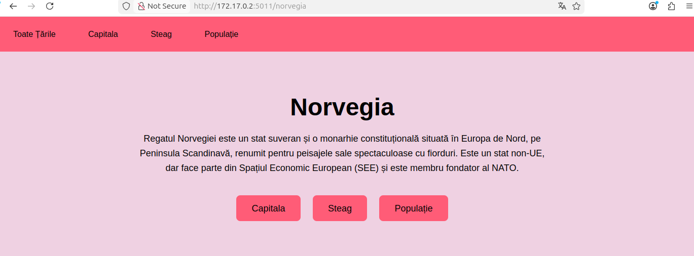

*5. Log-uri consolă (interacțiune browser-container):*

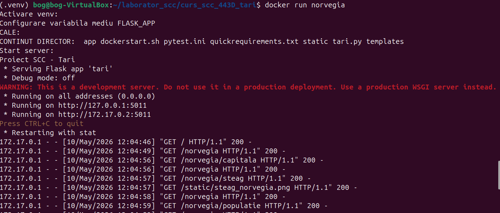

## 6. Integrare și Review

- **Branch dezvoltare:** `dev_enache_bogdan`
- **Pull Request (PR) către:** `main_enache_bogdan` - Creat

## 7. Review-uri:

- [ ] Am primit review de la: []

## 8. De făcut

 - [x] Finalizare cod și teste manuale.
 - [x] Aplicație containerizată și accesibilă.
 - [x] Succes Pipeline Jenkins.
 - [ ] Obținerea aprobării de la colegi pentru PR-ul final, în main.
 - [ ] Integrarea finală în branch-ul main.

=======

# România - Gheorghe Răzvan
[Tari Proiect](#index-țări)

## 1. Identificator Dezvoltator
- **Nume:** Gheorghe Răzvan
- **Grupă:** 443D
- **Țară alocată:** România

## 2. Funcționalitate Adăugată
Am implementat logica pentru afișarea informațiilor despre România. Aceasta include:
- Definirea rutelor în `app/lib/biblioteca_romania.py`.
- Adăugarea datelor specifice (populație, capitală, vecini) în dicționarul de țări.
- Integrarea steagului în folderul `static/`.

## 3. Stadiul Implementării
- [x] Cod funcționalitate adăugat

## 4. Testare
### Testare Manuală
Aplicația a fost verificată local rulând `./ruleaza_aplicatia` și accesând `http://localhost:5011`.

### Testare Automatizată (Jenkins)
Am configurat un Pipeline în Jenkins care rulează automat testele. Testul din `app/tests/` a trecut cu succes (PASS).

**Dovada Build Jenkins:**
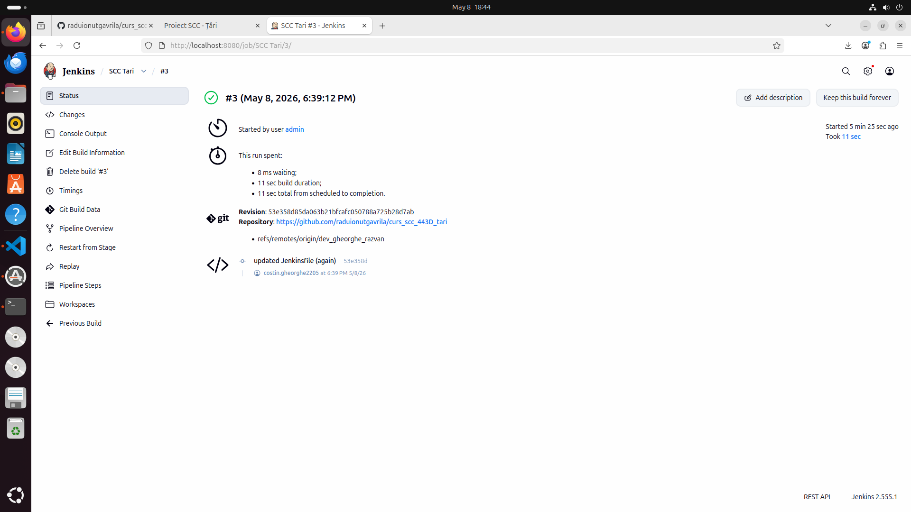
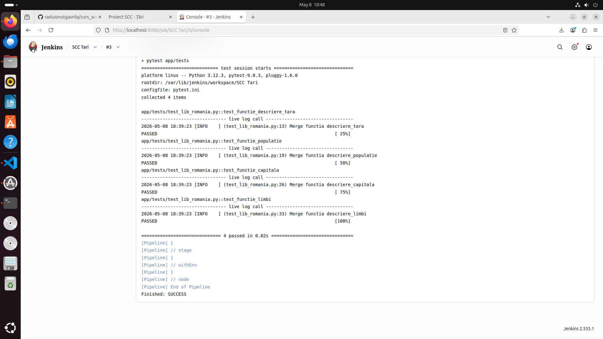


## 5. Containerizare (Docker)
Aplicația a fost containerizată folosind o imagine de Python 3.12-slim. Containerul expune portul 5011.

**Dovezi Containerizare:**

*1. Imaginea Docker creată:*
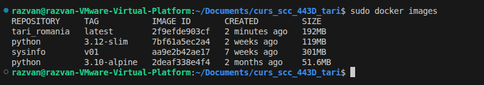

*2. Containerul rulând activ:*
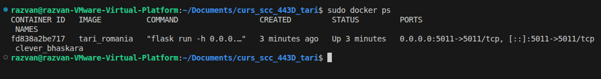

*3. Accesare aplicație din container (Browser):*


*4. Log-uri consolă (interacțiune browser-container):*


## 6. Integrare și Review
- **Branch dezvoltare: `dev_gheorghe_razvan`**
- **Pull Request (PR) către `main_gheorghe_razvan`:** 
Creat
- **Review-uri:**
    - [ ] Am făcut review pentru colegul: [Nume Coleg / ID PR]
    - [x] Am primit review de la: Zidu Cristian / PR ID: #6

## 7. Ce mai este de făcut
- [ ] Integrarea finală în branch-ul `main` al grupei după aprobarea tuturor review-urilor.


# Brazilia - Balaban Răzvan-Marian

[Tari Proiect](#index-țări)

# Cuprins

1. [Dezvoltator](#dezvoltator)
1. [Descriere aplicatie](#descriere-aplicatie)
1. [Descriere versiune](#descriere-versiune)
1. [Configurare](#configurare)
1. [Exemple pagina web](#exemple-pagina-web)
1. [Testare cu pytest](#testare-cu-pytest)
1. [Verificare statica. pylint - calitate cod](#verificare-statica-cu-pylint)
1. [Docker](#docker)
1. [DevOps](#devops-ci)
   1. [Pipeline Jenkins](#exemplu-executie-pipeline-jenkins)
1. [Bibliografie](#bibliografie)

# Dezvoltator
[cuprins](#cuprins)
- **Nume:** Balaban Răzvan-Marian
- **Grupă:** 443D
- **Țară alocată:** Brazilia

# Descriere aplicatie
[cuprins](#cuprins)

Elementul **Brazilia** din aplicația tari gestioneaza si afiseaza informatii detaliate despre geografia, demografia si cultura Braziliei intr-o interfata web intuitiva.
Sistemul de operare tinta este Linux, aplicatia fiind dezvoltata si testata pe distributia `Ubuntu 24.04`.
Componenta WEB a proiectului utilizeaza framework-ul `Flask`.

Arhitectura este una modulara: datele sunt procesate si extrase prin functii dedicate localizate in pachetul app/lib/, fiind ulterior preluate si returnate cu ajutorul functiilor view (localizate in `tari.py`) catre client sub forma de pagini HTML.

Pentru o experienta de utilizare facila, interfata include un sistem de navigare intre pagini:

* Pagina principala: Contine link-uri/butoane catre tarile alocate fiecarui student.
* Pagina specifica tarii: Odata selectata tara, se afiseaza o descriere scurta a acesteia si un meniu cu inca 3 butoane:

    * Capitala: Afiseaza capitala.
    * Steag: Afiseaza o imagine drapelului oficial
    * Populatie: Afiseaza numarul actualizat de locuitori.

* Sistemul de retur: Fiecare pagina contine link-uri de navigare inapoi pentru a asigura fluiditatea navigarii.

Aplicatia include suport pentru containerizare in fisierul `Dockerfile` din directorul principal al aplicatiei.

Din punct de vedere al verificarii calitatii, aplicatia include:

*    Unit testing: Realizat cu pytest pentru functiile din app/lib/, testele fiind organizate in directorul app/tests/.

*    Analiza statica: Verificarea conformitatii codului utilizand pylint.

`DevOps CI`.
Pipeline-ul pentru Jenkins este definint in fisierul `Jenkinsfile`.
Acesta asigura parcurgerea automata a etapelor de Build (creare venv), Linter (verificare calitate), Testare (pytest) si Deploy (lansarea containerului Docker pe portul 8020).

# Descriere versiune
[cuprins](#cuprins)

## v1.0 - Implementare structură ierarhică și integrare Docker/Jenkins.
*   Afișare date despre Brazilia
*   Adăugare link-uri între pagini
*   Configurare mapare porturi pentru acces prin container.

### Rute aplicație WEB:
*   **Ruta standard**  `/` - URL: `http://127.0.0.1:5011`
*   **Rute specifice Brazilia**:
    *   Pagina principală țară: `/brazilia` - URL: `http://127.0.0.1:5011/brazilia`
    *   Capitală:          `/brazilia/capitala` - URL: `http://127.0.0.1:5011/brazilia/capitala`
    *   Steag:             `/brazilia/steag` - URL: `http://127.0.0.1:5011/brazilia/steag`
    *   Populație:         `/brazilia/populatie` - URL: `http://127.0.0.1:5011/brazilia/populatie`

# Configurare
[cuprins](#cuprins)

Configurare .venv si instalare pachete

In directorul radacina `curs_scc_443D_tari` rulati comenzile:

1) **activeaza_venv**: Incearca sa activeze venv-ul. 
                   Daca nu poate, configureaza venv-ul in directorul .venv si apoi instaleaza flask si flask-bootstrap.
                   La urmatoarea rulare, va activa doar venv-ul.
                
2) **ruleaza_aplicatia**: De rulat doar dupa activarea venv-ului. 
                      Va porni serverul pe IP: 127.0.0.1 si port: 5011.
                      Acces server din browser: http://127.0.0.1:5011

# Exemplu activare venv si rulare

    razvan@razvan-VirtualBox:~/Desktop/proiect/curs_scc_443D_tari$ . ./activeaza_venv
    SUCCESS: venv was activated.
    (.venv) razvan@razvan-VirtualBox:~/Desktop/proiect/curs_scc_443D_tari$ ./ruleaza_aplicatia 
    Proiect SCC - Tari
    * Serving Flask app 'tari'
    * Debug mode: off
    WARNING: This is a development server. Do not use it in a production deployment. Use a production WSGI server instead.
    * Running on http://127.0.0.1:5011
    Press CTRL+C to quit
    * Restarting with stat
    Proiect SCC - Tari


# Exemple pagina web
[cuprins](#cuprins)

## Pagina principala
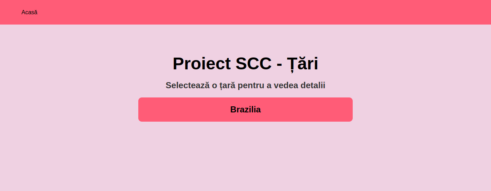

## Pagina specifica tarii
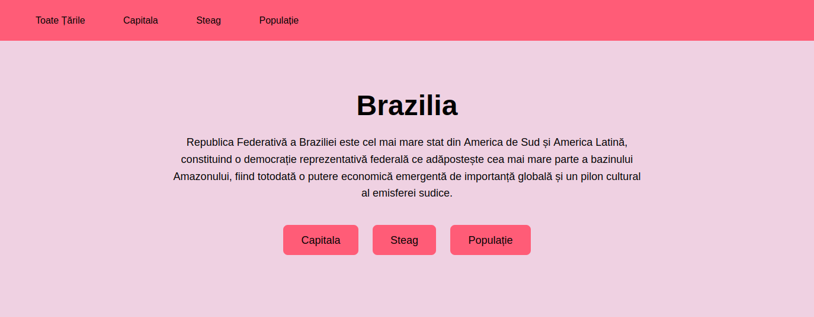

## Pagina - Capitala


## Pagina - Steag
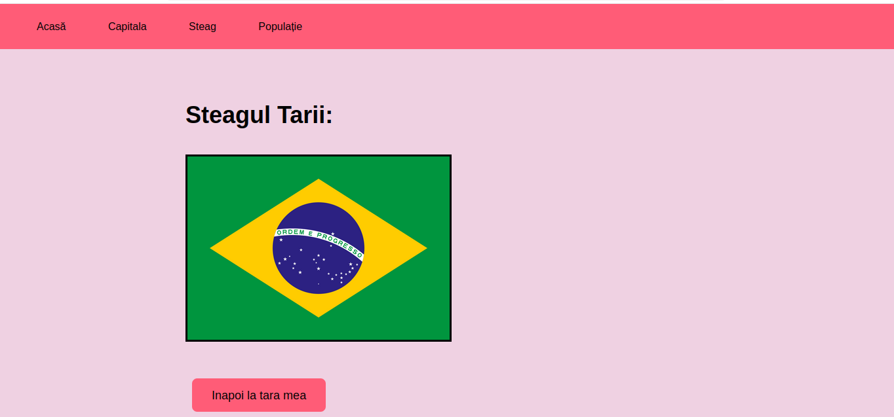

## Pagina - Populatie


# Testare cu pytest
[cuprins](#cuprins)

Funcțiile din biblioteca aplicației, localizate în directorul `app/lib/` (fișierul `biblioteca_brazilia.py`), au teste de tip 'unit-test' asociate. Acestea apelează funcția și compară valoarea obținută cu cea așteptată, returnând **PASS** dacă valorile coincid și **FAIL** în caz contrar.

Pentru testare s-a folosit pachetul **pytest** din Python. Acesta este instalat în mediul virtual prin scriptul de configurare.

Execuția testelor se face din directorul rădăcină al aplicației (`curs_scc_443D_tari`) folosind comanda:

```bash
(.venv) razvan@razvan-VirtualBox:~/Desktop/proiect/curs_scc_443D_tari$ pytest app/tests/test_lib_brazilia.py -v
```
Testele au fost rulate local cu succes folosind pytest:
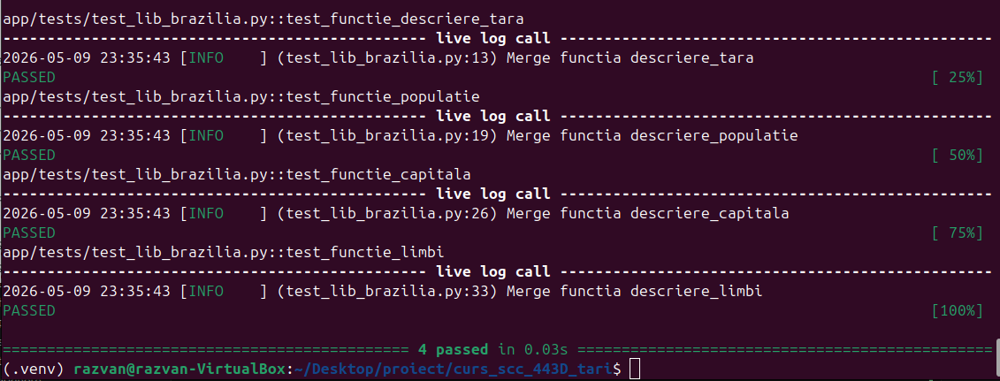

# Verificare statica cu pylint
[cuprins](#cuprins)

Pentru verificarea calității codului sursă se utilizează pachetul **pylint**. Acesta analizează conformitatea codului cu standardele Python (verifică spații, convenții de numire a variabilelor, variabile neutilizate etc.).

În cadrul acestui proiect, problemele raportate de **pylint** sunt doar afișate pentru monitorizare, nu sunt considerate erori.

```bash
(.venv) razvan@razvan-VirtualBox:~/Desktop/proiect/curs_scc_443D_tari$ pylint --exit-zero app/lib/*.py
(.venv) razvan@razvan-VirtualBox:~/Desktop/proiect/curs_scc_443D_tari$ pylint --exit-zero app/tests/*.py
(.venv) razvan@razvan-VirtualBox:~/Desktop/proiect/curs_scc_443D_tari$ pylint --exit-zero tari.py
```

# Docker
[cuprins](#cuprins)

Aplicația a fost containerizată folosind o imagine de Python 3.10-alpine. Containerul este configurat să ruleze procesul Flask pe portul intern **5011**.

## Creare imagine
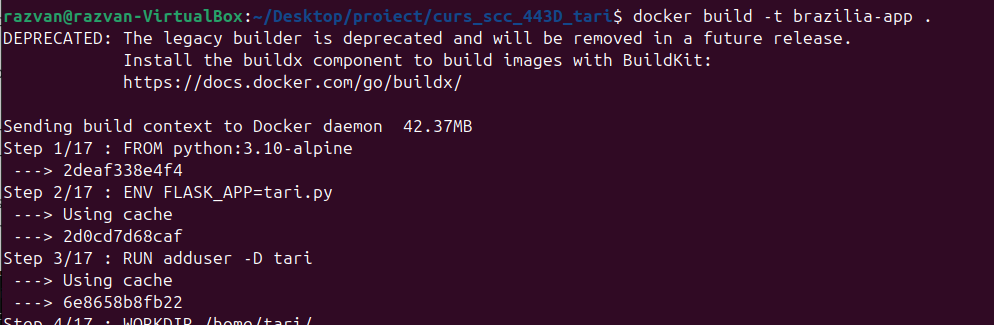

## Rulare container si vizualizare
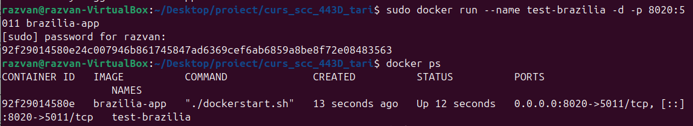

## Docker logs
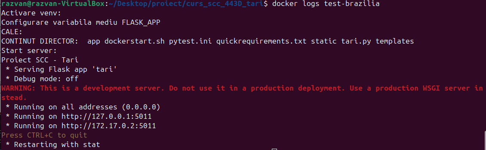

## Accesare aplicație din browser:
Aplicația poate fi accesată local la adresa http://localhost:8020 sau direct prin IP-ul intern alocat de Docker http://172.17.0.2:5011.
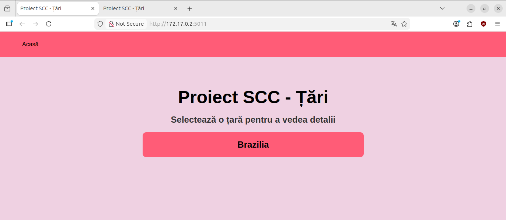

Pentru oprirea și eliminarea containerului, se utilizează următoarele comenzi:
 * **Oprire**: `docker stop test-brazilia`
 * **Ștergere**: `docker rm test-brazilia`

# DevOps CI
[cuprins](#cuprins)

- **CI** = Continuous Integration (Integrare Continuă)

Proiectul utilizează un flux de automatizare definit în `Jenkinsfile`, care asigură validarea codului și livrarea aplicației.

## Exemplu executie pipeline Jenkins

Pentru a se putea executa cu succes ultimul pas din pipeline-ul de Jenkins (crearea și lansarea containerului Docker), este necesar ca utilizatorul `jenkins` să aibă permisiuni de rulare a comenzilor Docker fără `sudo`.

Puteti gasi pasii de configurare pe [docs.docker.com - linux-postinstall](https://docs.docker.com/engine/install/linux-postinstall/).
Daca folositi masina virtuala linux, restartati masina dupa ce faceti configuratia.

**Etapele Pipeline-ului:**
1. **Build**: Crearea mediului virtual și instalarea dependințelor.
2. **Linter**: Verificarea stilului codului cu `pylint`.
3. **Unit Tests**: Rularea testelor cu `pytest`.
4. **Deploy**: Construirea imaginii Docker și pornirea containerului pe portul **8020**.


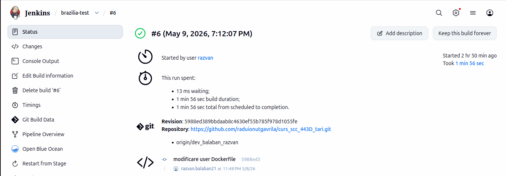

Aplicația poate fi accesată după finalizarea pipeline-ului la adresa: `http://localhost:8020/`

# Bibliografie:
[cuprins](#cuprins)

https://github.com/crchende/sysinfo.git

https://github.com/crchende/jenkinsdemo

https://www.jenkins.io/doc/book/installing/linux/


# Japonia - Ciobanu Andrei
[Tari Proiect](#index-țări)

## Student

Nume: Andrei Ciobanu  
Branch dezvoltare: dev_ciobanu_andrei  
Tema: Tari  
Tara aleasa: Japonia  

## Functionalitate adaugata

Am adaugat functionalitatea pentru tara Japonia.

Au fost modificate/adaugate urmatoarele fisiere:

- `app/lib/biblioteca_japonia.py`
- `app/lib/biblioteca_tari.py`
- `app/tests/test_lib_japonia.py`
- `static/steag_japonia.png`
- `Dockerfile`
- `Jenkinsfile`


## Descriere functionalitate

Pentru Japonia au fost implementate urmatoarele functii:

- `descriere_tara()`
- `descriere_limbi()`
- `descriere_populatie()`
- `descriere_capitala()`
- `descriere_steag()`

Aceste functii returneaza informatii despre tara, limba, populatie, capitala si steagul Japoniei.

## Testare locala cu Pytest

Testele au fost rulate local cu comanda:

```bash
pytest app/tests/test_lib_japonia.py -v
```

Rezultat obtinut:

```text
4 passed
```

Au fost rulate si toate testele proiectului cu:

```bash
pytest app/tests/*.py -v
```

Rezultat obtinut:

```text
4 passed
```

## Testare manuala Flask

Aplicatia a fost pornita local cu:

```bash
./ruleaza_aplicatia
```

Au fost verificate in browser urmatoarele pagini:

```text
http://127.0.0.1:5011
http://127.0.0.1:5011/japonia
http://127.0.0.1:5011/japonia/steag
http://127.0.0.1:5011/japonia/populatie
http://127.0.0.1:5011/japonia/capitala
```

Functionalitatea pentru Japonia a fost accesibila din browser.

---

## Containerizare cu Docker

Pentru containerizarea aplicatiei am creat fisierul `Dockerfile` in branch-ul personal de dezvoltare `dev_ciobanu_andrei`.

Dockerfile-ul porneste de la imaginea `python:3.12-slim`, copiaza fisierele proiectului, instaleaza dependintele din `quickrequirements.txt`, acorda permisiuni scripturilor si porneste aplicatia Flask folosind scriptul `dockerstart.sh`.

Imaginea Docker a fost construita cu urmatoarea comanda:

```bash
sudo docker build -t proiect-scc-japonia .
```

Imaginea a fost creata cu succes si apare in lista de imagini Docker:


Containerul a fost pornit cu urmatoarea comanda:

```bash
sudo docker run --rm -p 5011:5011 proiect-scc-japonia
```

Containerul pornit poate fi vazut cu `docker ps`:


In consola de rulare a containerului se observa ca aplicatia Flask porneste corect si ca browserul acceseaza rutele aplicatiei. Apar request-uri cu status `200` pentru paginile Japoniei:

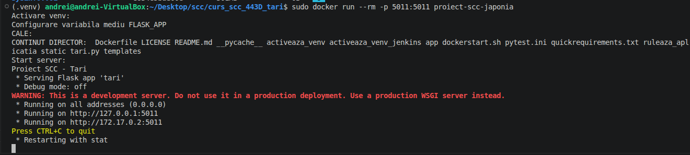

Aplicatia rulata in container a fost accesata din browser la adresa:

```text
http://127.0.0.1:5011/japonia
```


Prin acest test am verificat ca aplicatia a fost containerizata corect si ca functionalitatea pentru Japonia poate fi accesata din browser din container.

---

## Testare automata cu Jenkins

Pentru testarea automata am creat fisierul `Jenkinsfile` in branch-ul personal de dezvoltare `dev_ciobanu_andrei`.

A fost creat un job Jenkins de tip Pipeline cu numele:

```text
proiect-scc-japonia
```

Job-ul este configurat sa ia codul din repository-ul GitHub, de pe branch-ul `dev_ciobanu_andrei`, si sa ruleze fisierul `Jenkinsfile`.

Configurarea folosita:

- Definition: `Pipeline script from SCM`
- SCM: `Git`
- Repository URL: `https://github.com/raduionutgavrila/curs_scc_443D_tari.git`
- Branch Specifier: `*/dev_ciobanu_andrei`
- Script Path: `Jenkinsfile`

Job-ul Jenkins a rulat cu succes, avand status verde:

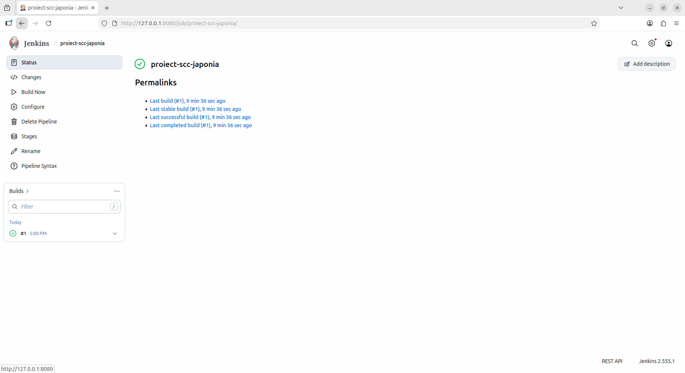

Pipeline-ul Jenkins pregateste mediul Python, instaleaza dependintele si ruleaza testele unitare cu pytest:

```bash
pytest app/tests/test_lib_japonia.py -v
```

Rezultatul rularii testelor in Jenkins a fost:

```text
4 passed
```

La finalul executiei, Jenkins a afisat:

```text
Finished: SUCCESS
```

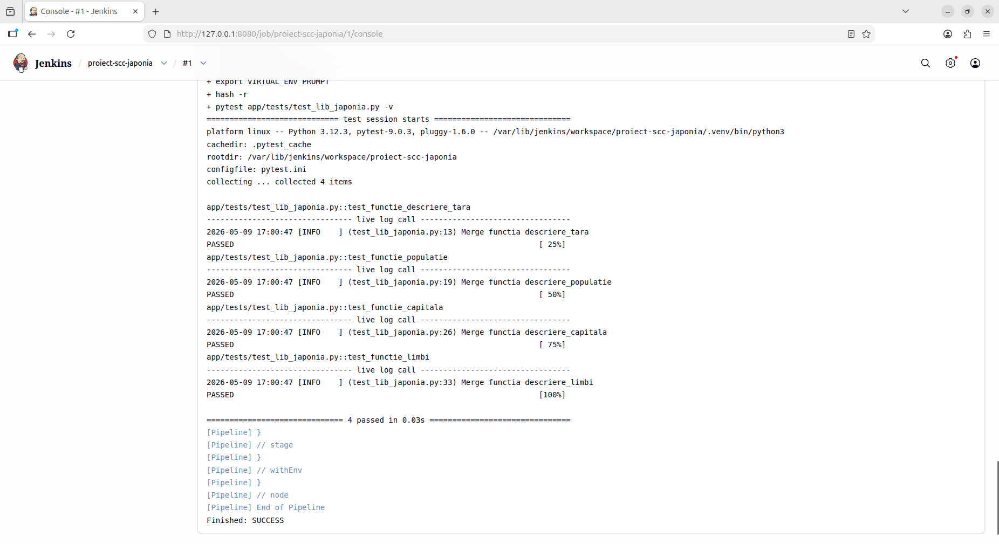

Prin acest test am verificat ca functionalitatea pentru Japonia este testata automat cu Jenkins si ca toate testele trec cu succes.

### Vizualizare pipeline in Jenkins Stages

Pe langa Console Output, am verificat rularea pipeline-ului si in pagina de Stages din Jenkins.

In aceasta pagina se vad etapele pipeline-ului:

- Build
- pylint - calitate cod
- Unit Testing cu pytest
- Deploy

Toate etapele au rulat cu succes, iar pipeline-ul a avut status final SUCCESS.

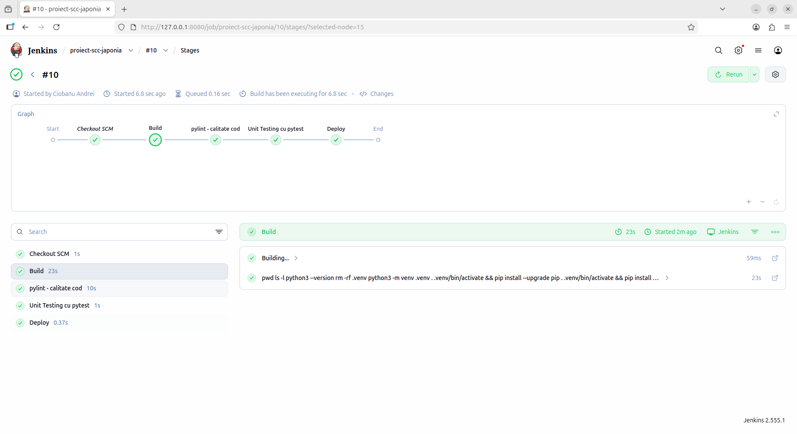

### Vizualizare pipeline in Blue Ocean

Pentru o vizualizare mai clara a pipeline-ului, am folosit si interfata Blue Ocean din Jenkins.

In Blue Ocean se poate observa executia etapelor pipeline-ului si faptul ca acestea au fost finalizate cu succes.

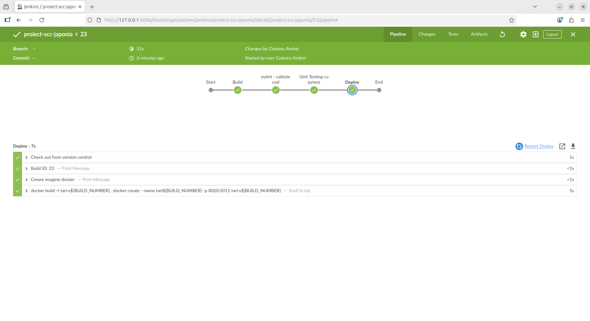

---

## Git si GitHub

Modificarile au fost adaugate in branch-ul personal:

```text
dev_ciobanu_andrei
```

Comenzi folosite pentru salvarea modificarilor:

```bash
git add .
git commit -m "Actualizeaza documentatia proiectului"
git push
```

## Pull Request

Urmeaza crearea unui Pull Request din branch-ul:

```text
dev_ciobanu_andrei
```

catre branch-ul indicat pentru integrare.

PR-ul trebuie sa primeasca review de la cel putin un coleg.

## Ce mai este de facut

- creare Pull Request;
- obtinere review de la un coleg;
- integrare in branch-ul stabilit de grupa.

# Germania - Colan Bianca
[Tari Proiect](#index-țări)

## 1. Identificator Dezvoltator

**Nume:** Bianca Colan  
**Grupă:** 443D  
**Țară alocată:** Germania  

---

## 2. Funcționalitate Adăugată

Am implementat logica pentru afișarea informațiilor despre Germania în aplicația web Flask.

Funcționalitatea include:

- crearea fișierului `app/lib/biblioteca_germania.py`;
- modificarea fișierului `app/lib/biblioteca_tari.py` pentru integrarea Germaniei în aplicație;
- adăugarea testelor automate în `app/tests/test_lib_germania.py`;
- adăugarea steagului Germaniei în folderul `static/`;
- adăugarea fișierelor `Dockerfile` și `Jenkinsfile`.

Descrierea Germaniei include informații generale despre țară și atracții turistice reprezentative.

Au fost incluse atracții precum:

- BMW Museum din München;
- Mercedes-Benz Museum din Stuttgart;
- Porsche Museum din Stuttgart-Zuffenhausen;
- Poarta Brandenburg din Berlin;
- Castelul Neuschwanstein din Bavaria;
- Catedrala din Köln;
- Pădurea Neagră;
- Zidul Berlinului;
- Marienplatz din München;
- Valea Rinului.

De asemenea, descrierea menționează berării populare din Bavaria, precum:

- Hofbräuhaus München;
- Augustiner Bräustuben;
- Paulaner Bräuhaus.

---

## 3. Stadiul Implementării

- [x] Cod funcționalitate adăugat
- [x] Teste automate adăugate
- [x] Steag Germania adăugat
- [x] Dockerfile adăugat
- [x] Jenkinsfile adăugat
- [x] Aplicația a fost rulată local
- [x] Testele au fost rulate local cu succes
- [x] Aplicația a fost rulată în container Docker
- [x] Pipeline-ul Jenkins a fost rulat cu succes

---

## 4. Structura Proiectului

```text
.
├── activeaza_venv
├── activeaza_venv_jenkins
├── app
│   ├── lib
│   │   ├── biblioteca_germania.py
│   │   ├── biblioteca_header.py
│   │   └── biblioteca_tari.py
│   └── tests
│       └── test_lib_germania.py
├── dockerstart.sh
├── Dockerfile
├── Jenkinsfile
├── pytest.ini
├── quickrequirements.txt
├── README.md
├── ruleaza_aplicatia
├── screenshots
│   ├── germania_docker_browser.png
│   ├── germania_germania_docker_build.png
│   ├── germania_germania_jenkins_build_pass.png
│   ├── germania_germania_jenkins_console_output.png
│   └── germania_pytest.png
├── static
│   └── steag_germania.png
├── tari.py
└── templates
    ├── base.html
    ├── home.html
    ├── pagina.html
    ├── steag.html
    └── tara.html
```

---

## 5. Fișiere Modificate / Adăugate

### `app/lib/biblioteca_germania.py`

Conține funcțiile pentru afișarea informațiilor despre Germania:

- `descriere_tara()`
- `descriere_limbi()`
- `descriere_populatie()`
- `descriere_capitala()`
- `descriere_steag()`

Funcția `descriere_tara()` prezintă Germania într-un mod general și include atracții importante, începând cu muzeele auto BMW, Mercedes-Benz și Porsche.

### `app/lib/biblioteca_tari.py`

A fost modificat pentru:

- importarea bibliotecii Germaniei;
- adăugarea țării în dicționarul `TARI`;
- maparea bibliotecii în dicționarul `BIBLIOTECI`.

### `app/tests/test_lib_germania.py`

Conține testele automate pentru funcțiile implementate în biblioteca Germaniei.

### `static/steag_germania.png`

Conține imaginea steagului Germaniei.

### `Dockerfile`

Folosit pentru containerizarea aplicației. Fișierul a fost adăugat după modelul existent în branch-ul `dev_gavrila_radu`.

### `Jenkinsfile`

Folosit pentru rularea pipeline-ului Jenkins. Fișierul a fost adăugat după modelul existent în branch-ul `dev_gavrila_radu`.

### `screenshots/`

Conține dovezi pentru rularea testelor, Docker și Jenkins.

---

## 6. Rute Disponibile

| Rută | Descriere |
|---|---|
| `/` | Pagina principală |
| `/germania` | Pagina principală pentru Germania |
| `/germania/capitala` | Afișează capitala Germaniei |
| `/germania/populatie` | Afișează populația Germaniei |
| `/germania/limbi` | Afișează limba principală |
| `/germania/steag` | Afișează steagul Germaniei |

---

## 7. Testare

### Testare Manuală

Aplicația a fost verificată local rulând:

```bash
. ./activeaza_venv
./ruleaza_aplicatia
```

Aplicația a fost accesată în browser la:

```text
http://127.0.0.1:5011
```

Rute verificate manual:

```text
http://127.0.0.1:5011/germania
http://127.0.0.1:5011/germania/capitala
http://127.0.0.1:5011/germania/populatie
http://127.0.0.1:5011/germania/limbi
http://127.0.0.1:5011/germania/steag
```

### Testare Automată

Testele se află în:

```text
app/tests/test_lib_germania.py
```

Funcții testate:

- `descriere_tara()`
- `descriere_populatie()`
- `descriere_capitala()`
- `descriere_limbi()`

Comanda utilizată pentru rularea testelor:

```bash
pytest app/tests/test_lib_germania.py -v
```

Rezultat obținut local:

```text
4 passed
```

Dovadă rulare teste:


---

## 8. Jenkins

A fost adăugat fișierul:

```text
Jenkinsfile
```

Pipeline-ul Jenkins include etape pentru:

- build;
- verificarea calității codului cu `pylint`;
- rularea testelor automate cu `pytest`;
- creare imagine Docker.

Testarea automată cu Jenkins rulează testele din folderul:

```text
app/tests/
```

Job-ul Jenkins pentru proiectul Germania a fost rulat cu succes.

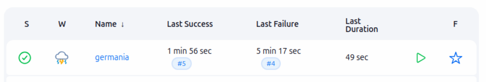

În Console Output se observă rularea pipeline-ului Jenkins și finalizarea cu succes.


---

## 9. Containerizare Docker

A fost adăugat fișierul:

```text
Dockerfile
```

Aplicația poate fi containerizată folosind Docker.

Construirea imaginii Docker:

```bash
sudo docker build -t germania-app .
```

Dovadă construire imagine Docker:


Rularea containerului:

```bash
sudo docker run --rm -p 8020:5011 germania-app
```

După rularea containerului, aplicația poate fi accesată la:

```text
http://127.0.0.1:8020/germania
```

Dovadă rulare aplicație în container:


---

## 10. Integrare și Review

Branch dezvoltare:

```text
dev_colan_bianca
```

Branch main personal:

```text
main_colan_bianca
```

Pull Request:

```text
dev_colan_bianca -> main_colan_bianca
```

Review-uri:

- [ ] Am făcut review pentru colegul: ................................
- [ ] Am primit review de la: ................................

---

## 11. Ce mai este de făcut

- [ ] Integrarea finală în branch-ul principal al grupei, dacă este cerută de cadrul didactic

---

## 12. Concluzie

Proiectul implementează țara Germania în structura aplicației existente, respectând template-ul primit.

Au fost adăugate:

- biblioteca pentru Germania;
- testele automate;
- steagul Germaniei;
- Dockerfile;
- Jenkinsfile;
- screenshots cu dovezi de rulare;
- documentația în README.


# Italia - Dumitrache Alexandru
[Tari Proiect](#index-țări)

## Dezvoltator
- **Nume:** Dumitrache Alexandru
- **Grupa:** 443D
- **Tema:** Țări
- **Element:** Italia
- **Branch de dezvoltare:** `dev_dumitrache_alexandru`

---

## Funcționalitate adăugată

Am adăugat funcționalitate referitoare la **Italia** în fișierul `app/lib/biblioteca_italia.py`:

- **descriere_tara()** – Returnează o descriere generală a Italiei
- **descriere_capitala()** – Returnează informații despre capitala Roma
- **descriere_populatie()** – Returnează informații despre populația Italiei
- **descriere_limbi()** – Returnează limbile oficiale ale Italiei
- **descriere_steag()** – Returnează descrierea și imaginea steagului Italiei

### Rute disponibile

| Ruta | Descriere |
|------|-----------|
| `/` | Pagina principală – lista tuturor țărilor |
| `/italia` | Informații generale despre Italia |
| `/italia/capitala` | Capitala Italiei – Roma |
| `/italia/populatie` | Populația Italiei |
| `/italia/steag` | Steagul Italiei |

### Fișiere modificate/adăugate
- `app/lib/biblioteca_italia.py` – **NOU** – biblioteca cu funcțiile pentru Italia
- `app/lib/biblioteca_tari.py` – **MODIFICAT** – adăugat import și înregistrare Italia în TARI și BIBLIOTECI
- `app/tests/test_lib_italia.py` – **NOU** – teste unitare pentru Italia
- `Jenkinsfile` – **NOU** – pipeline declarativ pentru Jenkins
- `Dockerfile` – **NOU** – containerizarea aplicației

---

## Stadiul implementării

- [x] Cod funcționalitate adăugat (`app/lib/biblioteca_italia.py`)
- [x] Italia înregistrată în `biblioteca_tari.py` (TARI + BIBLIOTECI)
- [x] Teste unitare scrise (`app/tests/test_lib_italia.py`)
- [x] Jenkinsfile configurat
- [x] Dockerfile creat
- [x] README.md completat

---

## Testare

### Testare manuală
Aplicația a fost verificată local rulând `./ruleaza_aplicatia` și accesând `http://localhost:5011`.

### Testare cu Jenkins
- Fișierul `Jenkinsfile` este configurat cu un pipeline declarativ
- Pipeline-ul conține etapele: Build, Verificare calitate cod (pylint), Teste unitare (pytest)
- Testele unitare se execută cu `pytest`
- **Rezultat:** PASS

**Dovada Build Jenkins:**
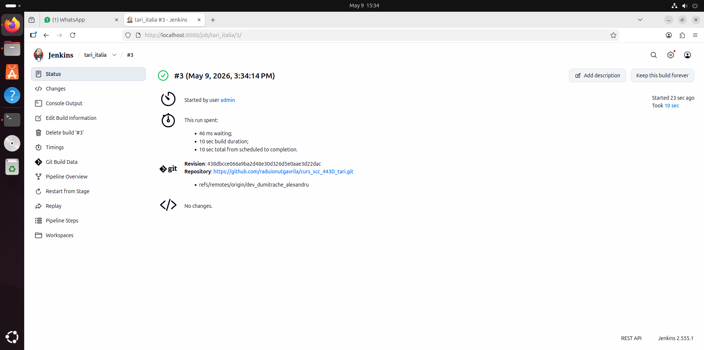
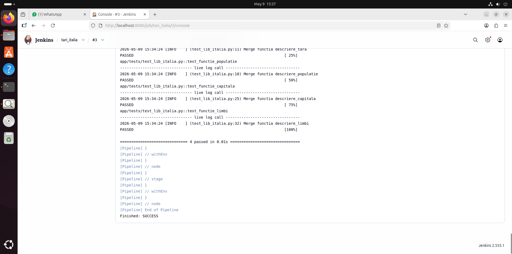

### Teste unitare (4/4 PASS)
- `test_functie_descriere_tara` – PASS
- `test_functie_populatie` – PASS
- `test_functie_capitala` – PASS
- `test_functie_limbi` – PASS

---

## Containerizare

### Construire imagine Docker
```bash
docker build -t scc_tari_italia .
```

### Creare și rulare container
```bash
docker run -d -p 5011:5011 --name tari_italia scc_tari_italia
```

### Accesare aplicație din browser
Aplicația poate fi accesată la: `http://localhost:5011/italia`

### Capturi de ecran

*Terminal - docker images, docker ps, docker logs:*
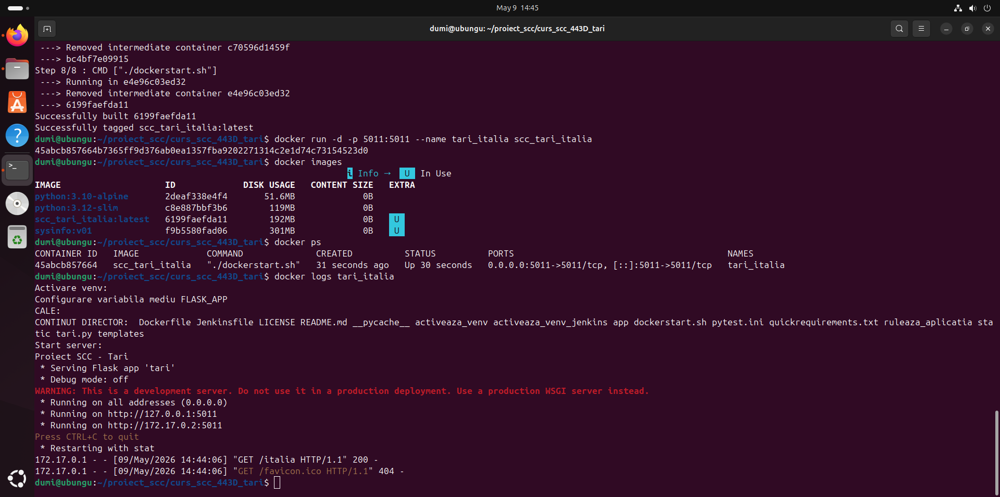

*Browser - accesare aplicație din container:*
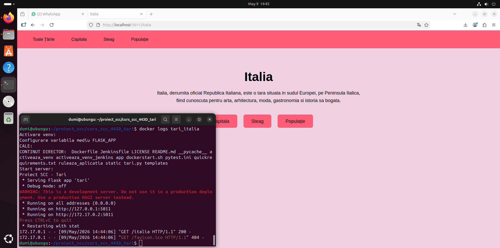

---

## Integrare (Pull Request)

- Branch sursă: `dev_dumitrache_alexandru`
- Branch destinație: `main_dumitrache_alexandru`
- Status: COMPLETAT (PR #37)
- Review de la: `Teodorescu-Colciu Matei (Doewsb [])`

---

## Pull Request-uri la care am făcut review

| PR ID | Autor | Descriere |
|-------|-------|-----------|
| #39 | Doewsb [] | Update README.md |

---

## Ce mai este de făcut

- [x] Obținere review de la un coleg
- [x] Review la PR-ul unui coleg
- [ ] Integrare README.md în branch-ul main


# Statele Unite - Esterabadeyan Hadi
[Tari Proiect](#index-țări)

## 1. Dezvoltator
- **Nume:** Esterabadeyan Hadi
- **Grupa:** 443D
- **Tara alocata:** Statele Unite

## 2. Functionalitate Adaugata
Am implementat funcționalitatea pentru Statele Unite ale Americii, incluzând:
 - Biblioteca specifică: app/lib/biblioteca_statele_unite.py.
 - Integrare: Actualizarea app/lib/biblioteca_tari.py pentru a include rutele și datele SUA.
 - Rute Flask: Rutele pentru descriere, capitală, populație, limbi și steag sunt active și funcționale.

## 3. Stadiul Implementarii
 - Cod Aplicație: Finalizat și verificat local.
 - Rute Web: Accesibile prin browser la portul 5011.
 - Resurse Statice: Steagul SUA adăugat în static/steag_sua.png

## 4. Testare
### Testare Manuală
 - Testare Manuală: Verificarea fiecărei rute în browser (Status: OK).
 - Testare Unitara (Pytest): Toate testele din app/tests/test_lib_statele_unite.py trec cu succes.
 - Configurare Jenkins: Creat Jenkinsfile cu etapele: Build, Linting, Unit Testing și Docker.
 - Status Jenkins: PASS.

**Test manual - Pytest**


**Status Build Jenkins**


## 5. Containerizare (Docker)
Aplicația a fost containerizată folosind un Dockerfile bazat pe Python Alpine.

**Dovezi Containerizare:**

1. Imaginea Docker creata
 - Imaginea creata manual este sua-app:latest
 - Imaginea creata automat de Jenkins este sua_app:v3


2. Containerul creat pe baza imaginii
 - Containerul creat manual este docker_app
 - Containerul creat manual este tari_container_3


3 Accesarea aplicatiei din container
 - Rularea containerului
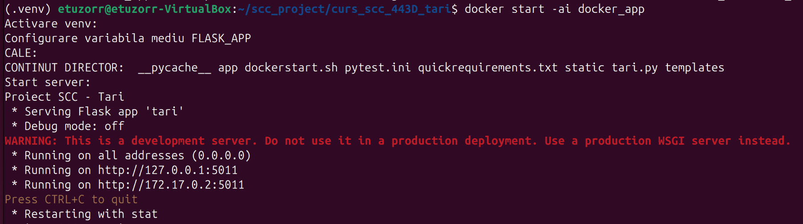
 - Accesarea aplicatiei web
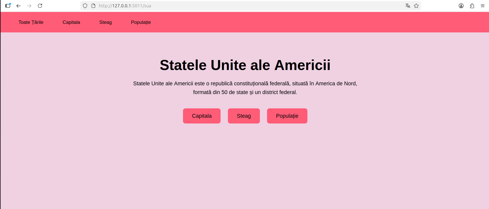

4 Log-uri consola docker
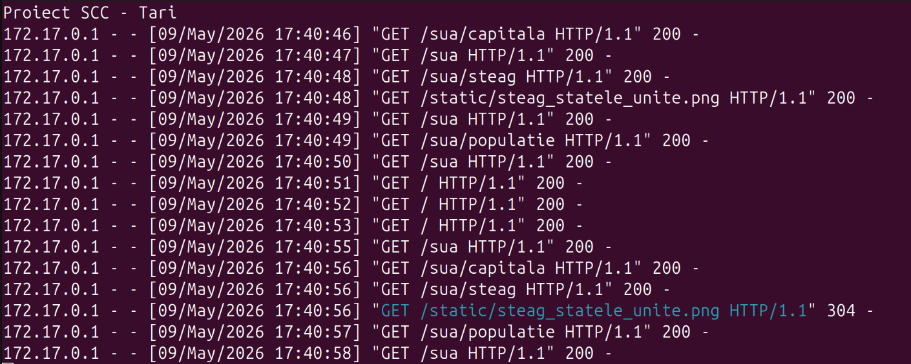


## 6. Integrare și Review
 - Branch sursa: `dev_esterabadeyan_hadi`
 - Branch destinatie: `main_esterabadeyan_hadi`
 - Status: complet si functional

## Pull Request-uri la care am făcut review

| PR ID | Autor | Descriere |
|-------|-------|-----------|
| 21 | Roseanu Vlad George (Vlad54689) | arata bine |

## 7. Comenzi necesare
 - Testare manuala cu pytest:
 ```bash
pytest app/tests/test_lib_statele_unite.py -v
 ```

  - Construirea imaginii:
```bash
docker build -t <nume_img> <locatia_fisierului_dockerfile>
```

 - Creare si construire container:
 ```bash
docker run -it --name <nume_cont> -p <port_local>:<port_intern> <imagine>
```

 - Repornirea containerului existent in mod interactiv:
 ```bash
docker start -ai <nume_cont>
```

## 8. Ce mai este de făcut

 - [x] Finalizare cod și teste manuale.
 - [x] Aplicație containerizată și accesibilă.
 - [x] Succes Pipeline Jenkins.
 - [ ] Obținerea aprobării de la colegi pentru PR-ul final.
 - [ ] Integrarea finală în branch-ul main.


# Estonia - Zidu Cristian
[Tari Proiect](#index-țări)

## Cuprins

1. [Dezvoltator](#dezvoltator)
1. [Descriere aplicatie](#descriere-aplicatie)
1. [Descriere versiune](#descriere-versiune)
1. [Configurare](#configurare)
1. [Exemple pagina web](#exemple-pagina-web)
1. [Testare cu pytest](#testare-cu-pytest)
1. [Verificare statica. pylint - calitate cod](#verificare-statica-cu-pylint)
1. [Docker](#docker)
1. [DevOps](#devops-ci)
   1. [Pipeline Jenkins](#exemplu-executie-pipeline-jenkins)
1. [Bibliografie](#bibliografie)

## Dezvoltator
[cuprins](#cuprins)
- *Nume:* Zidu Cristian
- *Grupă:* 443D
- *Țară alocată:* Estonia

## Descriere aplicatie
[cuprins](#cuprins)

Elementul *Estonia* din aplicația tari gestioneaza si afiseaza informatii detaliate despre geografia, demografia si cultura Estoniei intr-o interfata web intuitiva.
Sistemul de operare tinta este Linux, aplicatia fiind dezvoltata si testata pe distributia Ubuntu 24.04.
Componenta WEB a proiectului utilizeaza framework-ul Flask.

Arhitectura este una modulara: datele sunt procesate si extrase prin functii dedicate localizate in pachetul app/lib/, fiind ulterior preluate si returnate cu ajutorul functiilor view>

Pentru o experienta de utilizare facila, interfata include un sistem de navigare intre pagini:

* Pagina principala: Contine link-uri/butoane catre tarile alocate fiecarui student.
* Pagina specifica tarii: Odata selectata tara, se afiseaza o descriere scurta a acesteia si un meniu cu inca 3 butoane:

    * Capitala: Afiseaza capitala.
    * Steag: Afiseaza o imagine drapelului oficial
    * Populatie: Afiseaza numarul actualizat de locuitori.

* Sistemul de retur: Fiecare pagina contine link-uri de navigare inapoi pentru a asigura fluiditatea navigarii.

Aplicatia include suport pentru containerizare in fisierul `Dockerfile` din directorul principal al aplicatiei.

Din punct de vedere al verificarii calitatii, aplicatia include:

*    Unit testing: Realizat cu pytest pentru functiile din app/lib/, testele fiind organizate in directorul app/tests/.

*    Analiza statica: Verificarea conformitatii codului utilizand pylint.

`DevOps CI`.
Pipeline-ul pentru Jenkins este definint in fisierul `Jenkinsfile`.
Acesta asigura parcurgerea automata a etapelor de Build (creare venv), Linter (verificare calitate), Testare (pytest) si Deploy (lansarea containerului Docker pe portul 8020).

## Descriere versiune
[cuprins](#cuprins)

### v1.0 - Implementare structură ierarhică și integrare Docker/Jenkins.
*   Afișare date despre Estonia
*   Adăugare link-uri între pagini
*   Configurare mapare porturi pentru acces prin container.

### Rute aplicație WEB:
*   **Ruta standard**  `/` - URL: `http://127.0.0.1:5011`
*   **Rute specifice Estonia**:
    *   Pagina principală țară: `/estonia` - URL: `http://127.0.0.1:5011/estonia`
    *   Capitală:          `/estonia/capitala` - URL: `http://127.0.0.1:5011/estonia/capitala`
    *   Steag:             `/estonia/steag` - URL: `http://127.0.0.1:5011/estonia/steag`
    *   Populație:         `/estonia/populatie` - URL: `http://127.0.0.1:5011/estonia/populatie`

## Configurare
[cuprins](#cuprins)

Configurare .venv si instalare pachete

In directorul radacina `curs_scc_443D_tari` rulati comenzile:

1) **activeaza_venv**: Incearca sa activeze venv-ul.
                   Daca nu poate, configureaza venv-ul in directorul .venv si apoi instaleaza flask si flask-bootstrap.
                   La urmatoarea rulare, va activa doar venv-ul.
                
2) **ruleaza_aplicatia**: De rulat doar dupa activarea venv-ului.
                      Va porni serverul pe IP: 127.0.0.1 si port: 5011.
                      Acces server din browser: http://127.0.0.1:5011

## Exemplu activare venv si rulare

    dawall@dawall-VirtualBox:~/Desktop/proiect/curs_scc_443D_tari$ . ./activeaza_venv
    SUCCESS: venv was activated.
    (.venv) dawall@dawall-VirtualBox:~/Desktop/proiect/curs_scc_443D_tari$ ./ruleaza_aplicatia 
    Proiect SCC - Tari
    * Serving Flask app 'tari'
    * Debug mode: off
    WARNING: This is a development server. Do not use it in a production deployment. Use a production WSGI server instead.
    * Running on http://127.0.0.1:5011
    Press CTRL+C to quit
    * Restarting with stat
    Proiect SCC - Tari

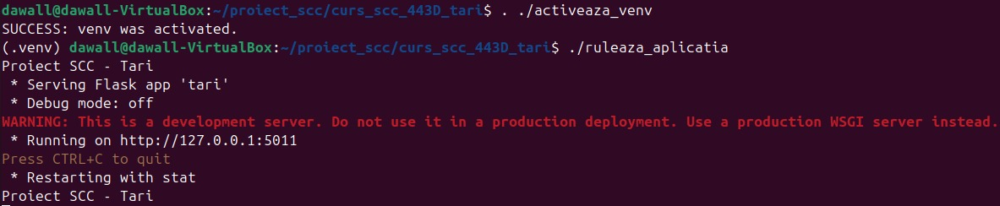

# Exemple pagina web
[cuprins](#cuprins)

## Pagina principala
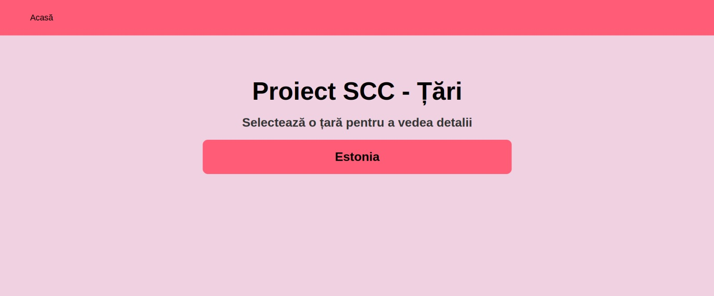

## Pagina specifica tarii
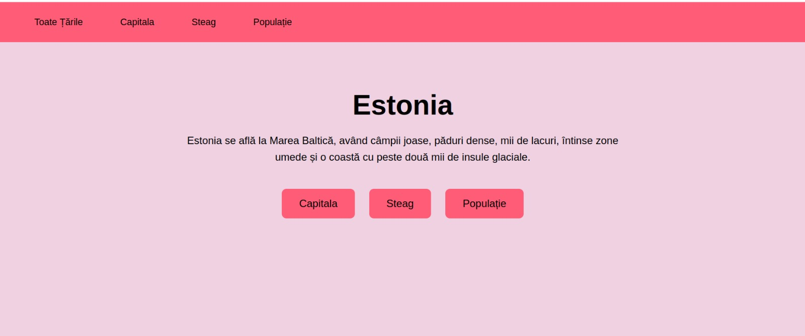

## Pagina - Capitala
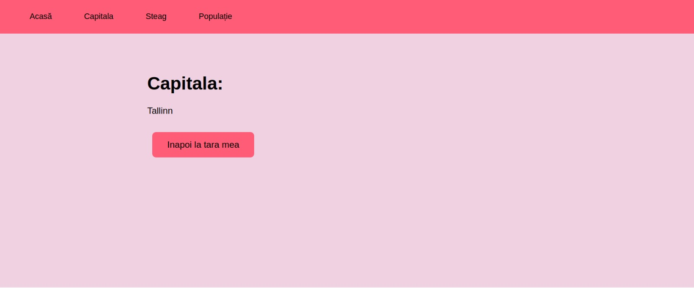

## Pagina - Steag

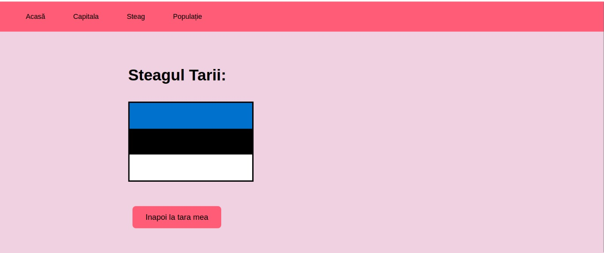

## Pagina - Populatie
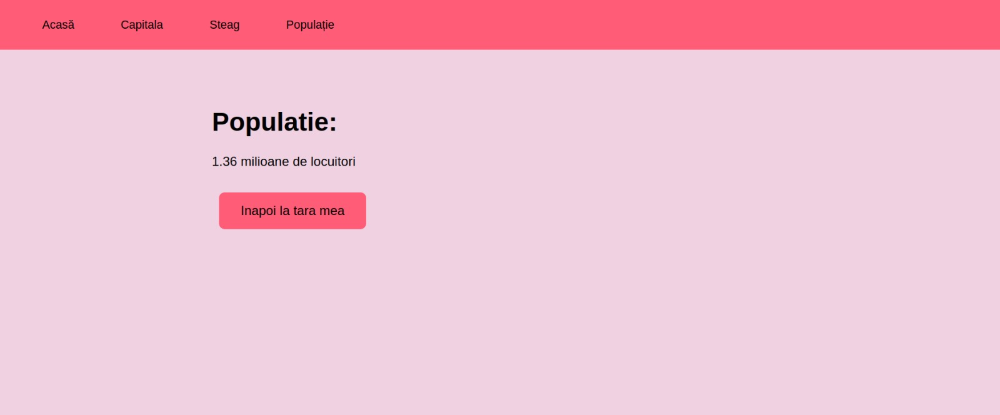


# Testare cu pytest
[cuprins](#cuprins)

Funcțiile din biblioteca aplicației, localizate în directorul `app/lib/` (fișierul `biblioteca_estonia.py`), au teste de tip 'unit-test' asociate. Acestea apelează funcția și compară >

Pentru testare s-a folosit pachetul **pytest** din Python. Acesta este instalat în mediul virtual prin scriptul de configurare.

Execuția testelor se face din directorul rădăcină al aplicației (`curs_scc_443D_tari`) folosind comanda:

```bash
(.venv) dawall@dawall-VirtualBox:~/Desktop/proiect/curs_scc_443D_tari$ pytest app/tests/test_lib_estonia.py -v
```
Testele au fost rulate local cu succes folosind pytest:
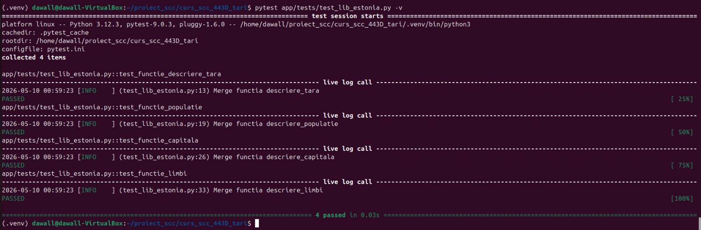

# Verificare statica cu pylint
[cuprins](#cuprins)

Pentru verificarea calității codului sursă se utilizează pachetul **pylint**. Acesta analizează conformitatea codului cu standardele Python (verifică spații, convenții de numire a var>

În cadrul acestui proiect, problemele raportate de **pylint** sunt doar afișate pentru monitorizare, nu sunt considerate erori.

```bash
(.venv) dawall@dawall-VirtualBox:~/Desktop/proiect/curs_scc_443D_tari$ pylint --exit-zero app/lib/*.py
(.venv) dawall@dawall-VirtualBox:~/Desktop/proiect/curs_scc_443D_tari$ pylint --exit-zero app/tests/*.py
(.venv) dawall@dawall-VirtualBox:~/Desktop/proiect/curs_scc_443D_tari$ pylint --exit-zero tari.py
```

# Docker
[cuprins](#cuprins)

Aplicația a fost containerizată folosind o imagine de Python 3.10-alpine. Containerul este configurat să ruleze procesul Flask pe portul intern *5011*.

## Creare imagine
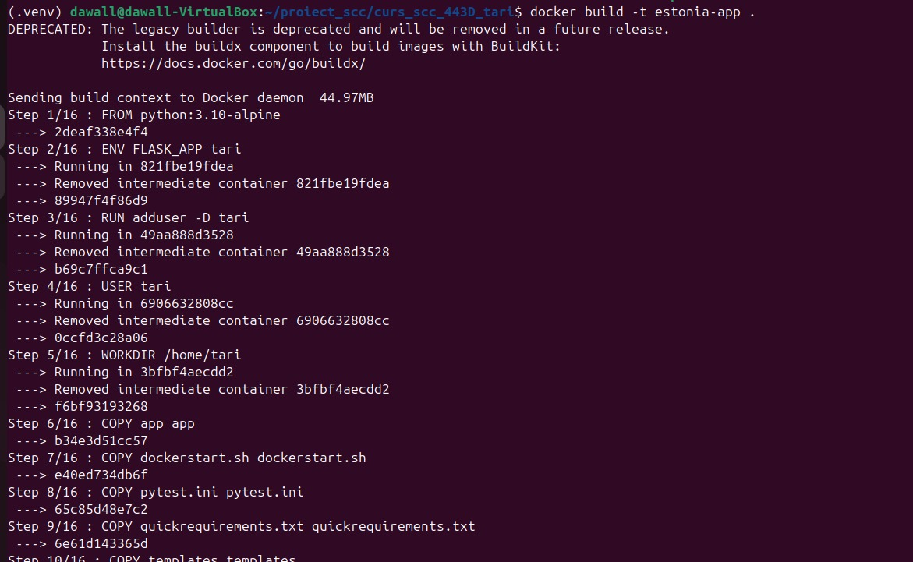

## Rulare container si vizualizare
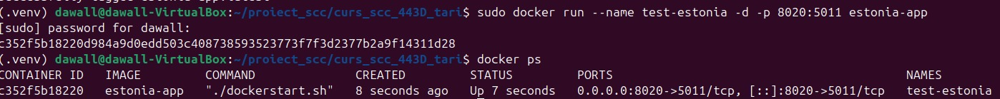

## Docker logs
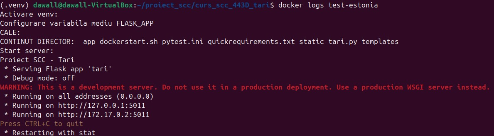

## Accesare aplicație din browser:
Aplicația poate fi accesată local la adresa http://localhost:8020 sau direct prin IP-ul intern alocat de Docker http://172.17.0.2:5011.
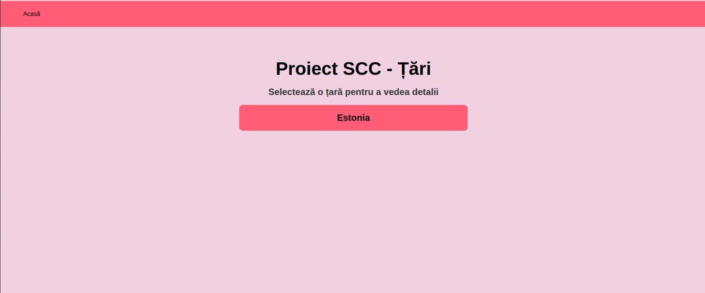

Pentru oprirea și eliminarea containerului, se utilizează următoarele comenzi:
 * *Oprire*: docker stop test-estonia
 * *Ștergere*: docker rm test-estonia

# DevOps CI
[cuprins](#cuprins)

- *CI* = Continuous Integration (Integrare Continuă)

Proiectul utilizează un flux de automatizare definit în Jenkinsfile, care asigură validarea codului și livrarea aplicației.

## Exemplu executie pipeline Jenkins

Pentru a se putea executa cu succes ultimul pas din pipeline-ul de Jenkins (crearea și lansarea containerului Docker), este necesar ca utilizatorul jenkins să aibă permisiuni de rul>

Puteti gasi pasii de configurare pe [docs.docker.com - linux-postinstall](https://docs.docker.com/engine/install/linux-postinstall/).
Daca folositi masina virtuala linux, restartati masina dupa ce faceti configuratia.

*Etapele Pipeline-ului:*
1. *Build*: Crearea mediului virtual și instalarea dependințelor.
2. *Linter*: Verificarea stilului codului cu pylint.
3. *Unit Tests*: Rularea testelor cu pytest
4. **Deploy**: Construirea imaginii Docker și pornirea containerului pe portul **8020**.

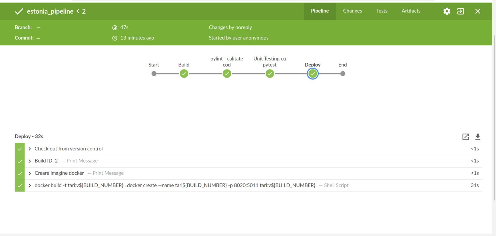
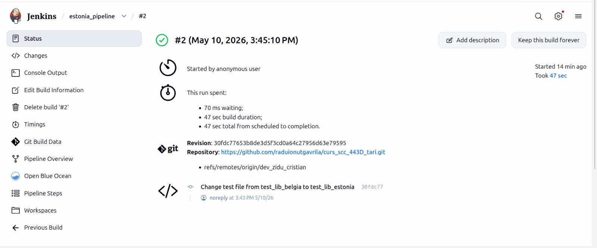

Aplicația poate fi accesată după finalizarea pipeline-ului la adresa: `http://localhost:8020/`

# Bibliografie:
[cuprins](#cuprins)

https://github.com/crchende/sysinfo.git

https://github.com/crchende/jenkinsdemo

https://www.jenkins.io/doc/book/installing/linux/
