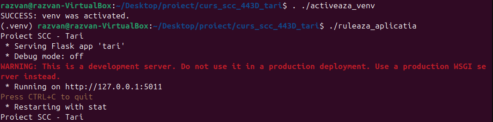
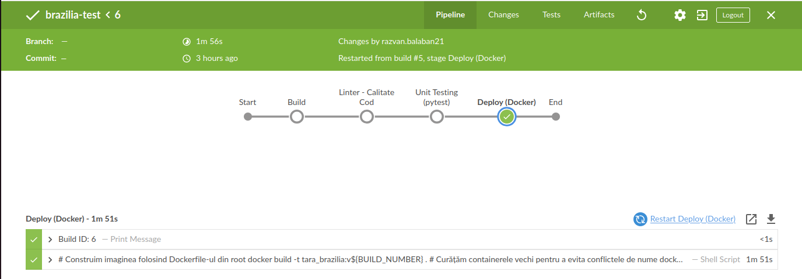

`Brazilia-App`
===================================

# Cuprins

1. [Descriere aplicatie](#descriere-aplicatie)
1. [Descriere versiune](#descriere-versiune)
1. [Configurare](#configurare)
1. [Exemple pagina web](#exemple-pagina-web)
1. [Testare cu pytest](#testare-cu-pytest)
1. [Verificare statica. pylint - calitate cod](#verificare-statica-cu-pylint)
1. [DevOps](#devops-ci)
   1. [Pipeline Jenkins](#exemplu-executie-pipeline-jenkins)
1. [Bibliografie](#bibliografie)

# Descriere aplicatie
[cuprins](#cuprins)

Aplicatia **Brazilia** gestioneaza si afiseaza informatii detaliate despre geografia, demografia si cultura Braziliei intr-o interfata web intuitiva.
Sistemul de operare tinta este Linux, aplicatia fiind dezvoltata si testata pe distributia `Ubuntu 24.04`.
Componenta WEB a proiectului utilizeaza framework-ul `Flask`.

Arhitectura este una modulara: datele sunt procesate si extrase prin functii dedicate localizate in pachetul app/lib/, fiind ulterior preluate si returnate cu ajutorul functiilor view (localizate in `tari.py`) catre client sub forma de pagini HTML.

Pentru o experienta de utilizare facila, interfata include un sistem de navigare intre pagini:

* Pagina principala: Contine link-uri/butoane catre tarile alocate fiecarui student.
* Pagina specifica tarii: Odata selectata tara, se afiseaza o descriere scurta a acesteia si un meniu cu inca 3 butoane:

    * Capitala: Afiseaza capitala.
    * Steag: Afiseaza o imagine drapelului oficial
    * Populatie: Afiseaza numarul actualizat de locuitori.

* Sistemul de retur: Fiecare pagina contine link-uri de navigare inapoi pentru a asigura fluiditatea navigarii.

Aplicatia include suport pentru containerizare in fisierul `Dockerfile` din directorul principal al aplicatiei.

Din punct de vedere al verificarii calitatii, aplicatia include:

*    Unit testing: Realizat cu pytest pentru functiile din app/lib/, testele fiind organizate in directorul app/tests/.

*    Analiza statica: Verificarea conformitatii codului utilizand pylint.

`DevOps CI`.
Pipeline-ul pentru Jenkins este definint in fisierul `Jenkinsfile`.
Acesta asigura parcurgerea automata a etapelor de Build (creare venv), Linter (verificare calitate), Testare (pytest) si Deploy (lansarea containerului Docker pe portul 8020).

# Descriere versiune
[cuprins](#cuprins)

## v1.0 - Implementare structură ierarhică și integrare Docker/Jenkins.
*   Afișare date despre Brazilia
*   Adăugare link-uri între pagini
*   Configurare mapare porturi pentru acces prin container.

### Rute aplicație WEB:
*   **Ruta standard**  `/` - URL: `http://127.0.0.1:5011`
*   **Rute specifice Brazilia**:
    *   Pagina principală țară: `/brazilia` - URL: `http://127.0.0.1:5011/brazilia`
    *   Capitală:          `/brazilia/capitala` - URL: `http://127.0.0.1:5011/brazilia/capitala`
    *   Steag:             `/brazilia/steag` - URL: `http://127.0.0.1:5011/brazilia/steag`
    *   Populație:         `/brazilia/populatie` - URL: `http://127.0.0.1:5011/brazilia/populatie`

# Configurare
[cuprins](#cuprins)

Configurare .venv si instalare pachete

In directorul radacina `curs_scc_443D_tari` rulati comenzile:

1) **activeaza_venv**: Incearca sa activeze venv-ul. 
                   Daca nu poate, configureaza venv-ul in directorul .venv si apoi instaleaza flask si flask-bootstrap.
                   La urmatoarea rulare, va activa doar venv-ul.
                
2) **ruleaza_aplicatia**: De rulat doar dupa activarea venv-ului. 
                      Va porni serverul pe IP: 127.0.0.1 si port: 5011.
                      Acces server din browser: http://127.0.0.1:5011

# Exemplu activare venv si rulare

    razvan@razvan-VirtualBox:~/Desktop/proiect/curs_scc_443D_tari$ . ./activeaza_venv
    SUCCESS: venv was activated.
    (.venv) razvan@razvan-VirtualBox:~/Desktop/proiect/curs_scc_443D_tari$ ./ruleaza_aplicatia 
    Proiect SCC - Tari
    * Serving Flask app 'tari'
    * Debug mode: off
    WARNING: This is a development server. Do not use it in a production deployment. Use a production WSGI server instead.
    * Running on http://127.0.0.1:5011
    Press CTRL+C to quit
    * Restarting with stat
    Proiect SCC - Tari



# Exemple pagina web
[cuprins](#cuprins)

## Pagina principala


## Pagina specifica tarii


## Pagina - Capitala


## Pagina - Steag


## Pagina - Populatie


# Testare cu pytest
[cuprins](#cuprins)

Funcțiile din biblioteca aplicației, localizate în directorul `app/lib/` (fișierul `biblioteca_brazilia.py`), au teste de tip 'unit-test' asociate. Acestea apelează funcția și compară valoarea obținută cu cea așteptată, returnând **PASS** dacă valorile coincid și **FAIL** în caz contrar.

Pentru testare s-a folosit pachetul **pytest** din Python. Acesta este instalat în mediul virtual prin scriptul de configurare.

Execuția testelor se face din directorul rădăcină al aplicației (`curs_scc_443D_tari`) folosind comanda:

```bash
(.venv) razvan@razvan-VirtualBox:~/Desktop/proiect/curs_scc_443D_tari$ pytest app/tests/test_lib_brazilia.py -v
```

# Verificare statica cu pylint
[cuprins](#cuprins)

Pentru verificarea calității codului sursă se utilizează pachetul **pylint**. Acesta analizează conformitatea codului cu standardele Python (verifică spații, convenții de numire a variabilelor, variabile neutilizate etc.).

În cadrul acestui proiect, problemele raportate de **pylint** sunt doar afișate pentru monitorizare, nu sunt considerate erori.

```bash
(.venv) razvan@razvan-VirtualBox:~/Desktop/proiect/curs_scc_443D_tari$ pylint --exit-zero app/lib/*.py
(.venv) razvan@razvan-VirtualBox:~/Desktop/proiect/curs_scc_443D_tari$ pylint --exit-zero app/tests/*.py
(.venv) razvan@razvan-VirtualBox:~/Desktop/proiect/curs_scc_443D_tari$ pylint --exit-zero tari.py
```

# DevOps CI
[cuprins](#cuprins)

- **CI** = Continuous Integration (Integrare Continuă)

## Exemplu execuție pipeline Jenkins

Pentru a se putea executa cu succes ultimul pas din pipeline-ul de Jenkins (crearea și lansarea containerului Docker), este necesar ca utilizatorul `jenkins` să aibă permisiuni de rulare a comenzilor Docker fără `sudo`.

Puteti gasi pasii de configurare pe [docs.docker.com - linux-postinstall](https://docs.docker.com/engine/install/linux-postinstall/).
Daca folositi masina virtuala linux, restartati masina dupa ce faceti configuratia.

**Etapele Pipeline-ului:**
1. **Build**: Crearea mediului virtual și instalarea dependințelor.
2. **Linter**: Verificarea stilului codului cu `pylint`.
3. **Unit Tests**: Rularea testelor cu `pytest`.
4. **Deploy**: Construirea imaginii Docker și pornirea containerului pe portul **8020**.




Aplicația poate fi accesată după finalizarea pipeline-ului la adresa: `http://localhost:8020/`

# Bibliografie:
[cuprins](#cuprins)

https://github.com/crchende/sysinfo.git

https://github.com/crchende/jenkinsdemo

https://www.jenkins.io/doc/book/installing/linux/

