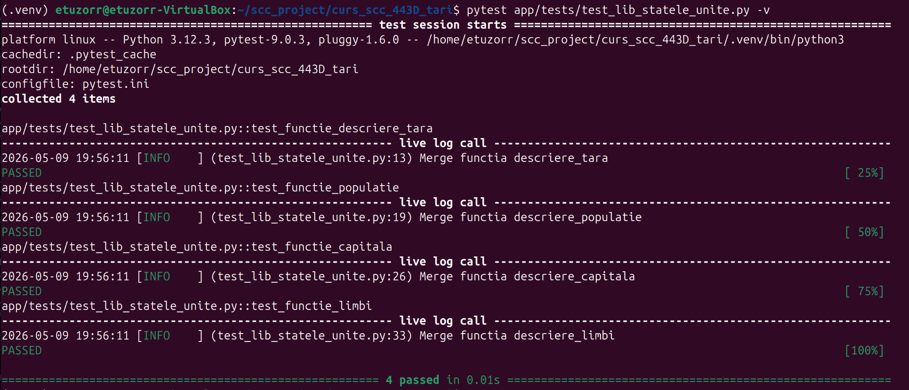
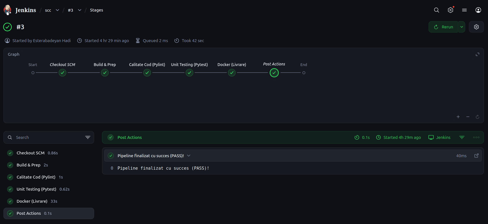
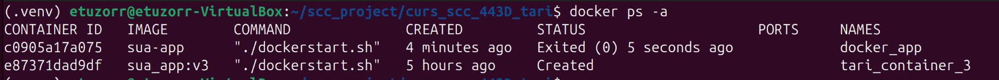

# Proiect SCC - Tari

## 1. Identificator Dezvoltator
- **Nume:** Esterabadeyan Hadi
- **Grupa:** 443D
- **Tara alocata:** Statele Unite

## 2. Functionalitate Adaugata
Am implementat funcționalitatea pentru Statele Unite ale Americii, incluzând:
 - Biblioteca specifică: app/lib/biblioteca_statele_unite.py.
 - Integrare: Actualizarea app/lib/biblioteca_tari.py pentru a include rutele și datele SUA.
 - Rute Flask: Rutele pentru descriere, capitală, populație, limbi și steag sunt active și funcționale.

## 3. Stadiul Implementarii
 - Cod Aplicație: Finalizat și verificat local.
 - Rute Web: Accesibile prin browser la portul 5011.
 - Resurse Statice: Steagul SUA adăugat în static/steag_sua.png

## 4. Testare
### Testare Manuală
 - Testare Manuală: Verificarea fiecărei rute în browser (Status: OK).
 - Testare Unitara (Pytest): Toate testele din app/tests/test_lib_statele_unite.py trec cu succes.
 - Configurare Jenkins: Creat Jenkinsfile cu etapele: Build, Linting, Unit Testing și Docker.
 - Status Jenkins: PASS.

## 5. Containerizare (Docker)
Aplicația a fost containerizată folosind un Dockerfile bazat pe Python Alpine.

**Dovezi Containerizare:**

*1. Imaginea Docker creata
 - Imaginea creata manual este sua-app:latest
 - Imaginea creata automat de Jenkins este sua_app:v3

*2. Containerul creat pe baza imaginii
 - Containerul creat manual este docker_app
 - Containerul creat manual este tari_container_3

*3 Accesarea aplicatiei din container

*4 Log-uri consola docker

## 6. Integrare și Review
 - Branch sursa: `dev_esterabadeyan_hadi`**
 - Branch destinatie: `main_esterabadeyan_hadi`:** 
 - Status: *(de completat)*
 - Review: *(de completat cu numele colegului)*

## Pull Request-uri la care am făcut review

| PR ID | Autor | Descriere |
|-------|-------|-----------|
| *(de completat)* | *(de completat)* | *(de completat)* |

## 7. Ce mai este de făcut

[x] Finalizare cod și teste manuale.
[x] Aplicație containerizată și accesibilă.
[x] Succes Pipeline Jenkins.
[ ] Obținerea aprobării de la colegi pentru PR-ul final.
[ ] Integrarea finală în branch-ul main.