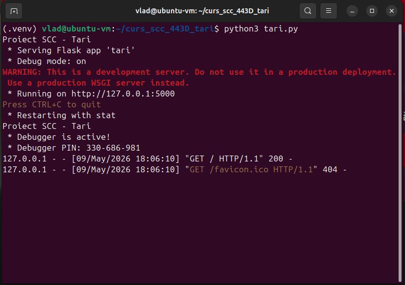
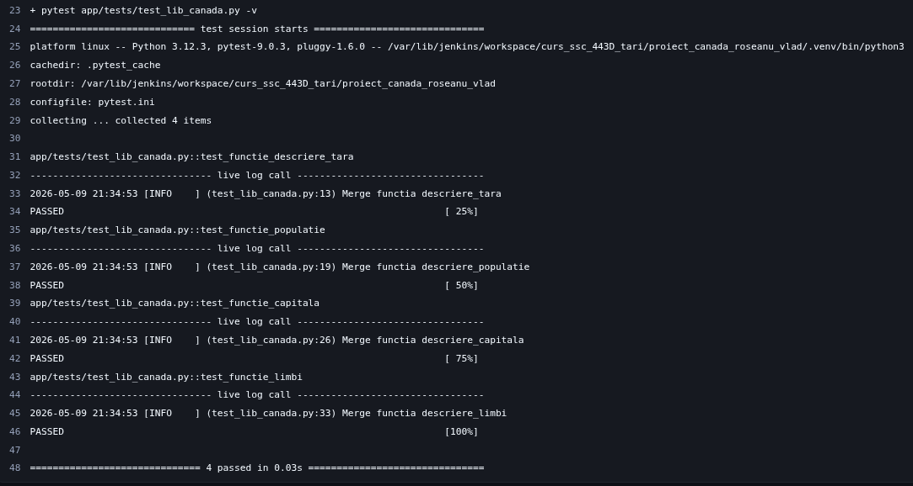
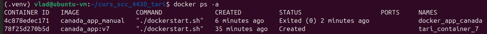
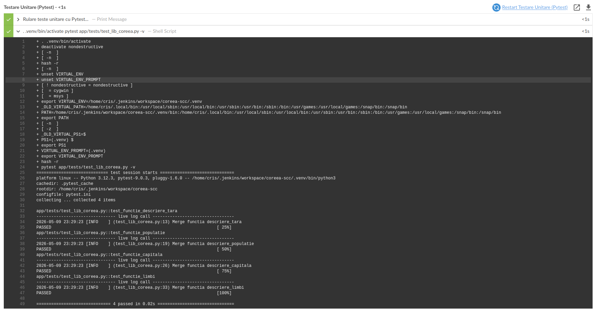
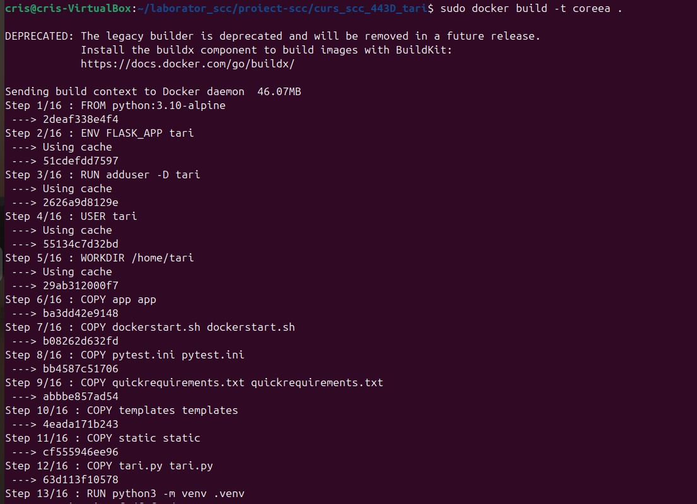
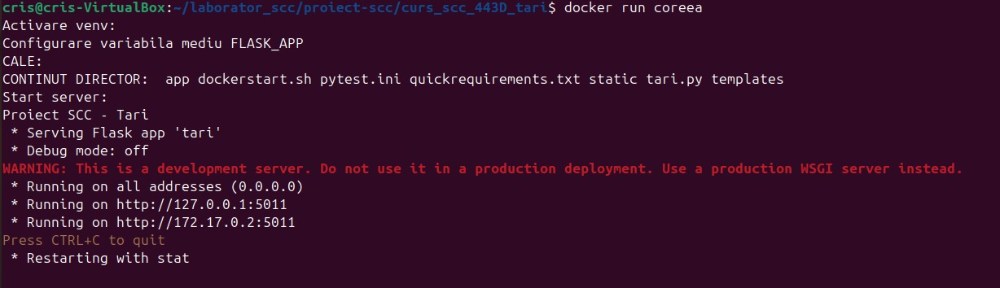
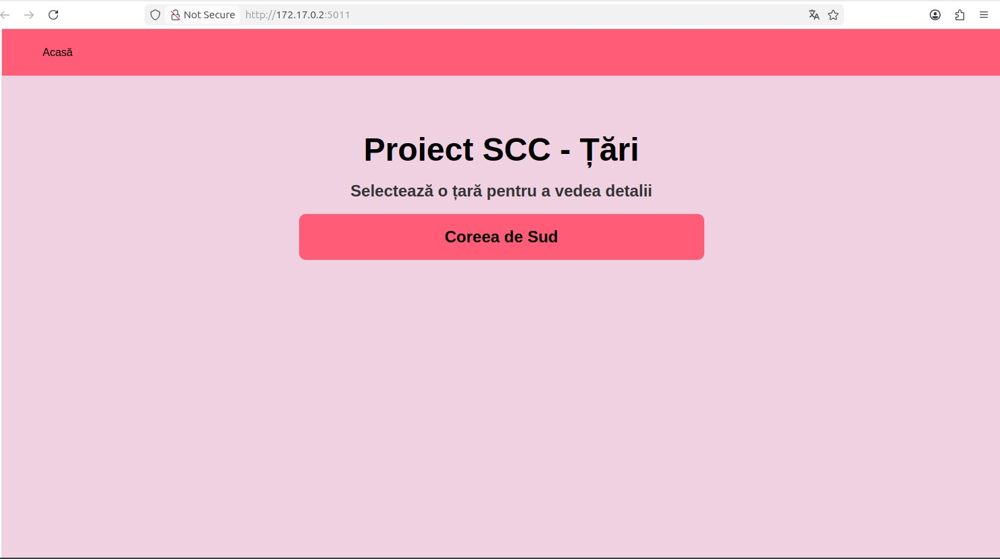
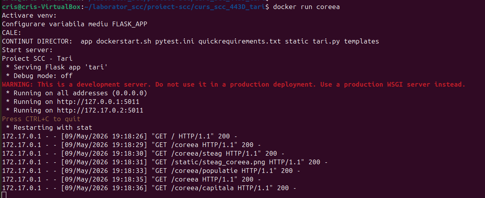

# Proiect SCC - Țări 
## Table of Contents
* [Canada](#Canada - Roseanu Vlad-George)
* ["Coreea de Sud"](#Coreea de Sud - Toaca Cristiana)
* [Usage](#usage)

## Canada - Roseanu Vlad-George


## Dezvoltator
- **Nume:** Roșeanu Vlad-George
- **Grupă:** 443D
- **Țară alocată:** Canada 🇨🇦
- **Branch de dezvoltare:** `dev_roseanu_vlad`

## Funcționalitate Adăugată
Am adaugat funcționalitatea pentru **Canada** în fișierul `app/lib/biblioteca_canada.py`:
- **descriere_tara()** – Returnează o descriere generală a Canadei
- **descriere_capitala()** – Returnează capitala Canadei
- **descriere_populatie()** – Returnează populația Canadei
- **descriere_limbi()** – Returnează limbile oficiale ale Canadei
- **descriere_steag()** – Returnează imaginea steagului Canadei

## Rute accesibile

| Ruta | Descriere |
|------|-----------|
| `/` | Pagina principală – lista tuturor țărilor |
| `/canada` | Informații generale despre Canada |
| `/canada/capitala` | Capitala Canadei– Ottawa |
| `/canada/populatie` | Populația Canada |
| `/canada/steag` | Steagul Canada |

## Modificări

🇨🇦 `app/lib/biblioteca_canada.py` – biblioteca cu funcțiile pentru Canada

🔗 `app/lib/biblioteca_tari.py` – adăugat import și înregistrare Canada în TARI și BIBLIOTECI

🛠️ `app/tests/test_lib_canada.py` – teste unitare pentru Canada

⚙️ `Jenkinsfile` – pipeline declarativ pentru Jenkins

🐳 `Dockerfile` – containerizarea aplicației

## Testare Manuală
Aplicația a fost verificată local rulând:

```bash
python3 tari.py
```

și accesând:

```text
http://localhost:5000
```



## Testare Automatizată (Jenkins)
Am configurat un Pipeline în Jenkins care rulează automat testele. Testul din `app/tests/` a trecut cu succes (PASS).

**Dovada Build Jenkins:**



## Containerizare (Docker)
Aplicația a fost containerizată folosind o imagine de Python 3.10-alpine. Containerul expune portul 5011.

**Dovezi Containerizare:**

*1. Imaginea Docker creată:*


*2. Toate containerele Docker:*


*3. Containerul rulând activ:*


*4. Accesare aplicație din container (Browser):*


*4. Log-uri consolă (interacțiune browser-container):*


## 6. Comenzi folosite:
🧪 Rulare manuala pytest:
```bash
pytest app/tests/test_lib_canada.py -v
```
🐳 Construirea imaginii:
```bash
docker build -t <nume_img> <locatia_fisierului_dockerfile>
```
🚀 Crearea și construirea:
```bash
docker run -it --name <nume_cont> -p <port_local>:<port_intern> <imagine>
```
🔄 Repornirea containerului in mod interactiv:
```bash
docker start -ai <nume_cont>
```


## 7. Integrare și Review
🌿 Branch sursa: `dev_roseanu_vlad`

🎯 Branch destinatie: `main_roseanu_vlad`

📊 Status: *Verificat*

👀 Review: *Esterabadeyan Hadi*

## Pull Request-uri la care am făcut review

| 🆔 PR ID | 👤 Autor | 📝 Descriere |
| :---: | :--- | :--- |
| *(de completat)* | *(de completat)* | *(de completat)* |

## 8. Ce mai este de făcut

 - [x] Finalizare cod și teste manuale.
 - [x] Aplicație containerizată și accesibilă.
 - [x] Succes Pipeline Jenkins.
 - [ ] Obținerea aprobării de la colegi pentru PR-ul final.
 - [ ] Integrarea finală în branch-ul main.


# Coreea de Sud - Toaca Cristiana

## 1. Identificator Dezvoltator
- **Nume:** Toacă Cristiana
- **Grupă:** 443D
- **Țară alocată:** Coreea de Sud

## 2. Funcționalitate Adăugată
Am implementat logica pentru afișarea informațiilor despre Coreea de Sud. Aceasta include:

- **descriere_tara()** – Returnează o descriere generală a Canadei
- **descriere_capitala()** – Returnează capitala Canadei
- **descriere_populatie()** – Returnează populația Canadei
- **descriere_limbi()** – Returnează limbile oficiale ale Canadei
- **descriere_steag()** – Returnează imaginea steagului Canadei

### Rute accesibile

| Ruta | Descriere |
|------|-----------|
| `/` | Pagina principală – lista tuturor țărilor |
| `/coreea` | Informații generale despre Coreea de Sud |
| `/coreea/capitala` | Capitala Coreei de Sud |
| `/coreea/populatie` | Populația Coreea de Sud |
| `/coreea/steag` | Steagul Coreei de Sud |

## 3. Stadiul Implementării
- [x] Cod funcționalitate adăugat

## 4. Testare
### Testare Manuală
Aplicația a fost verificată local rulând `.\ruleaza_aplicatia` și accesând `http://127.0.0.1:5011/`.

**Output Consola Locala:**


**Apliactia Accesata la `http://127.0.0.1:5011/`:**


### Testare Locala Folosind Pytest
Mai intai am verificat ca testele functioneaza local.

**Testare Locala cu Pytest:**


### Testare Automata folosind Jenkins

Am configurat un Pipeline în Jenkins care rulează automat testele. Testul din `app/tests/` a trecut cu succes (PASS).

**Dovada Build Jenkins:**


**Dovada Teste Pytest in Jenkins:**



## 5. Containerizare (Docker)
Aplicația a fost containerizată folosind o imagine de Python 3.10-alpine. Containerul expune portul 5011 si poate fi accesat la `http://172.17.0.2:5011/`.

**Dovezi Containerizare:**

*1. Creare imagine Docker:*



*2. Start container creat:*



*3. Verificare a rularii containerului:*


*4. Accesare aplicație din container (Browser):*

Aplicatia va putea fi accesata la: `http://172.17.0.2:5011/`



*5. Log-uri consolă (interacțiune browser-container):*



## 6. Integrare și Review
- **Branch dezvoltare: `dev_toaca_cristiana`**
- **Pull Request (PR) către `main_toaca_cristiana`:** 

## 7. Review-uri:

- [ ] Am făcut review pentru colegul: [Nume Coleg (username github) / ID PR]
- [x] Am primit review de la: [ Gavrila Radu (raduionutgavrila) / #20]

## 8. De facut
 - [x] Finalizare cod și teste manuale.
 - [x] Aplicație containerizată și accesibilă.
 - [x] Succes Pipeline Jenkins.
 - [ ] Obținerea aprobării de la colegi pentru PR-ul final, in main.
 - [ ] Integrarea finală în branch-ul main.
