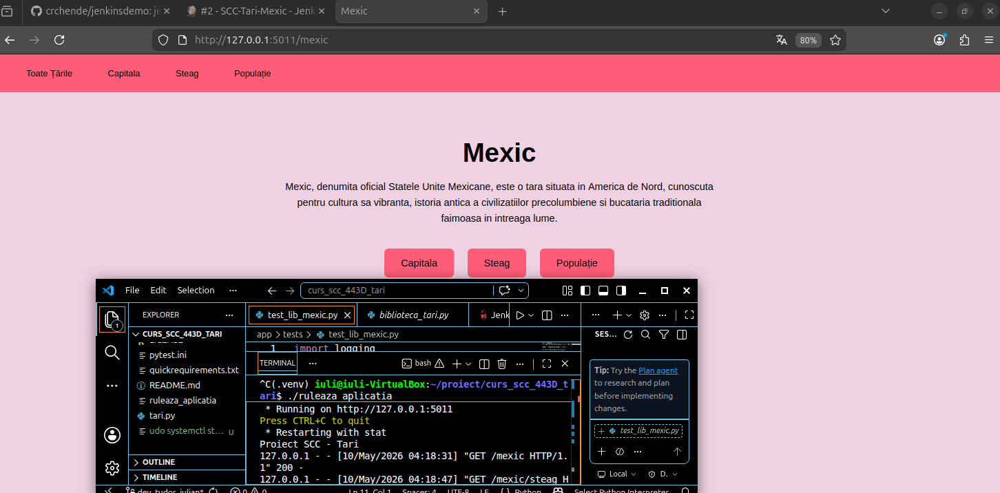
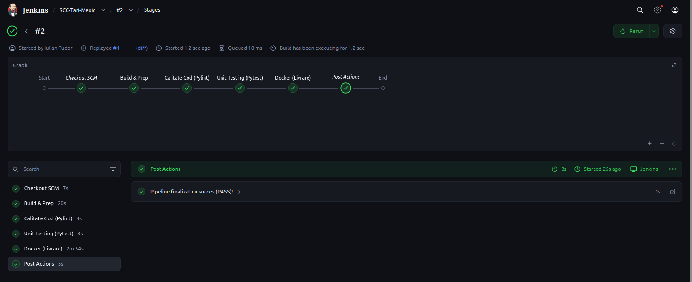
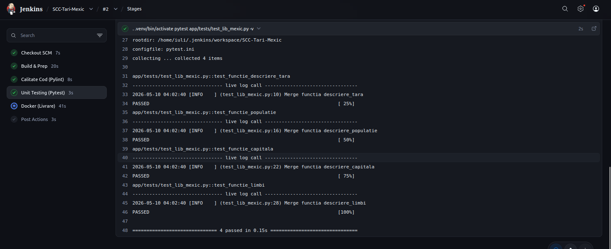
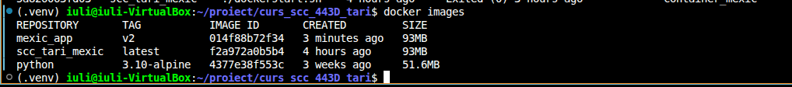
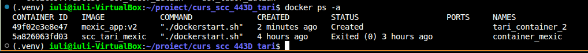
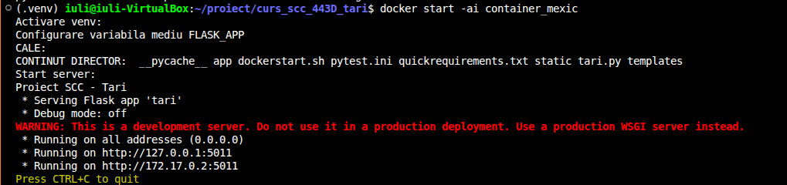
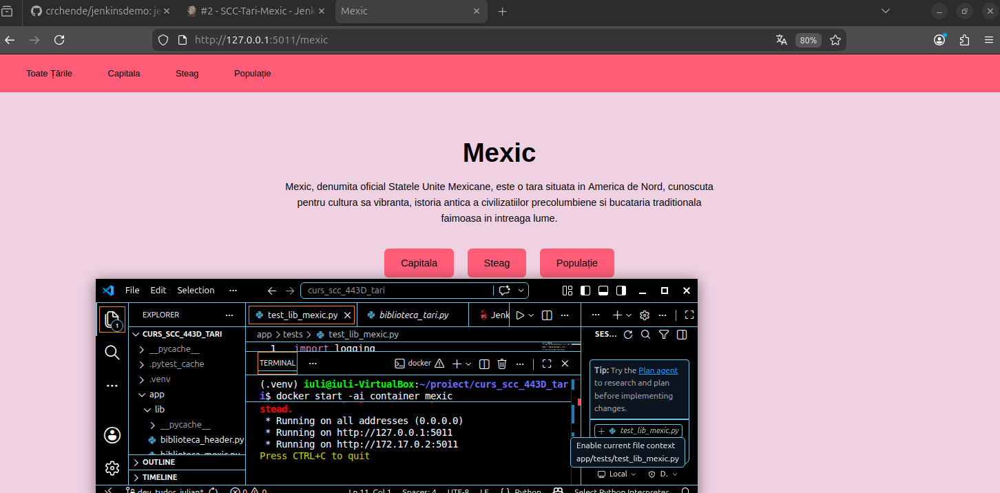
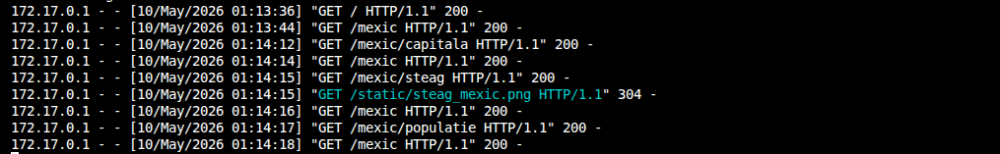

# Proiect SCC - Mexic

## 1. Detalii Dezvoltator
- **Nume:** Tudor Iulian
- **Grupa:** 443D
- **Tara:** Mexic 🇲🇽
- **Branch lucru:** `dev_tudor_iulian`

---

## 2. Functionalitati Implementate
Proiectul a constat in integrarea Mexicului in platforma SCC, adaugand urmatoarele componente:
- **Biblioteca specifica:** `app/lib/biblioteca_mexic.py` , adaugarea datelor (capitala,populatie,steag).
- **Integrare:** Inregistrarea rutelor in `app/lib/biblioteca_tari.py` 
- **Resurse:** Integrarea steagului in `static/steag_mexic.png`.
- **Automatizare:** Configurarea fluxului de CI/CD prin `Jenkinsfile` si containerizarea prin `Dockerfile`.

### Rute disponibile

| Ruta | Descriere |
| :--- | :--- |
| `/` | Pagina principala – lista tuturor tarilor |
| `/mexic` | Informatii generale despre Mexic |
| `/mexic/capitala` | Capitala Mexicului – Ciudad de Mexico |
| `/mexic/populatie` | Populatia Mexicului |
| `/mexic/steag` | Steagul Mexicului |

## 3. 📁 Structura si Modificari
| Componenta | Descriere |
| :--- | :--- |
| `app/lib/biblioteca_mexic.py` | Functiile core pentru datele despre Mexic |
| `app/tests/test_lib_mexic.py` | Testele unitare pentru validarea corectitudinii |
| `static/steag_mexic.png` | Imaginea statica a steagului |
| `Dockerfile` | Reteta pentru crearea imaginii de container |
| `Jenkinsfile` | Pipeline-ul pentru automatizarea build-ului si testarii |

---

## 4. 🛠️ Verificare si Testare

### 4.1. Testare Manuala (Local)
Aplicatia a fost rulata initial in mediul local pentru a verifica integritatea rutelor Flask.


### 4.2. Testare Automatizata (Jenkins)
Am configurat un server Jenkins care monitorizeaza codul. Acesta ruleaza automat testele Pytest si verifica calitatea codului.

**Status Pipeline Jenkins:**


**Rezultate Teste Unitare (Pytest):**


---

## 5. 🐳 Containerizare cu Docker
Pentru a asigura portabilitatea, am creat o imagine Docker bazata pe Python Alpine, optimizata pentru dimensiune si securitate.

### Dovezi Containerizare:

**1. Imaginile Docker (Manuala vs Automata):**
Se pot observa atat imaginea creata manual, cat si cea generata automat de Jenkins (v1).


**2. Status Containere:**
Lista containerelor create si porturile mapate (5011).


**3. Rularea in Terminal:**
Pornirea containerului si vizualizarea procesului activ.


**4. Interfata Web (Browser):**
Accesarea aplicatiei containerizate la adresa `http://localhost:5011/mexic`.


**5. Jurnal de Log-uri:**
Interactiunea dintre utilizator si aplicatie capturata in log-urile Docker.


---

## 6. Comenzi Utile

### Testare
```bash
pytest app/tests/test_lib_mexic.py -v
```

### Docker
```bash
# Build imagine
docker build -t <imagine> <locatie_fisier_dockerfile>

# Rulare container
docker run -d -p 5011:5011 --name <nume_container> <imagine>

# Repornire container
docker start -ai <nume_container>
```

---

## 7. Status Integrare
- **Branch Sursa:** `dev_tudor_iulian`
- **Branch Destinatie:** `main_tudor_iulian`
- **Status:** Merged , Verificat
- **Review realizat de:** Dumitrache Alexandru

### Review-uri oferite de mine
| PR ID | Autor | Descriere |
| :--- | :--- | :--- |
| #... | ... | ... |