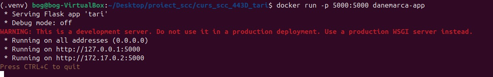
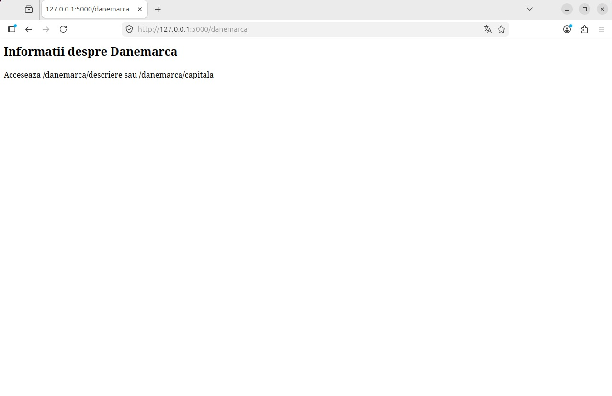
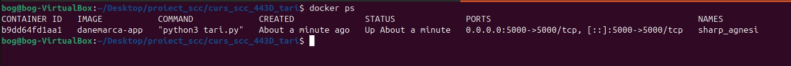

# Proiect SCC - Danemarca

## 1. Identificator Dezvoltator
**Nume:** Ivan Luca  
**Grupă:** 443D  
**Țară alocată:** Danemarca  

## 2. Funcționalitate Adăugată
Am implementat logica pentru afișarea informațiilor despre Danemarca în aplicația web Flask.
Funcționalitatea include:
* crearea fișierului `app/lib/danemarca.py`;
* modificarea fișierului `tari.py` pentru integrarea Danemarcei;
* adăugarea testelor automate în `app/tests/test_lib_danemarca.py`;
* adăugarea fișierelor `Dockerfile` și `Jenkinsfile`.

## 3. Stadiul Implementării
- [x] Cod funcționalitate adăugat
- [x] Teste automate adăugate
- [x] Dockerfile adăugat
- [x] Jenkinsfile adăugat
- [x] Aplicația a fost rulată local
- [x] Testele au fost rulate local cu succes

## 4. Structura Proiectului

    .
    ├── app
    │   ├── lib
    │   │   ├── danemarca.py
    │   │   └── __init__.py
    │   ├── tests
    │   │   └── test_lib_danemarca.py
    │   └── __init__.py
    ├── screenshots
    │   ├── 1_build.jpeg
    │   ├── 2_run.jpeg
    │   ├── 3_browser.jpeg
    │   ├── 4_ps.jpeg
    │   └── 5_test.jpeg
    ├── Dockerfile
    ├── Jenkinsfile
    ├── requirements.txt
    └── tari.py

## 5. Fișiere Modificate / Adăugate

**`app/lib/danemarca.py`**
Conține funcțiile pentru afișarea informațiilor despre Danemarca:
* `descriere_danemarca()`
* `capitala_danemarca()`

**`tari.py`**
A fost modificat pentru:
* importarea bibliotecii Danemarcei;
* definirea rutelor specifice în aplicația Flask.

**`app/tests/test_lib_danemarca.py`**
Conține testele automate (unit tests) pentru funcțiile implementate în bibliotecă.

## 6. Rute Disponibile
| Rută | Descriere |
|---|---|
| `/` | Pagina principală a proiectului |
| `/danemarca` | Pagina principală pentru Danemarca |
| `/danemarca/descriere` | Afișează descrierea generală a țării |
| `/danemarca/capitala` | Afișează capitala Danemarcei |

## 7. Testare

### Testare Manuală
Aplicația a fost verificată local rulând comanda:
`python3 tari.py`

Aplicația a fost accesată în browser la: `http://127.0.0.1:5000`

Rute verificate manual:
* `http://127.0.0.1:5000/danemarca`
* `http://127.0.0.1:5000/danemarca/descriere`
* `http://127.0.0.1:5000/danemarca/capitala`

### Testare Automată
Testele se află în folderul `app/tests/`.
Testele au fost rulate local cu succes folosind `pytest`:

## 8. Jenkins
A fost adăugat fișierul `Jenkinsfile` pentru automatizarea procesului de CI/CD.
Pipeline-ul Jenkins include etape pentru:
* **build**: pregătirea mediului;
* **test**: rularea testelor automate cu `pytest`.

Testarea automată cu Jenkins rulează testele din folderul: `app/tests/`

## 9. Containerizare Docker
A fost adăugat fișierul `Dockerfile` pentru containerizarea aplicației.

**Construirea imaginii Docker:**
`docker build -t danemarca-app .`

**Rularea containerului:**
`docker run -p 5000:5000 danemarca-app`

**Accesarea aplicației din container:**

**Verificare container activ:**
`docker ps`

## 10. Integrare și Review
- [ ] Crearea Pull Request-ului din `dev_ivan_luca` către `main_ivan_luca`
- [ ] Review din partea unui coleg de grupă
- [ ] Merge în branch-ul principal de documentare al grupei

## 11. Ce mai este de făcut
- [ ] Finalizarea documentației în fișierul principal README.md al repository-ului.
- [ ] Obținerea aprobării (review) pentru Pull Request.

## 12. Concluzie
Proiectul implementează funcționalitatea pentru țara Danemarca într-o structură modulară, respectând cerințele cursului SCC. Aplicația este pregătită pentru livrare prin containerizare Docker și testare automată via Jenkins.
