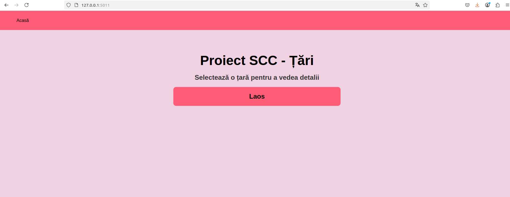
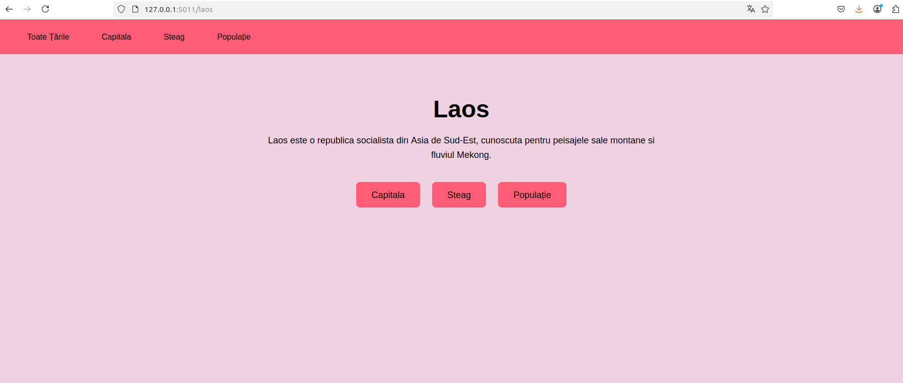
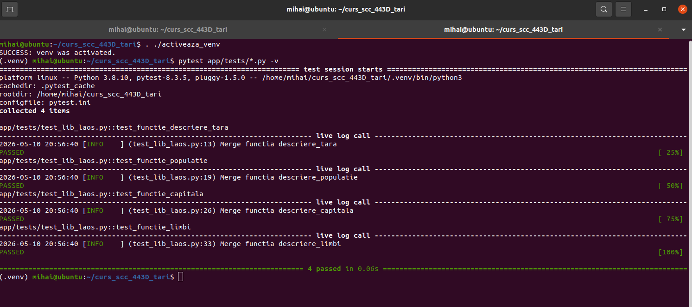
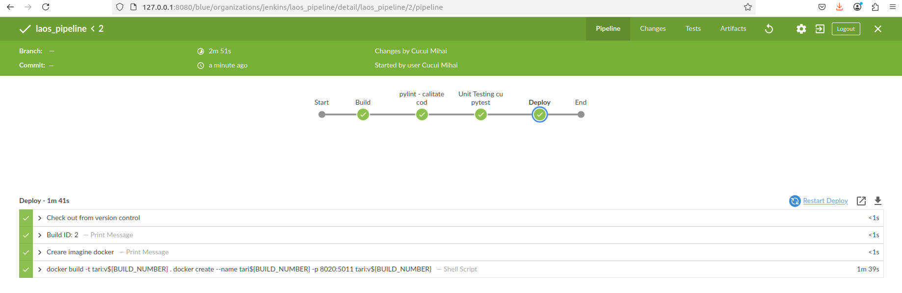
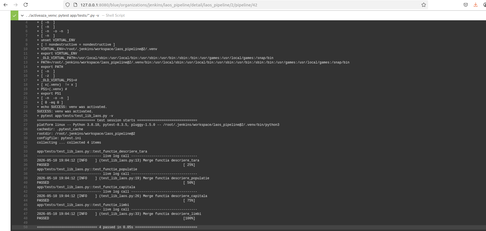
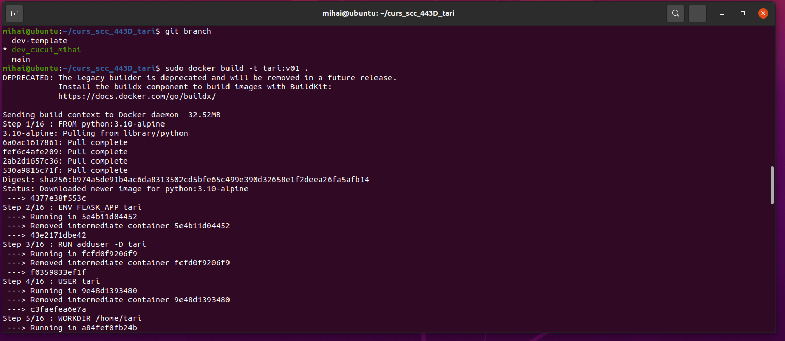
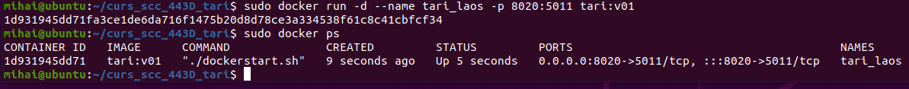
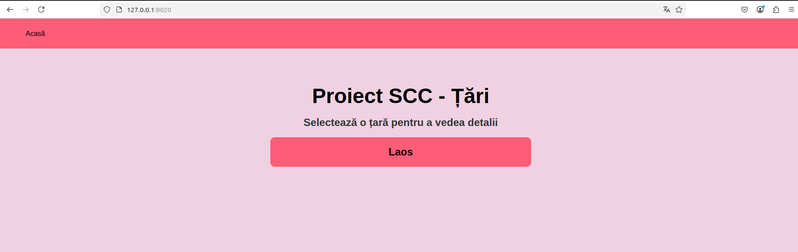

# Proiect SCC - Țări

## Dezvoltator
- **Nume:** Cucui Mihai-Cătălin
- **Grupa:** 443D
- **Țară alocată:** Laos

## Funcționalitate

Aplicația este implementată utilizând framework-ul web Flask, fiind structurată pentru a gestiona și expune datele reprezentative ale țării Laos prin intermediul următoarelor funcții logice:

- **descriere_tara()** – Sintetizează principalele caracteristici ale țării Laos.
- **descriere_capitala()** – Returnează capitala statului Laos.
- **descriere_populatie()** – Returnează date demografice despre statul Laos.
- **descriere_limbi()** – Enumeră limbile oficiale recunoscute pe teritoriul Laos.
- **descriere_steag()** – Afișează steagul Laos.

## Stadiul dezvoltării

- Funcționalitățile aplicației au fost complet implementate.

- Versiunea finală a codului încărcată pe branch-ul de lucru dedicat.

- Dockerfile și Jenkinsfile sunt funcționale, urmând pipeline-ul de CI/CD.

## Testare

### Testare inițială

Activăm mediul virtual și testăm aplicația local rulând scripturile activeaza_venv și ruleaza_aplicatia.

**Aplicația poate fi accesată la adresa `http://127.0.0.1:5011/`:**

Tot aici putem verifica cele 4 rute:
- `/laos`
- `/laos/capitala`
- `/laos/populatie`
- `/laos/steag`

### Testare cu Pytest

Am rulat comanda pytest app/tests/*.py -v pentru a valida funcționarea testelor local:

### Testare cu Jenkins

Am realizat un pipeline Jenkins care să testeze automat funcționalitatea aplicației:

Build cu succes:

Teste validate:

### Testare cu Docker

- Aplicația a fost containerizată, utilizând o imagine Python 3.10-alpine.

- Containerul este configurat să expună portul 5011.

- Se poate accesa la adresa:`http://127.0.0.1:8020/`

Creare imagine Docker:

Pornire container:

Aplicația accesată din container:

## Integrare
- **Branch dezvoltare:** `dev_cucui_mihai`

## Review

- Am făcut review pentru colegul: [Cucui Petruț-Gabriel (PetrutG)]
- Am primit review de la: [Cucui Petruț-Gabriel (PetrutG)]

## De făcut
 - [x] Finalizare cod și teste manuale.
 - [x] Aplicație containerizată.
 - [x] Creare Pipeline Jenkins cu succes.  
 - [ ] Obținerea aprobării de la colegi pentru PR-ul final, în main.
 - [ ] Integrarea finală în branch-ul main.

  
