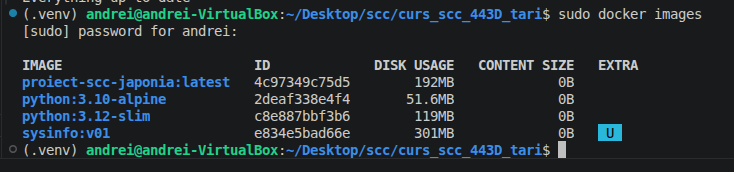
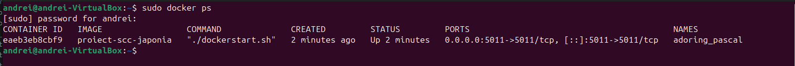
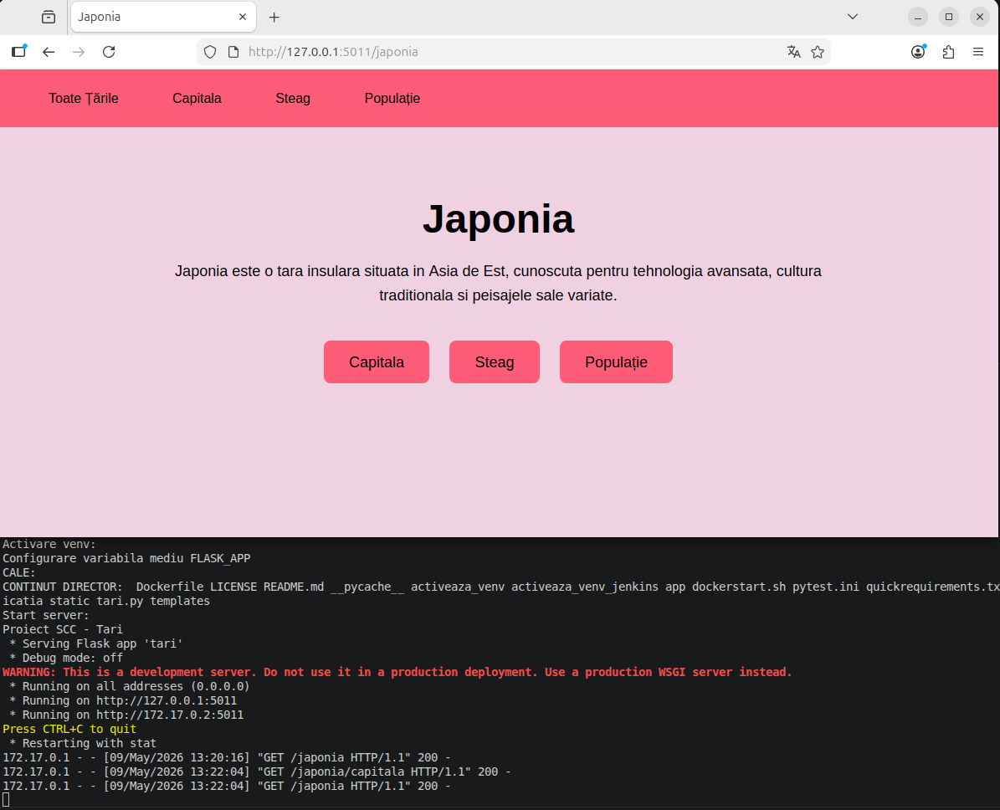

# Documentatie proiect - Japonia

## Student

Nume: Andrei Ciobanu  
Branch dezvoltare: dev_ciobanu_andrei  
Tema: Tari  
Tara aleasa: Japonia  

## Functionalitate adaugata

Am adaugat functionalitatea pentru tara Japonia.

Au fost modificate/adaugate urmatoarele fisiere:

- `app/lib/biblioteca_japonia.py`
- `app/lib/biblioteca_tari.py`
- `app/tests/test_lib_japonia.py`
- `static/steag_japonia.png`
- `Dockerfile`
- `Jenkinsfile`

## Descriere functionalitate

Pentru Japonia au fost implementate urmatoarele functii:

- `descriere_tara()`
- `descriere_limbi()`
- `descriere_populatie()`
- `descriere_capitala()`
- `descriere_steag()`

Aceste functii returneaza informatii despre tara, limba, populatie, capitala si steagul Japoniei.

## Testare locala cu Pytest

Testele au fost rulate local cu comanda:

```bash
pytest app/tests/test_lib_japonia.py -v
```

Rezultat obtinut:

```text
4 passed
```

Au fost rulate si toate testele proiectului cu:

```bash
pytest app/tests/*.py -v
```

Rezultat obtinut:

```text
4 passed
```

## Testare manuala Flask

Aplicatia a fost pornita local cu:

```bash
./ruleaza_aplicatia
```

Au fost verificate in browser urmatoarele pagini:

```text
http://127.0.0.1:5011
http://127.0.0.1:5011/japonia
http://127.0.0.1:5011/japonia/steag
http://127.0.0.1:5011/japonia/populatie
http://127.0.0.1:5011/japonia/capitala
```

Functionalitatea pentru Japonia a fost accesibila din browser.

---

## Containerizare cu Docker

Pentru containerizarea aplicatiei am creat fisierul `Dockerfile` in branch-ul personal de dezvoltare `dev_ciobanu_andrei`.

Dockerfile-ul porneste de la imaginea `python:3.12-slim`, copiaza fisierele proiectului, instaleaza dependintele din `quickrequirements.txt`, acorda permisiuni scripturilor si porneste aplicatia Flask folosind scriptul `dockerstart.sh`.

Imaginea Docker a fost construita cu urmatoarea comanda:

```bash
sudo docker build -t proiect-scc-japonia .
```

Imaginea a fost creata cu succes si apare in lista de imagini Docker:



Containerul a fost pornit cu urmatoarea comanda:

```bash
sudo docker run --rm -p 5011:5011 proiect-scc-japonia
```

Containerul pornit poate fi vazut cu `docker ps`:



In consola de rulare a containerului se observa ca aplicatia Flask porneste corect si ca browserul acceseaza rutele aplicatiei. Apar request-uri cu status `200` pentru paginile Japoniei:


Aplicatia rulata in container a fost accesata din browser la adresa:

```text
http://127.0.0.1:5011/japonia
```



Prin acest test am verificat ca aplicatia a fost containerizata corect si ca functionalitatea pentru Japonia poate fi accesata din browser din container.

---

## Testare automata cu Jenkins

Pentru testarea automata am creat fisierul `Jenkinsfile` in branch-ul personal de dezvoltare `dev_ciobanu_andrei`.

A fost creat un job Jenkins de tip Pipeline cu numele:

```text
proiect-scc-japonia
```

Job-ul este configurat sa ia codul din repository-ul GitHub, de pe branch-ul `dev_ciobanu_andrei`, si sa ruleze fisierul `Jenkinsfile`.

Configurarea folosita:

- Definition: `Pipeline script from SCM`
- SCM: `Git`
- Repository URL: `https://github.com/raduionutgavrila/curs_scc_443D_tari.git`
- Branch Specifier: `*/dev_ciobanu_andrei`
- Script Path: `Jenkinsfile`

Job-ul Jenkins a rulat cu succes, avand status verde:


Pipeline-ul Jenkins pregateste mediul Python, instaleaza dependintele si ruleaza testele unitare cu pytest:

```bash
pytest app/tests/test_lib_japonia.py -v
```

Rezultatul rularii testelor in Jenkins a fost:

```text
4 passed
```

La finalul executiei, Jenkins a afisat:

```text
Finished: SUCCESS
```


Prin acest test am verificat ca functionalitatea pentru Japonia este testata automat cu Jenkins si ca toate testele trec cu succes.

### Vizualizare pipeline in Jenkins Stages

Pe langa Console Output, am verificat rularea pipeline-ului si in pagina de Stages din Jenkins.

In aceasta pagina se vad etapele pipeline-ului:

- Build
- pylint - calitate cod
- Unit Testing cu pytest
- Deploy

Toate etapele au rulat cu succes, iar pipeline-ul a avut status final SUCCESS.


### Vizualizare pipeline in Blue Ocean

Pentru o vizualizare mai clara a pipeline-ului, am folosit si interfata Blue Ocean din Jenkins.

In Blue Ocean se poate observa executia etapelor pipeline-ului si faptul ca acestea au fost finalizate cu succes.


---

## Git si GitHub

Modificarile au fost adaugate in branch-ul personal:

```text
dev_ciobanu_andrei
```

Comenzi folosite pentru salvarea modificarilor:

```bash
git add .
git commit -m "Actualizeaza documentatia proiectului"
git push
```

## Pull Request

Urmeaza crearea unui Pull Request din branch-ul:

```text
dev_ciobanu_andrei
```

catre branch-ul indicat pentru integrare.

PR-ul trebuie sa primeasca review de la cel putin un coleg.

## Ce mai este de facut

- creare Pull Request;
- obtinere review de la un coleg;
- integrare in branch-ul stabilit de grupa.