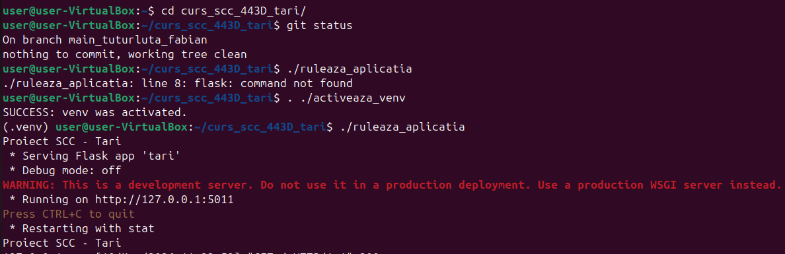
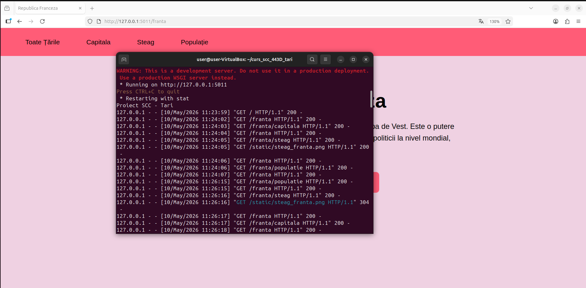
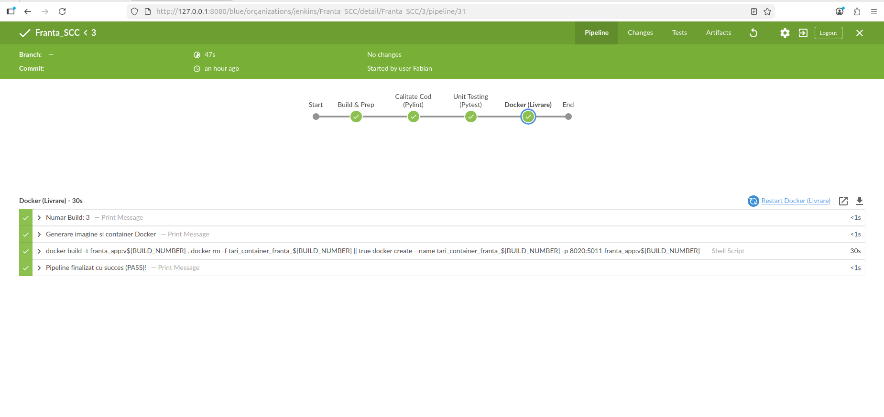
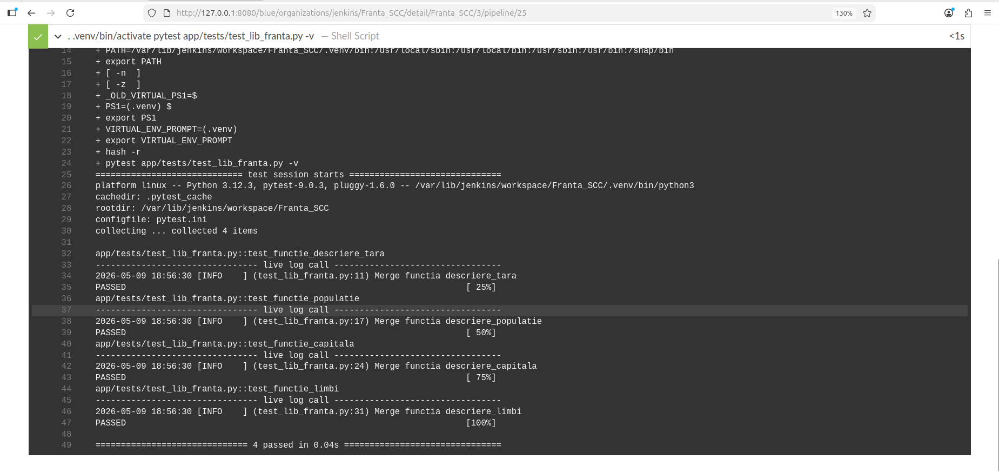
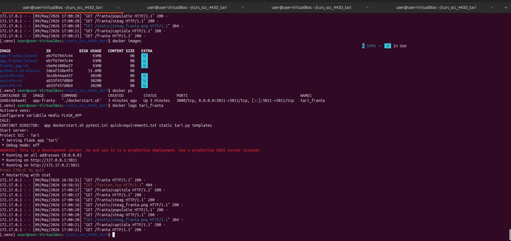
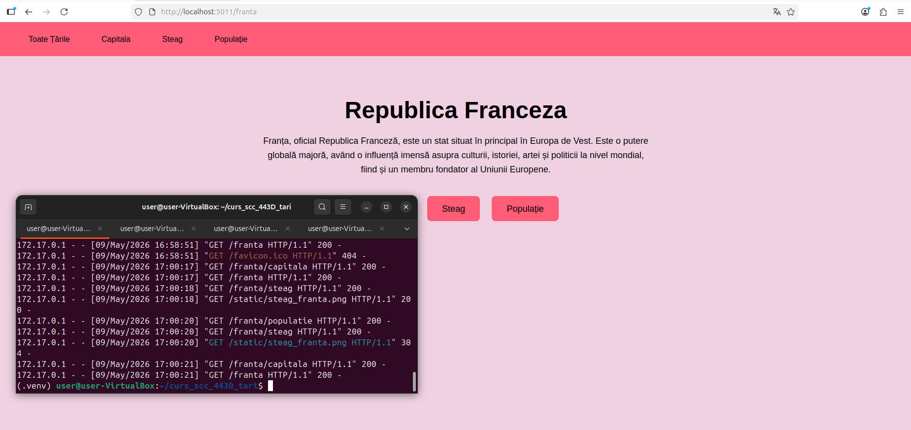

# Proiect SCC - Țări - Franța

## Dezvoltator
- **Nume:** Tuturluță Costi-Giani-Fabian
- **Grupa:** 443D
- **Tema:** Țări
- **Element:** Franța
- **Branch de dezvoltare:** `dev_tuturluta_fabian`

---

## Funcționalitate adăugată

Am adăugat funcționalitate referitoare la **Franța** în fișierul `app/lib/biblioteca_franta.py`:

- **descriere_tara()** – Returnează o descriere generală a Franței
- **descriere_capitala()** – Returnează informații despre capitala Paris
- **descriere_populatie()** – Returnează informații despre populația Franței
- **descriere_limbi()** – Returnează limbile oficiale ale Franței
- **descriere_steag()** – Returnează descrierea și imaginea steagului Franței

### Rute disponibile

| Ruta | Descriere |
|------|-----------|
| `/` | Pagina principală – lista tuturor țărilor |
| `/franta` | Informații generale despre Franța |
| `/franta/capitala` | Capitala Franței – Paris |
| `/franta/populatie` | Populația Franței |
| `/franta/steag` | Steagul Franței |

### Fișiere modificate/adăugate
- `app/lib/biblioteca_franta.py` – biblioteca cu funcțiile pentru Franța
- `app/lib/biblioteca_tari.py`  – adăugat import și înregistrare Franța în TARI și BIBLIOTECI
- `app/tests/test_lib_franta.py` –  – teste unitare pentru Franța
- `Jenkinsfile` – pipeline declarativ pentru Jenkins
- `Dockerfile` – containerizarea aplicației

---

## Stadiul implementării

- [x] Cod funcționalitate adăugat (`app/lib/biblioteca_franta.py`)
- [x] Franța înregistrată în `biblioteca_tari.py` (TARI + BIBLIOTECI)
- [x] Teste unitare scrise (`app/tests/test_lib_franta.py`)
- [x] Jenkinsfile configurat
- [x] Dockerfile creat
- [x] README.md completat

---

## Github 
Pentru a stoca și pentru a eficientiza modalitatea de migrare și lucrul în echipă, am folosit GitHub. 
Pentru a respecta bunele practici de colaborare și pentru a evita conflictele, am utilizat branch-uri dedicate (ramura `main` a grupului și ramurile `dev` personale). 

## Github Local Configurare + Pull Request 
Proiectul a fost descărcat de pe GitHub folosind comanda: `git clone https://github.com/raduionutgavrila/curs_scc_443D_tari.git` 
Dezvoltarea s-a realizat pe branch-ul personal `dev_tuturluta_fabian`. 
Pentru a rezolva problemele de autentificare (GitHub nu mai acceptă parolele clasice în terminal), am utilizat un **Personal Access Token (PAT)** generat din setările contului, folosit ca parolă la operațiunile de `push`. Comenzile utilizate pentru salvarea muncii: 
```bash 
git add . 
git commit -m "Mesaj sugestiv despre modificari" 
git push origin dev_tuturluta_fabian
```

## Testare

### Testare manuală
Aplicația a fost verificată local rulând `. ./activeaza_venv`, urmat de `./ruleaza_aplicatia` și accesând `http://127.0.0.1:5011`.



### Testare cu Jenkins
- Fișierul `Jenkinsfile` este configurat cu un pipeline declarativ
- Pipeline-ul conține etapele: Build, Verificare calitate cod (pylint), Teste unitare (pytest)
- Testele unitare se execută cu `pytest`
- **Rezultat:** PASS

**Dovada Build Jenkins:**



### Teste unitare (4/4 PASS)
- `test_functie_descriere_tara` – PASS
- `test_functie_populatie` – PASS
- `test_functie_capitala` – PASS
- `test_functie_limbi` – PASS

---

## Containerizare

### Construire imagine Docker
```bash
docker build -t app_franta .
```

### Creare și rulare container
```bash
docker run -d -p 5011:5011 --name tari_franta app-franta
```

### Accesare aplicație din browser
Aplicația poate fi accesată la: `http://localhost:5011/franta`

### Capturi de ecran

*Terminal - docker images, docker ps, docker logs:*


*Browser - accesare aplicație din container:*


---

## Integrare (Pull Request)

- Branch sursă: `dev_tuturluta_fabian`
- Branch destinație: `main_tuturluta_fabian`
- Status: *Verificat*
- Review de la: Toaca Cristiana

---

## Pull Request-uri la care am făcut review

| PR ID | Autor | Descriere |
|-------|-------|-----------|
| *#38* | *Toaca Cristiana* | *Finalizare Proiect Coreea de Sud* |

---

## Ce mai este de făcut

- [x] Obținere review de la un coleg
- [ ] Integrare README.md în branch-ul main
- [x] Review la PR-ul unui coleg# Proiect SCC - Țări - Franța
