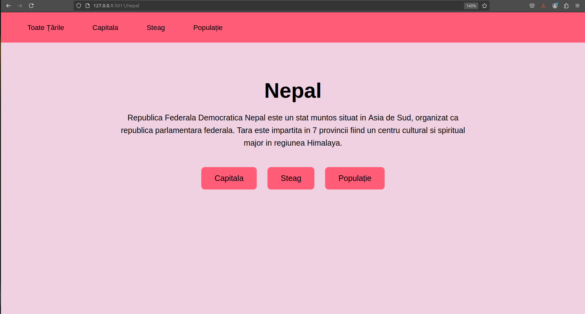
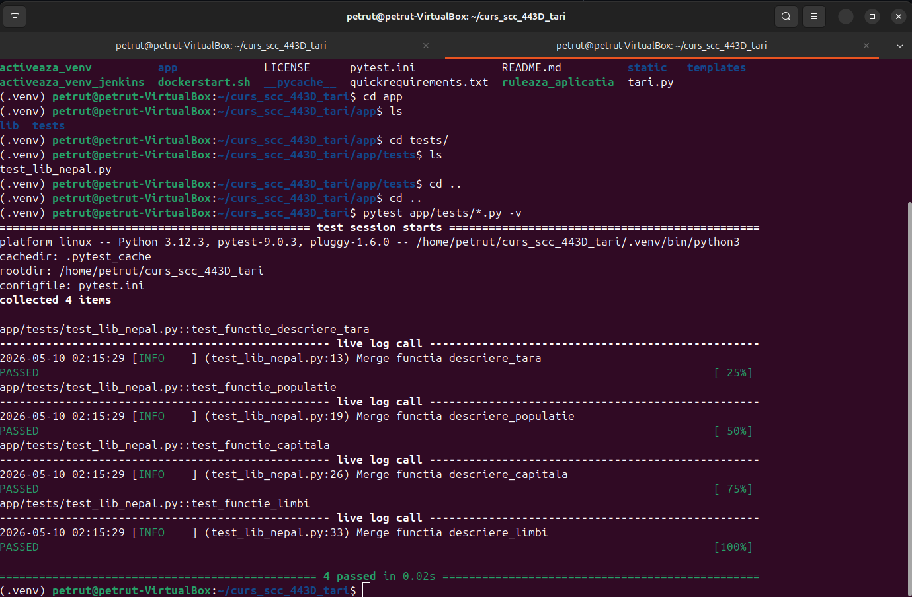
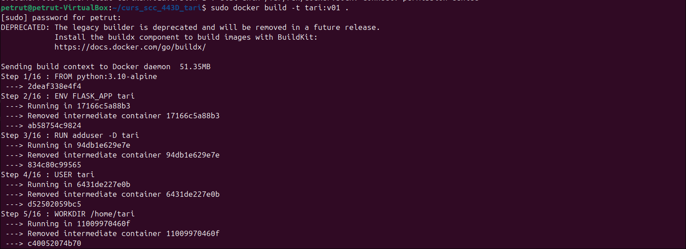
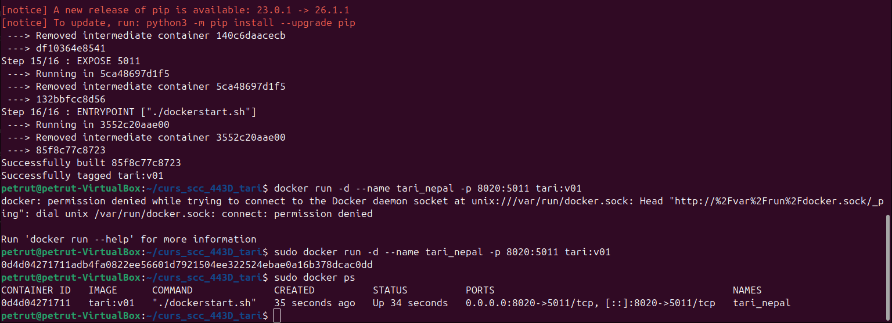
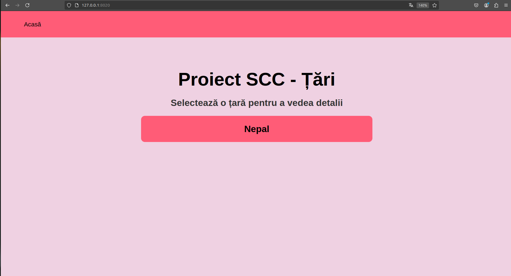
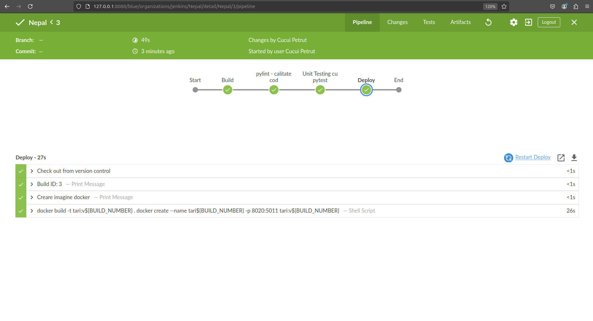
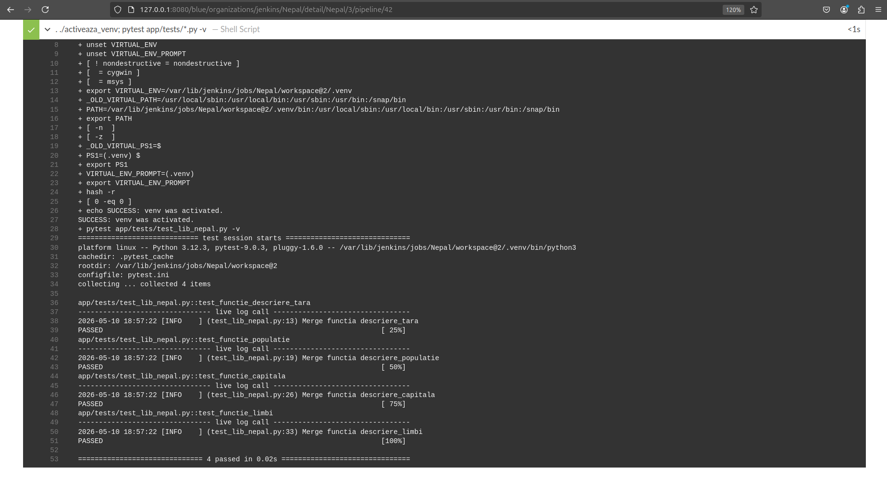

# Proiect SCC - Țări

## Dezvoltator
- **Nume:** Cucui Petruț-Gabriel
- **Grupa:** 443D
- **Țară alocată:** Nepal

## Funcționalitate implementată

În acest branch au fost adăugate funcțiile:
  - `descriere_capitala()` – returnează capitala Nepalului.
  - `descriere_steag()` – returnează un png cu steagul Nepalului.
  - `descriere_limbi()` – afișează limbile oficiale ale Nepalului.
  - `descriere_tara()` – returnează o descriere generală a Nepalului.
  - `descriere_populatie()` – afișează numărul de locuitori.

Rutele disponibile sunt: 
  - `/nepal` – informații generale despre Nepal.
  - `/nepal/capitala` – capitala Nepalului.
  - `/nepal/populatie` – date demografice.
  - `/nepal/steag` – png cu drapelul Nepalului.

## Stadiul dezvoltării
Codul a fost implementat.

## Testare manuală în browser
Aplicația este testată local prin intermediul comenzii: 
```
./ruleaza_aplicatia
```
Pentru verificarea funcționalității se accesează în browser adresa: 
http://127.0.0.1:5011/




## Testare folosind pytest
Testele au fost scrise în fișierul app/tests/test_lib_nepal.py. Se pornește venv-ul și se introduce în terminal comanda :
```
pytest app/tests/*.py -v
```
Testele au fost validate local, implementarea este funcțională.



## Testare folosind Docker
S-a realizat containerizarea aplicației folosind un container Docker. Etapele creării și rulării aplicației sunt următoarele: 

**1. Se construiește imaginea cu ajutorul comenzii:**
```
docker build -t tari:v01 .
```


**2. Se rulează container-ul:**
```
docker run -d --name tari_nepal -p 8020:5011 tari:v01
```


**3. Pentru verificarea funcționalității se accesează în browser adresa: http://localhost:8020/**



## Testare folosind Jenkins

Se pornește Jenkins introducând în terminal comanda :

```
jenkins
```
## Pașii pentru a crea un Pipeline Jenkins care să realizeze automat testarea sunt următorii:

**1. Integrarea repository-ului în instanța locală Jenkins (port 8080).**

**2. Build-ul manual (Build Now).**

**3. Verificarea statusului final și a log-urilor de execuție în Console Output pentru validare.**




# Integrare
**- Branch-ul de dezvoltare: dev_cucui_petrut**  
# Review
**- Am primit review de la colegul: Cucui Mihai Cătălin (MihaiC03)**

**- Am facut review pentru colegul: Cucui Mihai Cătălin (MihaiC03)**

# Rămas de făcut
**- [x] Implementarea codului și validarea testelor local.**

**- [x] Containerizarea aplicației și rulare.**

**- [x] Crearea Pipeline-ului Jenkins și validarea automată a testelor.**

**- [ ] Finalizarea Pull Request-ului și obținerea aprobării pentru fuziunea în branch-ul main.**
